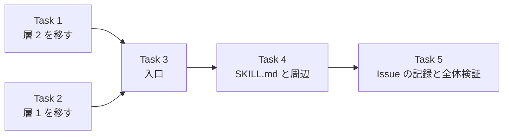

# ISSUE-58 実装計画: 公開される本文へ漏洩検査を通す手順を配布物に入れる

> For agentic workers: REQUIRED SUB-SKILL: Use superpowers:subagent-driven-development (recommended) or superpowers:executing-plans to implement this plan task-by-task. Steps use checkbox (`- [ ]`) syntax for tracking.

Goal: `dev-workflow:commit-and-pr-message` の手順が、公開される本文を渡す前に層 1 と層 2 の漏洩検査を
同梱の入口 1 本で通す状態にする。

Architecture: 層 2 のスクリプトと層 1 のルールの canonical を skill 配下へ移し、root の
`.gitleaks.toml` はそれを `[extend]` するだけにする。新しい入口 `check-outgoing-text.py` が両層を
走らせ、canary で自己検査し、終了コード 0/1/2/3 に畳む。SKILL.md は全ての面で 4 手の手順を持つ。

Tech Stack: Python 3.11 以上の標準ライブラリ (tomllib を使う)、unittest、gitleaks 8.30.1、
pre-commit、GitHub Actions。

Spec: `docs/issues/ISSUE-58_PR 本文の漏洩検査を配布物の手順へ組み込む/ISSUE-58-spec.md`
(実行者は plan と spec の両方を読むこと)

## Global Constraints

- 依存を増やさない。標準ライブラリと unittest だけで書く。pytest を入れない
- テストに skip と expectedFailure を置かない (runner が赤にする)
- コメントは日本語。WHY を書き、外部コマンドの挙動に由来する実装には実測を添える
- 追跡ファイルに実在の絶対パス・メールアドレス・個人を特定する情報を書かない。合成したユーザーパス・
  メールアドレス・UUID・トークンは、ソース上で連続しないよう変数や連結で実行時に組み立てる
  (先例は `scripts/check-leak-guard-rules.py` の `NAME` と `_UUID_PARTS`)。ソースに連続した形で
  書くと、そのファイル自身が層 1 に捕まる
- 入口と層 2 の出力に、禁止語・入力パス・一致した文字列・gitleaks の生の出力を出さない
- `LEAK_GUARD_DENYLIST` が指すファイルを開かない・表示しない。環境変数の値も表示しない
- gitleaks の版は 8.30.1 (CI の pin と開発機を揃える)
- 書き捨ては `<repo>/.cache/` に置く。コミット本文は `.cache/commit-<slug>.txt` に Write で書き
  `git commit -F` で渡す。末尾に `Claude-Session: <URL>` を置く
- テストを増減・改名したら `python3 scripts/run-python-tests.py --update-manifest`、漏洩ケースを
  増減したら `python3 scripts/check-leak-guard-rules.py --update-manifest` で再生成してコミットする
- 変異注入は 1 箇所ずつ入れ、復元は Edit で行う (`git checkout -- <file>` を使わない)
- 配布物 (`plugins/`) の中の散文は、配布先で読まれても偽にならない形で書く。「このリポジトリ」
  「`scripts/...` を実行する」のような配布元の前提を断定しない

## 基準値 (実測、2026-09-17、変更前の `ac85917` 系)

| 項目 | 値 |
|---|---|
| `python3 scripts/run-python-tests.py` | 9 ファイル / 665 件 |
| うち `scripts/test_check_leak_guard_denylist.py` | 78 件 (Attachment 10 件 + それ以外 68 件) |
| `gitleaks git --redact --no-banner -c .gitleaks.toml` (作業ツリーで) | 65 commits scanned / no leaks |
| 同じコマンドを clone で `.gitleaksignore` を消して実行 | 10 件 (user-path 1 / vm-uuid 9) |

git モードでは `-i` を渡しても走査対象リポジトリの root の `.gitleaksignore` が読まれる (実測)。
`.gitleaksignore` を効かせない対照は、clone からファイルを消して取ること。

## ファイル構成

置き場の略記: `CPM` = `plugins/dev-workflow/skills/commit-and-pr-message`

| パス | 種別 | 責務 | Task |
|---|---|---|---|
| `CPM/scripts/check-leak-guard-denylist.py` | `scripts/` から移動 | 層 2 | 1 |
| `CPM/scripts/test_check_leak_guard_denylist.py` | `scripts/` から移動し分割 | 層 2 の単体テスト | 1 |
| `scripts/test_leak_guard_denylist_attachment.py` | 新規 (分割先) | 層 2 と入口の取り付けの pin | 1, 3 |
| `CPM/scripts/leak-guard.gitleaks.toml` | root から中身を移動 | 層 1 のルール | 2 |
| `.gitleaks.toml` | 変更 | `[extend] path` だけ | 2 |
| `scripts/check-leak-guard-rules.py` | 変更 | 層 1 のルールを実際の経路で対照検査 | 2 |
| `CPM/scripts/check-outgoing-text.py` | 新規 | 入口 | 3 |
| `CPM/scripts/test_check_outgoing_text.py` | 新規 | 入口の単体テストと SKILL.md の表の pin | 3, 4 |
| `scripts/ci/install-gitleaks.sh` | 新規 | gitleaks の版と sha256 の canonical | 3 |
| `.github/workflows/ci.yml` | 変更 | 両 job から install-gitleaks.sh を呼ぶ | 3 |
| `CPM/SKILL.md` | 変更 | 4 手の手順と終了コードの表 | 4 |
| `.claude/skills/release/SKILL.md` | 変更 | 検査を CPM の手順へ委ねる | 1, 4 |
| `.pre-commit-config.yaml` / `CLAUDE.md` / README / manifest 2 本 | 変更 | 追従 | 1, 2, 4 |



Task 1 と Task 2 は互いに独立だが、同じ `.pre-commit-config.yaml` と `CLAUDE.md` を触るので順に行う。

### Task 1: 層 2 を skill 配下へ移す (振る舞いは変えない)

Files:
- Move: `scripts/check-leak-guard-denylist.py` → `CPM/scripts/check-leak-guard-denylist.py` (`git mv`)
- Move: `scripts/test_check_leak_guard_denylist.py` → `CPM/scripts/test_check_leak_guard_denylist.py` (`git mv`)
- Create: `scripts/test_leak_guard_denylist_attachment.py`
- Modify: `.pre-commit-config.yaml` (層 2 の hook 2 本の `entry`)、`CLAUDE.md` (確認手順の canonical のパス)、
  `.claude/skills/release/SKILL.md` (手順 3 と 4 のコマンドのパス。Task 4 で委譲へ置き換える)、
  `scripts/python-tests-manifest.txt` (再生成)

Interfaces:
- Consumes: なし
- Produces: `CPM/scripts/check-leak-guard-denylist.py` (CLI と定数 `ENV_VAR` / `STATUS_SKIPPED` /
  `STATUS_CHECKED` / `EXIT_OK` / `EXIT_VIOLATION` / `EXIT_UNABLE` は不変)。Task 3 がこのパスを
  sibling として呼ぶ

- [ ] Step 1: 移動前の基準を取る。`python3 scripts/run-python-tests.py` が 665 件で緑であること
- [ ] Step 2: 分割先の配線テストを先に書く。`scripts/test_leak_guard_denylist_attachment.py` に、
  現行の `Attachment` クラスを移し、`CHECKER` を移動先のパス
  `"plugins/dev-workflow/skills/commit-and-pr-message/scripts/check-leak-guard-denylist.py"` にする。
  `live_lines` などの補助と `TRACKED_HOOK_KEYS` / `COMMIT_MSG_HOOK_KEYS` も一緒に移す。
  `test_ci_does_not_run_this_check` の docstring へ、スクリプト側から外す「CI へ取り付けない理由」
  (PUBLIC リポジトリの Actions ログから座標の交差で語を復元できる) を書く
- [ ] Step 3: 実行して赤を確かめる。`cd scripts && python3 -m unittest test_leak_guard_denylist_attachment` で
  `test_checker_path_exists` と pre-commit の呼び出しの pin が失敗すること
- [ ] Step 4: `git mv` で 2 ファイルを移す。移したテストから `Attachment` クラスと、それだけが使う
  定数を消す。`CHECKER` はテストファイルの隣を指す形 (`Path(__file__).resolve().parent /
  "check-leak-guard-denylist.py"`) にし、`load()` と `run_cli()` をそれに合わせる。
  `ROOT` と `PRE_COMMIT_CONFIG` は不要になるので消す
- [ ] Step 5: `.pre-commit-config.yaml` の `leak-guard-denylist` と `leak-guard-denylist-commit-msg` の
  `entry` を移動先へ。hook のコメントのうち「CI へ取り付けない」理由が
  スクリプトの docstring を名指ししていたら、配線テストを名指しする形へ直す
- [ ] Step 6: 移した 2 ファイルの散文を配布先で偽にならない形へ直す。次で当たる行を 1 行ずつ見る
  (`tgrep -n 'このリポジトリ|本リポジトリ|scripts/|PUBLIC|ISSUE-|CI |pre-commit|commit-msg hook' CPM/scripts/`)。
  基準は「配布先に同じものが無くても真であるか」。直す方向は次のとおり
  - 配布元の実測や経緯は「配布元で測った」と分かる書き方にするか、一般化する
  - 取り付けの判断 (pre-commit へ載せる・CI へ載せない) は「利用する側の判断」とし、配布元の
    判断の理由は配線テストへ移す (Step 2)
  - セットアップの確認コマンドはパスを含めず「このスクリプトを `--check` で実行する」にする
  - `#N` 記法の禁止の出所は、同じ bundle の `in-repo-issue` の `issue-id.py` と書く
  - `run_check_text` の「spec の実装順序 5 (未実装)」は Task 4 で直すので、ここでは触らない
- [ ] Step 7: `CLAUDE.md` の「確認手順の canonical は `scripts/check-leak-guard-denylist.py` の docstring」を
  移動先のパスへ。release skill の手順 3 と 4 の `python3 scripts/check-leak-guard-denylist.py` を
  移動先のパスへ (Task 4 で置き換えるまでの橋渡し)
- [ ] Step 8: `tgrep -n 'check-leak-guard-denylist' --glob '!docs/issues/closed/**' .` と、dot 始まりの
  `.pre-commit-config.yaml` `.github/workflows/ci.yml` `.claude/skills/release/SKILL.md` を個別に引き、
  旧パス `scripts/check-leak-guard-denylist.py` が残っていないこと (closed の Issue は履歴として除く)
- [ ] Step 9: `python3 scripts/run-python-tests.py` が「消えた / 未記録」の 78 件ずつで赤になることを
  確かめてから `--update-manifest`。再実行で 9 → 10 ファイル / 665 件、manifest と一致
- [ ] Step 10: 変異注入。`.pre-commit-config.yaml` の `leak-guard-denylist` hook の `entry` 行を
  コメントアウトし、配線テストが赤になること。Edit で戻す
- [ ] Step 11: `pre-commit run --all-files` が全 hook 緑、`leak-guard-denylist` の出力が
  `status=checked` であること。`pre-commit run --hook-stage commit-msg --commit-msg-filename <.cache のファイル>`
  で commit-msg の 2 本も緑
- [ ] Step 12: コミット。件名 `refactor(dev-workflow): 禁止語の検査を commit-and-pr-message へ移す (ISSUE-58)`

### Task 2: 層 1 のルールを skill 配下へ移し、root を extend にする

Files:
- Create: `CPM/scripts/leak-guard.gitleaks.toml`
- Modify: `.gitleaks.toml`、`scripts/check-leak-guard-rules.py`、`scripts/leak-guard-cases-manifest.txt` (再生成)、
  `.pre-commit-config.yaml` (`leak-guard-rules` の `files:` とファイル冒頭のコメント)、`CLAUDE.md` (漏洩ルールの canonical)

Interfaces:
- Consumes: なし
- Produces: `CPM/scripts/leak-guard.gitleaks.toml`。`[extend] useDefault = true` と custom ルール
  `user-path` / `vm-uuid` / `email-address` を持ち、自身は `[extend] path` を持たない。Task 3 が
  sibling として `-c` へ渡し、tomllib で `[[rules]]` の id を読む

- [ ] Step 1: 対照ケースを先に足す (`scripts/check-leak-guard-rules.py`)
  - `SHOULD_ALLOW` に `mail-anthropic-noreply` のケースを足す。値は帰属行が持つ Anthropic の noreply
    アドレスそのもの。許可側なので literal で書いてよい (Step 3 の許可と同じコミットに入れること。
    許可より先にコミットすると、そのファイル自身が層 1 に捕まる)
  - `SHOULD_DETECT` に `("email-address", "mail-github-noreply", "12345+" + NAME + "@users." + "noreply.github.com")`
  - 既定ルールの検出ケースを別の並び `DEFAULT_DETECT` に置く:
    `("github-pat", "default-github-pat", "ghp" + "_" + "aB3dE5gH7jK9mN1pQ2rS4tU6vW8xY0zC5fD7")`。
    36 文字を多様な英数字にするのは、既定ルールにエントロピーの閾値があり単調な並びは当たらない
    ため (この並びで検出を実測)。入口の canary も同じ値を使う。`SHOULD_DETECT` へ入れないのは、
    そちらの名指すルールが custom ルール集合との一致を要求されているため
  - `case_keys()` に `detect-default::<rule>::<case>` を足し、`main()` の判定で `DEFAULT_DETECT` も
    ルール別に見る
- [ ] Step 2: `python3 scripts/check-leak-guard-rules.py` を実行し、`mail-anthropic-noreply` の誤検出で
  赤になることを確かめる (他の新ケースは現行ルールで既に期待どおり)
- [ ] Step 3: `CPM/scripts/leak-guard.gitleaks.toml` を作る。中身は root の `.gitleaks.toml` から移す。
  変えるのは次の 4 点
  - `title` を配布物として中立な名前へ
  - `email-address` の allowlist の末尾に `'''(?i)^noreply@anthropic\.com$'''` を足す。
    allowlist の regexes は 1 本へ束ねて評価され `(?i)` が前方へ漏れるので、既存と同じく付ける
  - 「gitleaks が `.gitleaks.toml` という名前のファイルを走査対象から外す」という説明を、
    「既定 config (`useDefault`) の allowlist が `*gitleaks.toml` という名前のファイルを外す。
    このファイルが実例を literal で書けるのはこの名前だから」へ直す (spec の前提 2)
  - 配布元固有の記述 (winvm の一時ファイル、fixture の出所、`scripts/check-leak-guard-rules.py` を
    名指す箇所) を、配布先で偽にならない書き方へ直す。値そのもの (fixture の UUID など) は残す
- [ ] Step 4: root の `.gitleaks.toml` を `title` と `[extend] path = "plugins/dev-workflow/skills/commit-and-pr-message/scripts/leak-guard.gitleaks.toml"`
  だけにする。コメントに次を書く: パスは cwd 基準で解決される (pre-commit と CI は cwd が root)。
  extend は 2 段で止める (3 段にすると既定のルールと除外がエラー無しで落ちる、実測)。
  `.gitleaksignore` はこのリポジトリの履歴の記録なのでここに残す
- [ ] Step 5: `scripts/check-leak-guard-rules.py` を直す
  - `RULES = ROOT / "plugins/dev-workflow/skills/commit-and-pr-message/scripts/leak-guard.gitleaks.toml"` を
    置き、`config_rule_ids()` は `RULES` を読む
  - `detections()` は `-c .gitleaks.toml` (相対) を `cwd=ROOT` で渡す。pre-commit と CI が使う
    経路 (extend) ごと対照で見るため
  - root の `.gitleaks.toml` が `title` と `extend.path` 以外を持たないこと、`extend.path` が
    `RULES` の root からの相対パスと一致することを tomllib で確かめ、外れたら 2 を返す
  - 失敗時に `proc.stderr` を印字するとき、`str(ROOT)` と一時ディレクトリの絶対パスを
    プレースホルダへ置き換える (config を読めないと stderr に絶対パスが出る、実測)
  - モジュール docstring と `RULE_IDS` のコメントが名指す canonical を `RULES` へ
- [ ] Step 6: `python3 scripts/check-leak-guard-rules.py` が緑。`--update-manifest` で manifest を
  再生成し、再実行で一致
- [ ] Step 7: 変異注入 (1 つずつ、Edit で戻す)
  - root の `.gitleaks.toml` から `[extend]` を消す → 検出側の取りこぼしで赤
  - root と `RULES` の間に中間ファイルを 1 段挟む (3 段) → `default-github-pat` の取りこぼしで赤
  - `RULES` の noreply の許可を消す → `mail-anthropic-noreply` の誤検出で赤
  - root に custom ルールを 1 本足す → 2 (root が extend だけでない)
- [ ] Step 8: `.pre-commit-config.yaml` の `leak-guard-rules` の `files:` に `RULES` のパスを足す。
  冒頭コメントの「`.gitleaks.toml` の custom ルール」を extend の形に合わせる。`CLAUDE.md` の
  「形の決まった漏洩の検査ルール」の canonical (表と本文の 2 箇所) を `RULES` のパスへ
- [ ] Step 9: 基準値との比較。作業ツリーで `gitleaks git --redact --no-banner -c .gitleaks.toml` が
  no leaks (commit 数は基準 + 本ブランチの分)。コミット後に clone して `.gitleaksignore` を消した
  同じコマンドが 10 件 (user-path 1 / vm-uuid 9) で基準と一致
- [ ] Step 10: `pre-commit run --all-files` 全緑。コミット。
  件名 `refactor(security): 漏洩ルールを commit-and-pr-message へ移し root は extend にする (ISSUE-58)`

### Task 3: 入口 `check-outgoing-text.py`

Files:
- Create: `CPM/scripts/check-outgoing-text.py`、`CPM/scripts/test_check_outgoing_text.py`、`scripts/ci/install-gitleaks.sh`
- Modify: `.github/workflows/ci.yml`、`scripts/test_leak_guard_denylist_attachment.py` (負の pin の対象に入口を足す)、
  `scripts/python-tests-manifest.txt` (再生成)

Interfaces:
- Consumes: Task 1 の `check-leak-guard-denylist.py` (sibling、subprocess で `--check-text <path>`)、
  Task 2 の `leak-guard.gitleaks.toml` (sibling)
- Produces (Task 4 のテストが import する):

```python
EXIT_OK, EXIT_FINDING, EXIT_UNABLE, EXIT_SKIPPED = 0, 1, 2, 3
STATE_CHECKED, STATE_SKIPPED, STATE_UNABLE = "checked", "skipped", "unable"
HERE: Path              # このファイルのディレクトリ
DENYLIST_SCRIPT: Path   # HERE / "check-leak-guard-denylist.py"
RULES_FILE: Path        # HERE / "leak-guard.gitleaks.toml"

class Hit(NamedTuple):
    file_no: int   # 引数の順番 (1 始まり)
    line: int
    layer: int     # 1 or 2
    label: str     # 層 1 はルール ID、層 2 は "denylist line <n>"

class Layer(NamedTuple):
    state: str
    reason: str    # checked のときは ""
    hits: list[Hit]

def main(argv: list[str] | None = None, *, env: Mapping[str, str] | None = None,
         rules: Path = RULES_FILE, denylist_script: Path = DENYLIST_SCRIPT) -> int
```

`gitleaks` の解決は `shutil.which("gitleaks", path=env.get("PATH"))`。テストは `PATH` で有無を作る。

振る舞いの canonical は spec の「入口の振る舞い」節で、実装後はこのファイルの docstring が持つ。
要点だけ次に置く。

| 項目 | 決め |
|---|---|
| 入力の検査 | 通常ファイルでない・読めない・0 byte → 両層 unable (reason `input-unreadable` / `input-empty`)。gitleaks も層 2 も起動しない |
| 層 1 の一時ディレクトリ | `tempfile.TemporaryDirectory()`。入力は `001.txt` から連番、canary は `000.txt`。名前の形はテストで pin |
| canary | custom ルールごとに 1 行 (`CANARY_BY_RULE: dict[str, str]`) と既定ルール 1 行 (`github-pat`)。値はソース上で連続しないよう組み立てる。ユーザーパスは裸の 1 行 (`/Users/<合成名>/x`) |
| custom ルール集合 | `rules` を tomllib で読んだ `[[rules]]` の id 集合が `CANARY_BY_RULE` のキーと一致しなければ unable (`canary-rule-mismatch`) |
| gitleaks の argv | `dir <tmp> -c <rules> --gitleaks-ignore-path <tmp> --report-format json --report-path - --redact --no-banner --no-color --exit-code 0` |
| 層 1 の前段 | `rules` を tomllib で読めなければ unable (`rules-unreadable`)。一時ディレクトリへ書けなければ unable (`copy-failed`) |
| gitleaks の rc | `--exit-code 0` なので 0 以外は unable (`gitleaks-failed`)。stdout と stderr は印字しない |
| レポート | stdout を JSON として読む (`report-unreadable`)。`File` の basename が `000.txt` / 入力の連番のどれでもなければ unable (`unknown-report-file`)。canary の (行, `RuleID`) 集合が期待と完全一致しなければ unable (`canary-not-detected`) |
| 層 2 | 入力ごとに `[sys.executable, denylist_script, "--check-text", path]`。stdout に `status=skipped` → skipped (`env-unset`)。rc 0 かつ `status=checked` → checked。rc 1 かつ `status=checked` → 検出 (stderr の `line N: denylist line M` を座標へ)。それ以外は unable (`denylist-unable` / `denylist-no-status`)。rc 1 なのに座標が 1 件も読めなければ unable。層の状態は入力間で最悪を採る |
| 想定外の例外 | `main` の最上位で受け、`error=<型名>` だけを出して EXIT_UNABLE |
| 終了コード | 検出 > unable > skipped > checked の順に 1 / 2 / 3 / 0 |

出力の形 (stdout。stderr には何も出さない):

```text
layer1 status=<state> [reason=<reason>] findings=<n>
layer2 status=<state> [reason=<reason>] findings=<n>
  [x] file <n> line <m>: layer1 <rule-id>
  [x] file <n> line <m>: layer2 denylist line <k>
result=<ok|finding|unable|skipped>
<日本語の要約 1 行>
```

- [ ] Step 1: `scripts/ci/install-gitleaks.sh` を作り、`ci.yml` の leak-guard job の「Install gitleaks」を
  これの呼び出しへ置き換え、python-tests job の runner の前に同じ呼び出しを足す。版
  (`8.30.1` と「開発機と揃える」の注記) と sha256 はこのスクリプトだけが持つ。展開先は
  `$RUNNER_TEMP`、`$GITHUB_PATH` への追記もこのスクリプトが行う。`download-and-verify.sh` を呼ぶ
- [ ] Step 2: テストを先に書く (`CPM/scripts/test_check_outgoing_text.py`)。禁止語は架空語、
  禁止語リストはテスト内の一時ファイル。合成値は組み立てる。判定表:

  | テスト | 入力と環境 | 期待 |
  |---|---|---|
  | clean | 清浄な本文 1 本、リスト設定済み | rc 0、両層 checked |
  | layer1_hit | 合成ユーザーパスの行 | rc 1、`file 1 line <n>: layer1 user-path` |
  | layer2_hit | 架空語の行 | rc 1、`layer2 denylist line 1` |
  | two_files | タイトルと本文の 2 本、2 本目だけ検出 | 座標が `file 2` |
  | gitleaks_absent | `PATH` から gitleaks のあるディレクトリを除く | rc 3、`layer1 status=skipped reason=gitleaks-not-found` |
  | env_unset | リスト未設定 | rc 3、`layer2 status=skipped reason=env-unset` |
  | defaults_dropped | `rules` から `[extend]` を除いた写し | rc 2、`canary-not-detected` |
  | rule_regex_broken | `user-path` の regex を当たらない形へ置換した写し | rc 2、`canary-not-detected` |
  | rule_missing | `vm-uuid` のブロックを除いた写し | rc 2、`canary-rule-mismatch` |
  | rules_unreadable | 存在しない `rules` | rc 2、出力にパス断片が無い |
  | no_args / missing_file / empty_file | 引数なし / 無いパス / 0 byte | rc 2 |
  | denylist_no_status | 何も出さず rc 0 で終わる stub を `denylist_script` に渡す | rc 2、`denylist-no-status` |
  | hit_beats_unable | 層 1 で検出、層 2 は stub で unable | rc 1 |
  | unable_in_one_file | 2 本のうち 1 本が非 UTF-8 (層 2 が unable) | rc 2 |
  | excluded_name | 入力のファイル名が `x.gitleaks.toml` と `y.bin`、中身に合成ユーザーパス | rc 1 |
  | anthropic_noreply | 帰属行の Anthropic noreply | rc 0 |
  | github_noreply | GitHub noreply 形の帰属行 | rc 1 |
  | redaction | 上の各ケースの出力全体 | 架空語・合成値・入力パス・`rules` のパス・一時ディレクトリのパスを含まない |
  | temp_names | 層 1 に渡す一時ファイルの名前 | `000.txt` と `001.txt` 以降 (名前を返す関数を pin) |

  写しの config は `rules` の本文への文字列置換で作り、置換が 1 回起きたことを assert する
  (起きていないとテストが対象を壊していない dead pin になる)。process 境界で見るケース
  (redaction、gitleaks_absent、env_unset、clean、layer1_hit) は `sys.executable` でスクリプトを
  起動する。残りは `main(argv, env=..., rules=..., denylist_script=...)` を呼び、stdout を捕捉する
- [ ] Step 3: `cd CPM/scripts && python3 -m unittest test_check_outgoing_text` で、入口が無いことによる
  失敗を確かめる
- [ ] Step 4: `check-outgoing-text.py` を実装する (上の表と出力の形)。docstring に、状態と理由の語彙、
  終了コードの優先順、canary の目的、`--report-path -` と `--gitleaks-ignore-path` を渡す理由 (実測)、
  stderr を流さない理由 (実測) を書く
- [ ] Step 5: テストを通す。`python3 scripts/run-python-tests.py --update-manifest` のあと
  `python3 scripts/run-python-tests.py` が緑
- [ ] Step 6: `scripts/test_leak_guard_denylist_attachment.py` の CI への負の pin を、入口のパスにも
  掛ける (workflow が入口を literal で呼ぶと、層 2 が公開ログへ取り付く)
- [ ] Step 7: 変異注入 (1 つずつ、Edit で戻す)。どれも赤になることを確かめる
  - canary の照合を外し、レポートを読めたら checked にする → `defaults_dropped` / `rule_regex_broken`
  - 一時ファイルを入力の basename で写す → `excluded_name` / `temp_names`
  - 優先順の 1 と 2 を入れ替える → `hit_beats_unable`
  - gitleaks の stderr を出力へ流す → `rules_unreadable` の redaction
  - 層 2 を rc だけで判定する → `denylist_no_status` / `env_unset`
  - 0 byte を通す → `empty_file`
- [ ] Step 8: live smoke (`.cache/` の合成ファイル、環境変数は起動元のまま)。
  清浄 → 0、合成ユーザーパス → 1、`env -u LEAK_GUARD_DENYLIST` → 3、`PATH` から gitleaks を外す → 3。
  出力に語もパスも出ないことを目で確かめる
- [ ] Step 9: `pre-commit run --all-files` 全緑。コミット。
  件名 `feat(dev-workflow): 公開する本文へ両層の漏洩検査を通す入口を足す (ISSUE-58)`

### Task 4: SKILL.md の手順と周辺の追従

Files:
- Modify: `CPM/SKILL.md`、`CPM/scripts/test_check_outgoing_text.py` (表の pin)、`CPM/scripts/check-leak-guard-denylist.py`
  (`run_check_text` の docstring)、`.claude/skills/release/SKILL.md`、`README.md` (再生成)、
  `scripts/python-tests-manifest.txt` (再生成)

Interfaces:
- Consumes: Task 3 の `EXIT_OK` / `EXIT_FINDING` / `EXIT_UNABLE` / `EXIT_SKIPPED`
- Produces: SKILL.md の節 `### 送る前の検査` (pin テストがこの見出しで節を引く)

- [ ] Step 1: pin テストを先に書く。SKILL.md の「送る前の検査」節にある表の 1 列目の整数集合が
  `{EXIT_OK, EXIT_FINDING, EXIT_UNABLE, EXIT_SKIPPED}` と一致すること。節が見つからない・
  表が空のときも赤 (0 件で緑にしない)。表の読み取りは見出しで節を切り、`| <整数> |` で始まる行だけ
  を取る
- [ ] Step 2: テストが節の不在で赤になることを確かめる
- [ ] Step 3: SKILL.md を直す
  - ワークフローの冒頭を 4 手 (書く / 送る前の検査 / 渡す / 載ったことを確認) にする
  - 「送る前の検査」節: 入口の呼び出し (`python3 "${CLAUDE_SKILL_DIR}/scripts/check-outgoing-text.py" <本文> [<1 行のファイル>]`)、
    終了コードごとの行動の表 (0/1/2/3 と「それ以外」)、書き直しの規則 (spec の「書き直し」)、
    「検査が見るのは形とリストに載った語だけなので渡す前に自分で読む」
  - インラインの 1 行 (`--title` / `--subject` / Issue タイトル / リリースタイトル) は
    `.cache/<面>-<slug>.title` にも書いて入口へ一緒に渡し、渡すときはその中身を写す
  - Phase A / C と C.3 の表に、2 手目が入口であることを反映する (面ごとに同じ説明を繰り返さない)
  - 落とし穴の表に「検査で 3 が出たが急ぐので渡す」「rc 1 の語をリストで確かめる」を足す
  - frontmatter の description に「渡す前に同梱の入口で漏洩検査を通す」を足す
- [ ] Step 4: `run_check_text` の docstring の「spec の実装順序 5 が扱う (未実装)」を、「公開される本文を
  送る前にこの入口を通す手順は、同じ skill の SKILL.md が `check-outgoing-text.py` 経由で持つ」へ
- [ ] Step 5: release skill の手順 3 と 4 から検査コマンドを外し、「`dev-workflow:commit-and-pr-message` の
  送る前の検査を通す」へ置き換える。「この面は gitleaks の走査面の外で、見る機会がこの手順にしか
  無い」という理由は残す。「載っていない語は通る」の段落は CPM へ移したので、release 側は参照に
  する。落とし穴の表の該当行も合わせる
- [ ] Step 6: `python3 scripts/gen-readme.py` で README を再生成。
  `python3 scripts/run-python-tests.py --update-manifest` と再実行で緑
- [ ] Step 7: 変異注入。SKILL.md の表から 3 の行を消す → pin テストが赤。Edit で戻す
- [ ] Step 8: `pre-commit run --all-files` 全緑 (`claude plugin validate` / package-shape / readme-drift を含む)。
  コミット本文と件名を入口に通してからコミットする (この Task から dogfooding)。
  件名 `feat(dev-workflow): 公開する本文を送る前に漏洩検査を通す手順を書く (ISSUE-58)`

### Task 5: Issue の記録と全体検証

Files:
- Modify: `docs/issues/ISSUE-58_PR 本文の漏洩検査を配布物の手順へ組み込む/issue.md`、
  `docs/issues/ISSUE-61_配布物が配布先で成立しているかを見る検査層が無い/issue.md`、
  `docs/issues/ISSUE-32_in-repo Issue の検査を配布先で走る状態にする/issue.md`

- [ ] Step 1: ISSUE-58 の本文に決定の要約 (spec を名指し) を足し、タスク 4 つの実施結果を書いて `[x]` にする
- [ ] Step 2: ISSUE-61 と ISSUE-32 の関連節の ISSUE-58 の行に、今回の結論 (同梱の入口 + canonical の
  移動。hook と CI の取り付けは範囲外) を 1 行足す。ISSUE-32 の「配布対象から外す検査の宣言」に
  関わる記述があれば、層 2 のスクリプトが配布物に入ったことを反映する
- [ ] Step 3: 全体検証 (すべて実測を記録する)
  - `pre-commit run --all-files` 全緑。`leak-guard-denylist` が `status=checked`
  - `pre-commit run --hook-stage commit-msg --commit-msg-filename <file>` が緑
  - `python3 scripts/run-python-tests.py` が manifest と一致 (ファイル数と件数を記録)
  - `python3 scripts/check-leak-guard-rules.py` が緑 (ケース数を記録)
  - `gitleaks git --redact --no-banner -c .gitleaks.toml` が no leaks
  - clone で `.gitleaksignore` を消した全履歴走査が 10 件 (user-path 1 / vm-uuid 9)
  - 追跡ファイルに旧パス (`scripts/check-leak-guard-denylist.py`) と、root の `.gitleaks.toml` を
    ルールの canonical と呼ぶ記述が残っていない (closed の Issue を除く)
- [ ] Step 4: コミット (本文と件名を入口に通す)。件名 `docs(issues): ISSUE-58 の実装結果を記録する (ISSUE-58)`
- [ ] Step 5: `dev-workflow:pre-merge-quality-gate` を通す。PR 本文とタイトルを入口に通してから
  `gh pr create` する (live smoke)。クローズは feature PR へ同梱する (`in-repo-issue` の
  「クローズ経路」節)

## 変異注入の一覧

| Task | 壊すもの | 赤になる検査 |
|---|---|---|
| 1 | pre-commit の層 2 hook の entry | 配線テスト |
| 2 | root の `[extend]` / 3 段 extend / noreply の許可 / root に custom ルール | `check-leak-guard-rules.py` |
| 3 | canary の照合 / 固定名での写し / 優先順 / stderr の遮断 / 層 2 の状態行 / 0 byte | 入口の単体テスト |
| 3 | workflow が入口を literal で呼ぶ | 配線テストの負の pin |
| 4 | SKILL.md の表の 1 行 | 表の pin テスト |

## 完了条件

- spec の「決定」「入口の振る舞い」「手順」「このリポジトリ側の追従」「テスト」の各行に、対応する
  Task の Step がある
- Task 5 の全体検証が全て記録どおり
- PR の本文とタイトルが入口を rc 0 で通った記録がある
