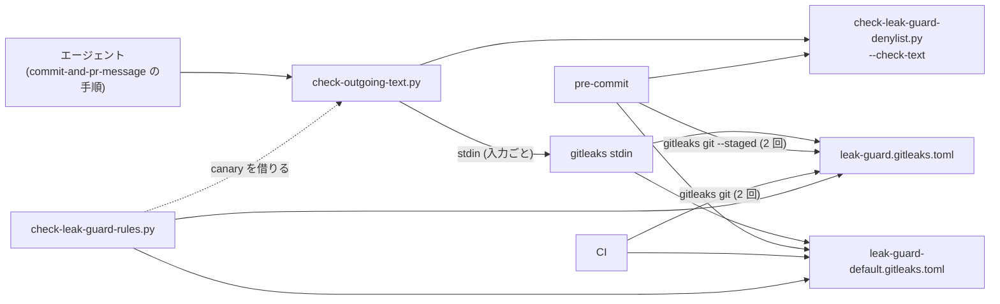

# ISSUE-58 spec: 公開される本文へ漏洩検査を通す手順を配布物に入れる

2026-09-17 のブレインストーミングとレビュー、2026-09-18 の計画レビューと簡素化で決めた設計の
スナップショット。実装後の振る舞いの canonical は各スクリプトの docstring とテストで、この文書は
追従させない。

## 決定 (ユーザー裁定)

| 論点 | 決定 | 退けた案 |
|---|---|---|
| 当てる層 | 層 1 (形の決まったルール) と層 2 (禁止語リスト) の両方 | 層 2 だけ / 層 1 はプロジェクトの設定があれば呼ぶ |
| 当てる面 | `commit-and-pr-message` が扱う全ての面 | main に残る面だけ / それにコミット本文を足した形 |
| 検査が skip したとき | 常に止めてユーザーに確認する | 未検査と明記して進む / 宣言がある環境だけ止める |
| 届け方 | canonical を skill 側へ移し、入口を 1 本作る (案 A) | 入口を作らず手順に 2 コマンドを書く / root を canonical にして写しを同期する |
| noreply 形のアドレス | Anthropic の noreply アドレスだけを値で許可する | GitHub の noreply 形も許可する / どちらも許可しない |
| 層 1 の config の形 (09-18) | custom ルールだけの config と、既定ルールだけの config の 2 本を平らに置き、それぞれを 1 回ずつ走らせる。root の `.gitleaks.toml` は置かない | 1 本に既定と custom を同居させる (前提 10) / root から extend する (前提 3・4) |
| 入口から gitleaks を呼ぶ形 (09-18) | 入力ごとに `gitleaks stdin` へ流し、先頭に canary の行を置く | 一時ディレクトリへ固定名で写し、`gitleaks dir` を 1 回だけ呼ぶ |
| 中身による読み飛ばし (09-18) | 入力ごとの canary で検出する。UTF-8 として読めない入力と NUL を含む入力は前段で止める | UTF-8 の検査だけ / 既知の限界に書くだけ |
| 範囲に足すもの (09-18) | このリポジトリの gitleaks 呼び出しにも `gitleaks:allow` の無視を足す。CLAUDE.md の依存節の対象を書き直す。ISSUE-55 の F2 と F25 を片付ける | — |
| 範囲から外すもの (09-18) | Linux のホームディレクトリ形のパスを user-path に含める件は別 Issue にする | — |

層 1 を当てるのは前提 1 による。ISSUE-15 の spec は PR 本文に「手順の中で層 2 を呼ぶ」と
決めていたが、層 2 だけではユーザー名を含む絶対パスが素通りする。

GitHub の noreply 形を許可しないのは、ユーザー名を含むからである。Anthropic の noreply アドレスは
ベンダーの固定値で個人を指さない。配布先の既定の帰属行がこれを持つので、許可しないと検査が毎回
止まり、止まる検査は迂回される。

config を 2 本に分けるのは、前提 10 の見逃しを塞ぐためである。既存の pre-commit と CI にも同じ
見逃しがあるので、ここで config の構成を組み替えるときに一緒に直す。extend をやめると、解決が
cwd と段数に依存する問題 (前提 3・4) も、それを見張る構造検査も要らなくなる。

入口を stdin 経由にすると、ファイル名・拡張子・symlink・一時領域のパスがどれも gitleaks に
渡らない。それぞれに要っていた対策 (固定名での写し、未知のファイル名の照合、パスによる既定の除外
への備え) が消える。

## 前提 (実測、gitleaks 8.30.1)

2026-09-17 に測ったもの:

1. 合成した PR 本文 3 本を両層へ通した。

   | 本文 | 層 2 | 層 1 (当時の `.gitleaks.toml`) |
   |---|---|---|
   | 清浄な本文 (対照) | 0 件 | no leaks |
   | ユーザー名を含む絶対パス | 0 件 | 1 件 |
   | メールアドレス | 2 件 | 1 件 |

2. 既定 config (`useDefault`) の allowlist は、パスに `gitleaks.toml` を部分文字列として含む
   ファイルを外す。ディレクトリ名に含む場合や、後ろに文字が続く名前も外れる。`.bin` などの拡張子と
   `node_modules/` 配下も外れる。`useDefault` を持たない config ではどれも外れない
3. `[extend] path` の相対パスは config ファイルではなく cwd を基準に解決される。cwd がずれると
   `Failed to load config` の rc 1 で、レポートは作られない
4. extend を 3 段にすると、custom ルールは効いたまま、既定のルールと既定の除外がエラー無しで落ちる
5. config を読めないとき、gitleaks は `--exit-code 0` を付けても rc 1 を返し、stderr に config の
   絶対パスをそのまま出す。成功した run の stderr は走査量と件数の 2 行だけで、パスを含まない
6. 帰属行の Anthropic の noreply アドレスと GitHub の noreply 形は `email-address` に当たる。
   セッション URL の行はどのルールにも当たらない
7. apm はパッケージ内の dot 始まりのファイルと実行ビットを展開先へ持ち込む
8. 配布物の skill の手順はエージェントが実行するので、skill のディレクトリを指す変数経由で同梱物に
   届く。この変数は Skill ツールで読み込んだ本文の中で、コードブロックに限らず全ての出現が
   絶対パスへ置換される。Read で読んだ本文では置換されず、Bash の環境変数にも無い
9. 層 2 の `--check-text` は、未設定でも検査済みでも rc 0 を返す。違いは stdout の
   `status=skipped` / `status=checked` の行だけにある。検出があると `status=checked` を出して
   rc 1 を返す。空ファイルは `status=checked lines=0` になる

2026-09-18 に測ったもの:

10. 既定 config の全体除外 `(?i)^true|false|null$` は custom ルールの検出にも効く。`true` で始まる
    メールアドレス、`false` を含むメールアドレス、`false` を含む・`null` で終わるユーザー名の
    パスが検出されない。同じ custom ルールを `useDefault` なしの config で回すと全部検出される
11. gitleaks は中身の先頭バイトで「バイナリ」と判定した入力を、rc 0 のまま読み飛ばす。PDF・MZ・
    RTF の magic で始まるもの、128 バイト目に DICM があるもの、UTF-16 が該当し、`dir` でも
    `stdin` でも同じ。先頭に 1 行足すと先頭の magic による読み飛ばしは消える。足したあとも条件が
    成り立つ形 (128 バイト目の DICM) では、足した行ごと検出されなくなる。NUL を含む UTF-8 は走査される
12. 行に `gitleaks:allow` を含むと、その行の検出が消える (HTML コメントの中に書いた形も同じ)。
    `--ignore-gitleaks-allow` を付けると戻る。`dir` でも `stdin` でも同じ
13. `gitleaks stdin` のレポートは `File` が空で、`StartLine` は流したバイト列の行番号になる。
    `-c` と `-i` を明示すると、cwd に置いた壊れた `.gitleaks.toml` は効かない
14. custom ルールだけの config には既定の除外が無いので、ルールファイル自身 (実例を literal で持つ) を
    名前で外す allowlist が要る。全履歴の走査 (`.gitleaksignore` を消した clone) で、外すと基準と同じ
    10 件、外さないと 24 件 (うち 14 件が過去の `.gitleaks.toml`)。既定ルールだけの config は 0 件
15. 開発機の PATH には gitleaks が 2 つある (mise の shim と Homebrew)。shim は mise で有効化されて
    いないと Homebrew 側へ委ね、PATH に shim しか無いと起動に失敗する (rc 1)

## 配置と canonical

置き場は `plugins/dev-workflow/skills/commit-and-pr-message/scripts/`。先例は
`in-repo-issue` の `issue-id.py` で、canonical を plugin 配下に置き、このリポジトリの
pre-commit がそこを直接呼んでいる。

| ファイル | 由来 | 役割 |
|---|---|---|
| `check-outgoing-text.py` | 新規 | 入口。渡されたファイルへ層 1 と層 2 を当てて結果を束ねる |
| `check-leak-guard-denylist.py` | `scripts/` から移動 | 層 2 の canonical。追跡ファイルを見る入口も残す |
| `leak-guard.gitleaks.toml` | root の `.gitleaks.toml` から custom ルールを移す | 層 1 の custom ルールの canonical。`[extend]` を持たず、実例を持つ設定ファイルを名前で外す allowlist を持つ |
| `leak-guard-default.gitleaks.toml` | 新規 | 既定ルールだけを有効にする (`[extend] useDefault = true` だけを持つ) |
| 単体テスト | 新規 / 移動 | 本体の隣に置く |

root の `.gitleaks.toml` は削除する。pre-commit と CI は 2 本の config を `-c` で明示し、どちらの
呼び出しにも `--ignore-gitleaks-allow` を付ける。`.gitleaksignore` はこのリポジトリの履歴にだけ
意味がある記録なので root に残す (git モードは root のものを読む)。

移すスクリプトとルールファイルの docstring とコメントは、配布先で読まれても偽にならない形へ
直す。このリポジトリの配線に由来する理由 (CI へ層 2 を取り付けない判断など) は、配線テストと
pre-commit のコメントへ移す。

## 入口の振る舞い

標準ライブラリだけで書き、3.9 でも読み込める構文に保つ (tomllib を使わない)。ルールファイルの
中身と canary の対応はリポジトリ側の対照検査が見るので、入口は実行時に config を読まない。

引数は 1 つ以上のファイル。層ごとに状態を checked / skipped / unable の 3 つで持ち、層の状態は
入力間で最も悪いもの (unable > skipped > checked) を採る。検出は状態とは別に数える。

入力の前段 (両層の前に確かめる): 通常ファイルでない (symlink は辿った先で見る)・読めない・
0 byte・UTF-8 として読めない・NUL を含む、のどれかに当たる入力があれば、両層とも unable にして
gitleaks も層 2 も起動しない。0 byte を通すと、書き忘れたファイルが「検査済みの 0 件」になる。

層 1:

| 状態 | 条件 |
|---|---|
| skipped | 渡された env の PATH で `gitleaks` が見つからない |
| unable | 起動の rc が 0 でない / stdout を JSON として読めない / canary の検出集合が期待と一致しない |
| checked | 全ての入力と config の組で、上のどれにも当たらない |

- 見つかった絶対パスで起動する。名前で引き直すと、解決と起動が別の実体を指しうる (前提 15)
- 入力ごと・config ごとに 1 回、`stdin` で呼ぶ。流すのは canary の行と入力のバイト列を
  つなげたもの。付けるフラグは `-c <config>`、`-i <同梱ディレクトリ>` (cwd の免除ファイルを効かせ
  ない。同梱ディレクトリには免除ファイルを置かない)、`--ignore-gitleaks-allow`、
  `--report-format json`、`--report-path -`、`--redact`、`--no-banner`、`--no-color`、
  `--exit-code 0` (config の失敗と検出を rc で分ける。前提 5)
- canary は custom の config にはルールごとに 1 行、既定の config には既定ルール 1 本に当たる行を
  置く。値は実行時に組み立てる。先頭の canary 行の範囲の検出集合が期待と完全に一致しなければ
  unable。何も検出されない場合も同じで、原因 (中身による読み飛ばし、ルールの欠落、gitleaks の版の
  違い) は docstring に書く
- canary の範囲より後ろの検出を、入力の行番号へ戻して座標にする
- stdout と stderr は捕捉し、どちらも出力へ流さない (前提 5)

層 2:

| 状態 | 条件 |
|---|---|
| skipped | stdout が `status=skipped` を持つ |
| checked | rc 0 で stdout が `status=checked` を持つ。rc 1 で `status=checked` を持ち、座標を 1 件以上読めたときは検出あり |
| unable | それ以外 |

層 2 は入力ごとに `sys.executable` で起動し、env をそのまま渡す。

入口自身の想定外の失敗は例外の型名だけを出して unable にする。未捕捉の例外は Python の既定で
rc 1 になり、「検出あり」に化けるうえ traceback にパスが載るので、入口の最上位で必ず受ける。

出力は層ごとの状態行、検出ごとの座標 (何番目のファイルの何行目・どの層・層 1 ならルール ID /
層 2 ならリストの行番号)、`result=` の行、要約だけ。語、パス、一致した文字列、gitleaks と層 2 の
生の出力は出さない。stderr には何も出さない。

終了コードは次の優先順で 1 つに決める。`result=` の語と組で持つ。

| 順 | 条件 | 終了コード | result |
|---|---|---|---|
| 1 | どれかの層に検出がある | 1 | finding |
| 2 | どれかの層が unable | 2 | unable |
| 3 | どれかの層が skipped | 3 | skipped |
| 4 | 両層とも checked で検出 0 件 | 0 | ok |

## 手順 (SKILL.md)

全ての面で同じ 4 手にする。適用範囲は言語と Tirith の有無を問わず「公開される本文を git / gh へ
渡すとき」に広げ、Tirith に由来する理由は「なぜファイル経由なのか」節に閉じ込める。

1. 本文を Write で書く。インラインで渡す 1 行 (PR タイトル、merge の subject、Issue タイトル、
   リリースタイトル) もファイルへ書く
2. 入口へ通す (本文と 1 行のファイルを同時に渡す)
3. file 系フラグで渡す。1 行はファイルの中身をそのまま写す
4. 載ったことを確認する

| 終了コードと result | 行動 |
|---|---|
| 0 / ok | 渡す |
| 1 / finding | 下の「書き直し」に従い、2 からやり直す |
| 2 / unable | 渡さずに止め、出力をそのままユーザーへ見せる |
| 3 / skipped | 渡さずに止め、未検査の層と理由を示して、このまま出してよいかをユーザーに確認する。承認が無ければ渡さない |
| 上記以外 (組が合わない、`result=` 行が無い、入口を起動できない) | 渡さずに止める |

2 と 3 のあとで、環境変数の値・シェルの設定・リストの所在を調べたり表示したりしない。ツールも
入れない。直すのはユーザーで、ここでは理由を伝えて確認するだけにする。

書き直し (rc 1):

- 示された行の該当部分を、綴りの言い換えや略称ではなく中立な表現へ置き換える。言い換えは
  「リストに無い語は通る」を自分で踏む形になる
- 禁止語リストを開かない。環境変数の値を表示しない (値のパス自体が私的な名前を含みがち)。
  候補の語を組み立てて入口に当てにいかない。どれも語を会話と書き捨てへ持ち込む
- どの部分か読み取れないとき、2 回書き直しても 1 が続くとき、harness が指示した行に当たったときは、
  書き直さずに座標だけを示してユーザーに聞く。harness の行を黙って落とさない

検査が見るのは形とリストに載った語だけなので、渡す前に自分で読む。この注意は release skill
から移す。入口のコマンド行と出力は公開する本文へ貼らない (置換後のコマンドはホームディレクトリの
絶対パスを含み、座標は語の推定に使える)。記録するなら rc と `result=` の行だけにする。

SKILL.md の散文では skill のディレクトリを指す変数の名前に触れない。変数はコードブロックの
呼び出し 1 箇所だけに置く (前提 8)。SKILL.md の表の組と入口の定数の組が一致することはテストで
pin する。

## このリポジトリ側の追従

| 対象 | 変更 |
|---|---|
| `.gitleaks.toml` | 削除 |
| `.pre-commit-config.yaml` | gitleaks の hook を config ごとの 2 本にし、どちらにも `--ignore-gitleaks-allow` を付ける。層 2 の hook 2 本の entry を新しいパスへ。`leak-guard-rules` の `files:` に 2 本の config と入口を足す。冒頭コメントのルール集合の再掲を消す (ISSUE-55 の F25) |
| `leak-guard.gitleaks.toml` | `email-address` の allowlist に Anthropic の noreply アドレスを値で足す。設定ファイル自身を名前で外す allowlist を足す。除外の出所を正しく書き直す |
| `scripts/check-leak-guard-rules.py` | custom のケースは custom の config、既定のケースは既定の config で見る。ルール集合の一致に入口の canary のキーを加え、既定のケースの値は入口の canary を借りる。既定の config が custom ルールを持たないことを確かめる。前提 10 と前提 12 のケース、noreply の許可と、その前後に文字を付けた検出側のケースを足す。印字するパスはプレースホルダへ置き換える |
| CI | gitleaks の導入を `scripts/ci/install-gitleaks.sh` (版と sha256 の canonical) へ切り出し、leak-guard job と python-tests job の両方から呼ぶ。全履歴の走査を config ごとに 2 回、どちらにも `--ignore-gitleaks-allow` を付ける |
| release skill | 手順 3 と 4 は、入口をリポジトリ内のパスで呼ぶ形に置き換える。終了コードごとの行動はリポジトリ内の `commit-and-pr-message` の節を名指す。「この面を見る機会はここにしか無い」という理由は残す。消費側で読み込まれる skill は pin が上がるまで旧版なので、委ねるだけにはしない |
| CLAUDE.md | canonical 表と本文の、漏洩ルールと層 2 の確認手順のパスを新しい置き場へ。「依存を増やさない」の対象を、置き場所ではなく「pre-commit か CI から呼ばれる Python」へ書き直す (例外は `uv run --script` で依存を宣言するものに限る) |
| `commit-and-pr-message` の SKILL.md | 4 手の手順と表、適用範囲、落とし穴 |
| `plugins/dev-workflow/SKILL.md` | component 表の役割と前提の段落を、検査を含む手順に合わせる。README を再生成する |
| `plugin.json` | version は据え置く (作成以来上げていない慣習に合わせる) |
| manifest 2 本 | Python テストと漏洩ケースを再生成する |
| `run_check_text` の docstring | 「spec の実装順序 5 (未実装)」を今回の実装へ向け直す |
| ISSUE-55 | F2 と F25 の箱を更新し、層 2 の本体とテストが移ったことを追記する |
| ISSUE-61 | 計画レビューで見つかった、配布先で成立しない形の 2 件を記録する (plugin の内側の skill 名を見ないインストール先の検査、in-repo-issue の散文が変数の置換で壊れること) |
| 新規 Issue | Linux のホームディレクトリ形のパスを user-path に含めるか |

既定ルールの検出ケースは `SHOULD_DETECT` へは入れず別の並びに置く。`SHOULD_DETECT` が名指す
ルールは custom ルール集合との一致を要求されているためである。

## テスト

入口の単体テストは本体の隣に置き、実物の gitleaks とテスト内で作る架空語の禁止語リストで判定表を
pin する。合成したユーザーパスとメールアドレスは、テストファイル自身が層 1 に捕まらないよう変数から
組み立てる (先例は `scripts/check-leak-guard-rules.py`)。

テストの env は `os.environ` から禁止語リストの変数と `GIT_*` を除いた形を基点にし、必要な値だけを
明示する。gitleaks が無い状態は、PATH を空の一時ディレクトリ 1 つにして作る。

| 状況 | 期待 |
|---|---|
| 両層とも検出 0 件 | 0、両層 checked |
| 層 1 の custom ルールだけ検出 / 既定ルールだけ検出 / 層 2 だけ検出 | 1、座標の層とルールが合う |
| 2 本の入力の 2 本目に両層の検出 | 座標がどちらも file 2 |
| 前提 10 の値 / 前提 12 の印を持つ行 / 先頭が magic の UTF-8 入力 / symlink の入力 | 1 |
| 足した行ごと読み飛ばされる入力 | 2、canary の不一致 |
| UTF-8 として読めない / NUL を含む / 0 byte / 無いパス | 2、両層とも入力の理由で、gitleaks と層 2 を起動していない |
| `gitleaks` が PATH に無い | 3、層 1 が skipped |
| 禁止語リストの変数が未設定 | 3、層 2 が skipped |
| custom の regex を壊した写し / custom ルールを 1 本消した写し / 既定の config から `useDefault` を消した写し | 2、canary の不一致 |
| gitleaks が config を読めない (プロセス境界) | 2、stderr は空、出力に一時ディレクトリのパスと目印が無い |
| 層 2 が状態行を出さない / rc 1 で状態行を出さない / rc 1 で座標を読めない | 2 |
| 引数が無い (プロセス境界) | 2 |
| 実行元の env に変数があっても、渡した env に無ければ層 2 は skipped | 3 |
| 想定外の例外 | 2、例外の型名だけを出す |
| 終了コードと result の決定 (純粋関数) | 検出 > unable > skipped > checked の全組 |
| レポートの読み取り (純粋関数) | JSON でない / 必要なキーが無い → unable |
| 出力の全行 | 決めた形のどれかに一致し、架空語・合成値・入力パス・config のパスを含まない |
| 同梱ディレクトリ | 免除ファイルを持たない |
| 入口のソース | 3.9 の構文として読める |

このほかに次を置く。

- SKILL.md の表の (終了コード, result) の組と、入口の定数の組の一致。定数の値そのものも literal で pin する
- 配線テスト (`scripts/`): pre-commit の新しいパス、gitleaks の hook が 2 本の config を
  `--ignore-gitleaks-allow` 付きで呼ぶこと、CI が 2 本の config で全履歴を走査すること、CI が層 2 と
  入口を呼ばないこと
- 変異注入 (作業ツリーの使い捨ての写しで行う): canary の照合を外す / canary の行を足さない /
  `--ignore-gitleaks-allow` を外す / 優先順を入れ替える / gitleaks の stderr を出力へ流す /
  層 2 を rc だけで判定する / 0 byte や読めない入力を通す / env を層 2 へ渡さない
- live smoke: この変更の PR 自身の本文とタイトルを、リポジトリ内のパスで入口へ通してから作る。
  3.9 の Python でも入口が起動して rc 0 か 3 を返すことを 1 度見る

python-tests job に gitleaks を入れるのは、実物で回すテストを skip させないためである
(runner は skip を赤にする)。

## 既知の限界

- 1 行のファイルとインラインで渡す値が一致することは手順が保証するだけで、検査しない
- GitHub の画面上での編集と、手順を踏まない主体が送る本文は通らない
- リストに無い語と、組み合わせで対象を特定する書き方は通る
- 起動元に環境変数が届かない環境では層 2 が skip する。この場合は手順が止まって確認を求める
- canary の完全一致は gitleaks の版に依存する。既定ルールが変わる版では canary が合わなくなり、
  止まり続ける。検証した版は docstring に書く
- このリポジトリの commit-msg hook は層 2 だけを見る。コミット本文に層 1 が当たるのは
  エージェントの手順を通したときだけ
- Linux のホームディレクトリ形のパスは user-path に当たらない (別 Issue)

## 見送ったもの

- 入口で gitleaks の版を確かめる案。canary の不一致で止まり、原因は docstring が挙げる
- 偽の gitleaks を置いてレポートの壊れ方を作るテスト。レポートの読み取りは純粋関数で見る
- 終了コードの組み合わせをプロセス境界で全て並べるテスト。決定は純粋関数の表で見る
- 設定ファイル自身を名前で外す allowlist を対照で pin する案。外れると pre-commit と CI が止まる向き
  (fail-closed) で、目に見える
- 他の skill の節を名指す参照を検査する範囲を `.claude/skills/` へ広げる案

## 範囲外

- 配布先の pre-commit への取り付け (ISSUE-32 の層 2 と dotfiles の ISSUE-86 が扱う)
- 公開される本文への Issue 記法の検査 (`in-repo-issue` の規約の側の話)
- 配布物が配布先で成立しているかを見る観点の設計 (ISSUE-61)
