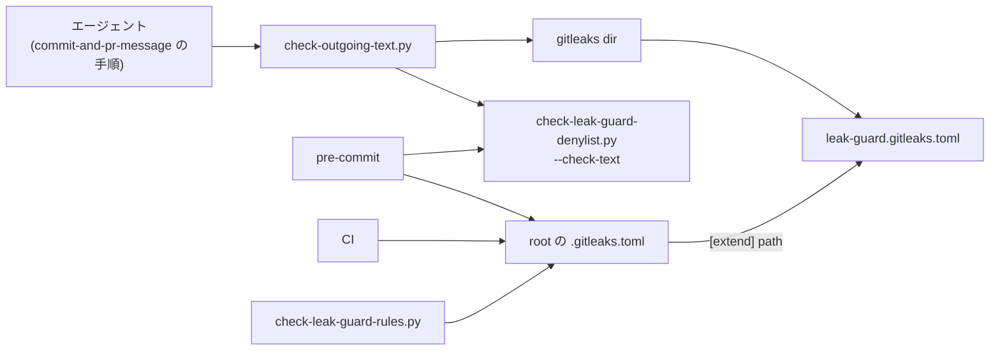

# ISSUE-58 spec: 公開される本文へ漏洩検査を通す手順を配布物に入れる

2026-09-17 のブレインストーミングとレビューで決めた設計のスナップショット。実装後の振る舞いの
canonical は各スクリプトの docstring とテストで、この文書は追従させない。

## 決定 (ユーザー裁定)

| 論点 | 決定 | 退けた案 |
|---|---|---|
| 当てる層 | 層 1 (形の決まったルール) と層 2 (禁止語リスト) の両方 | 層 2 だけ / 層 1 はプロジェクトの設定があれば呼ぶ |
| 当てる面 | `commit-and-pr-message` が扱う全ての面 | main に残る面だけ / それにコミット本文を足した形 |
| 検査が skip したとき | 常に止めてユーザーに確認する | 未検査と明記して進む / 宣言がある環境だけ止める |
| 届け方 | canonical を skill 側へ移し、入口を 1 本作る (案 A) | 入口を作らず手順に 2 コマンドを書く / root を canonical にして写しを同期する |
| noreply 形のアドレス | Anthropic の noreply アドレスだけを値で許可する | GitHub の noreply 形も許可する / どちらも許可しない |

層 1 を当てるのは下の実測 1 による。ISSUE-15 の spec は PR 本文に「手順の中で層 2 を呼ぶ」と
決めていたが、層 2 だけではユーザー名を含む絶対パスが素通りする。

GitHub の noreply 形を許可しないのは、ユーザー名を含むからである。Anthropic の noreply アドレスは
ベンダーの固定値で個人を指さない。配布先の既定の帰属行がこれを持つので、許可しないと検査が毎回
止まり、止まる検査は迂回される。

## 前提 (実測、2026-09-17、gitleaks 8.30.1)

1. 合成した PR 本文 3 本を両層へ通した。

   | 本文 | 層 2 | 層 1 (当時の `.gitleaks.toml`) |
   |---|---|---|
   | 清浄な本文 (対照) | 0 件 | no leaks |
   | ユーザー名を含む絶対パス | 0 件 | 1 件 |
   | メールアドレス | 2 件 | 1 件 |

2. gitleaks が `*gitleaks.toml` という名前のファイルを走査しないのは、既定 config の
   allowlist による。`useDefault = true` を持たない config ではどの階層の `.gitleaks.toml` も
   検出され、持つ config では `.gitleaks.toml` / `gitleaks.toml` / `leak-guard.gitleaks.toml` が
   階層を問わず外れた (対照の `other.toml` は検出)。当時の `.gitleaks.toml` のコメントは
   この除外を「ファイル名」に帰していた。既定の allowlist は `.bin` などの拡張子と固定の
   ファイル名でも除外する
3. `[extend] path` の相対パスは config ファイルではなく cwd を基準に解決される。cwd が
   ずれると `Failed to load config` の rc 1 で、レポートは作られない
4. extend は 2 段 (子 → `useDefault` を持つ中間) までなら、子と中間のルール、既定のルール、
   既定の除外がすべて効く。3 段にすると custom ルールは効いたまま、既定のルールと既定の除外が
   エラー無しで落ちる
5. config を読めないとき、stderr に config の絶対パスがそのまま出る。配布先の config は
   ホームディレクトリの下にあるので、ユーザー名が出力に載る
6. 帰属行の Anthropic の noreply アドレスと GitHub の noreply 形は `email-address` に当たる。
   セッション URL の行はどのルールにも当たらない
7. apm はパッケージ内の dot 始まりのファイルと実行ビットを展開先へ持ち込む
   (`windows-vm-verification/.gitignore`、`issue-id.py` の実行ビット)
8. 配布物の skill の手順はエージェントが実行するので、`${CLAUDE_SKILL_DIR}` 経由で同梱物に
   届く。`issue-scoped-artifacts` が「スクリプトを配る方式は採れない」とするのは git hook の
   経路の話で、この手順には掛からない
9. 層 2 の `--check-text` は、未設定でも検査済みでも rc 0 を返す。違いは stdout の
   `status=skipped` / `status=checked` の行だけにある。空ファイルは `status=checked lines=0` になる

## 配置と canonical

置き場は `plugins/dev-workflow/skills/commit-and-pr-message/scripts/`。先例は
`in-repo-issue` の `issue-id.py` で、canonical を plugin 配下に置き、このリポジトリの
pre-commit がそこを直接呼んでいる。

| ファイル | 由来 | 役割 |
|---|---|---|
| `check-outgoing-text.py` | 新規 | 入口。渡されたファイルへ層 1 と層 2 を当てて結果を束ねる |
| `check-leak-guard-denylist.py` | `scripts/` から移動 | 層 2 の canonical。追跡ファイルを見る入口も残す |
| `leak-guard.gitleaks.toml` | root の `.gitleaks.toml` から中身を移動 | 層 1 のルールの canonical。`useDefault = true` を持つので前提 2 の除外が効く |
| 単体テスト | 新規 / 移動 | 本体の隣に置く |

root の `.gitleaks.toml` は `[extend] path` だけを持つ。pre-commit と CI はどちらも cwd が
リポジトリ root なので、`-c .gitleaks.toml` のまま同じルールが効く (前提 3)。段数は 2 段で
止める (前提 4)。`.gitleaksignore` はこのリポジトリの履歴にだけ意味がある記録なので root に残す。

移すスクリプトとルールファイルの docstring とコメントは、配布先で読まれても偽にならない形へ
直す。このリポジトリの配線に由来する理由 (CI へ層 2 を取り付けない判断など) は、配線テストと
pre-commit のコメントへ移す。

## 入口の振る舞い

引数は 1 つ以上のファイル。層ごと・ファイルごとに状態を checked / skipped / unable の 3 つで持ち、
層の状態はファイル間で最も悪いものを採る。

| 層 | skipped | unable | checked |
|---|---|---|---|
| 1 | `gitleaks` が PATH に無い | 下の「層 1 の unable」のいずれか | canary の検出集合が期待と完全に一致し、レポートを読めた |
| 2 | stdout が `status=skipped` を持つ | rc が 0 でない / rc 0 なのに `status=checked` も `status=skipped` も無い | rc 0 で stdout が `status=checked` を持つ |

入力 (両層の前に確かめる): 読めない・通常ファイルでない・0 byte のものがあれば、両層とも unable。
0 byte を通すと、1 行のファイルを書き忘れたときに「検査済みの 0 件」になる。

層 1 の手順:

- 入力を連番の固定名 (`NNN.txt`) で一時ディレクトリへ写す。名前と拡張子による既定の除外
  (前提 2) を避けるためで、名前の形はテストで pin する。symlink は辿らず中身を写す
- 同じディレクトリに canary を 1 本置く。canary は同梱ルールのそれぞれに当たる行と、既定
  ルールに当たる行を 1 本ずつ持つ。値は実行時に組み立て、ユーザーパスの行は裸の形にする
- `gitleaks dir` を `--redact`、`--no-banner`、`--no-color`、`--report-format json`、
  `--report-path -` (レポートを stdout で受けてファイルを作らない)、`--gitleaks-ignore-path`
  (一時ディレクトリ。cwd の `.gitleaksignore` を効かせない) 付きで 1 回だけ呼ぶ
- stdout と stderr は捕捉し、どちらも出力へ流さない (前提 5)

層 1 の unable:

- 一時ディレクトリへ写せない
- gitleaks の rc が「検出あり」の値でない (canary があるので正常なら必ず検出がある)
- stdout を JSON として読めない
- canary の (行, ルール ID) の集合が期待と一致しない。既定ルールだけが効く状態、同梱ルールの
  一部が消えた状態、3 段 extend で既定が落ちた状態 (前提 4) がここで赤になる
- レポートに、写したどのファイルとも対応しない名前がある

入口自身の想定外の失敗は例外の型名だけを出して unable にする。未捕捉の例外は Python の既定で
rc 1 になり、「検出あり」に化けるうえ traceback にパスが載るので、入口の最上位で必ず受ける。

出力は層ごとの状態行と、検出ごとの座標 (何番目のファイルの何行目・どの層・層 1 ならルール ID /
層 2 ならリストの行番号) だけ。語、パス、一致した文字列、gitleaks と層 2 の生の出力は出さない。
レポートの `File` と `Fingerprint` も印字しない。

終了コードは次の優先順で 1 つに決める。

| 順 | 条件 | 終了コード |
|---|---|---|
| 1 | どれかの層に検出がある | 1 |
| 2 | どれかの層が unable | 2 |
| 3 | どれかの層が skipped | 3 |
| 4 | 両層とも checked で検出 0 件 | 0 |

## 手順 (SKILL.md)

全ての面で同じ 4 手にする。

1. 本文を Write で書く。インラインで渡す 1 行 (PR タイトル、merge の subject、Issue タイトル、
   リリースタイトル) もファイルへ書く
2. 入口へ通す (本文と 1 行のファイルを同時に渡す)
3. file 系フラグで渡す。1 行はファイルの中身をそのまま写す
4. 載ったことを確認する

| 終了コード | 行動 |
|---|---|
| 0 | 渡す |
| 1 | 下の「書き直し」に従い、2 からやり直す |
| 2 | 渡さずに止め、出力をそのままユーザーへ見せる |
| 3 | 渡さずに止め、未検査の層と理由を示して、このまま出してよいかをユーザーに確認する。承認が無ければ渡さない |
| 上記以外 (入口を起動できない等) | 渡さずに止める |

書き直し (rc 1):

- 示された行の該当部分を、綴りの言い換えや略称ではなく中立な表現へ置き換える。言い換えは
  「リストに無い語は通る」を自分で踏む形になる
- 禁止語リストを開かない。環境変数の値を表示しない (値のパス自体が私的な名前を含みがち)。
  候補の語を組み立てて入口に当てにいかない。どれも語を会話と書き捨てへ持ち込む
- どの部分か読み取れないとき、2 回書き直しても 1 が続くとき、harness が指示した行に当たったときは、
  書き直さずに座標だけを示してユーザーに聞く。harness の行を黙って落とさない

検査が見るのは形とリストに載った語だけなので、渡す前に自分で読む。この注意は release skill
から移す。SKILL.md の表と入口の終了コードの定数が一致することはテストで pin する。

## このリポジトリ側の追従

| 対象 | 変更 |
|---|---|
| `.pre-commit-config.yaml` | 層 2 の hook 2 本の entry を新しいパスへ。`leak-guard-rules` の `files:` に同梱のルールファイルを足す |
| `.gitleaks.toml` | `[extend] path` だけにし、cwd 基準であることと段数の上限を注記する |
| `leak-guard.gitleaks.toml` | `email-address` の allowlist に Anthropic の noreply アドレスを値で足す。除外の出所 (前提 2) を正しく書き直す |
| `scripts/check-leak-guard-rules.py` | ルール ID は同梱のルールファイルから読む。gitleaks へは root の `.gitleaks.toml` を cwd = root で渡し、実際の経路 (extend) ごと対照で見る。既定ルールの検出ケースを 1 本、noreply の許可と GitHub noreply の検出のケースを足す |
| CI | gitleaks の導入を `scripts/ci/install-gitleaks.sh` (版と sha256 の canonical) へ切り出し、leak-guard job と python-tests job の両方から呼ぶ |
| release skill | 手順 3 と 4 の検査コマンドを外し、`commit-and-pr-message` の手順を名指しする。「この面を見る機会はここにしか無い」という理由は残す |
| CLAUDE.md | canonical 表と本文の漏洩検査のパスを新しい置き場へ |
| `commit-and-pr-message` の frontmatter | 検査を足し、README を再生成する |
| `plugin.json` | version は据え置く (作成以来上げていない慣習に合わせる) |
| manifest 2 本 | Python テストと漏洩ケースを再生成する |
| `run_check_text` の docstring | 「spec の実装順序 5 (未実装)」を今回の実装へ向け直す |

既定ルールの検出ケースは `SHOULD_DETECT` へは入れず別の並びに置く。`SHOULD_DETECT` が名指す
ルールは `.gitleaks.toml` の custom ルール集合との一致を要求されているためである。

## テスト

入口の単体テストは本体の隣に置き、実物の gitleaks とテスト内で作る架空語の禁止語リストで
判定表を pin する。合成したユーザーパスとメールアドレスは、テストファイル自身が層 1 に
捕まらないよう変数から組み立てる (先例は `scripts/check-leak-guard-rules.py`)。

| 状況 | 期待 |
|---|---|
| 両層とも検出 0 件 | 0 |
| 層 1 だけ検出 | 1 |
| 層 2 だけ検出 | 1 |
| `gitleaks` が PATH に無い | 3、層 1 が skipped |
| 環境変数が未設定 | 3、層 2 が skipped |
| 同梱ルールの 1 本を欠いた config / 既定ルールを欠いた config | 2 |
| config が読めない / ファイルが無い / 引数が無い / 0 byte の入力 | 2 |
| 層 2 が rc 0 で状態行を出さない | 2 |
| 片方の層で検出、もう片方が unable | 1 |
| 複数ファイルのうち 1 本だけが層 2 で unable | 2 |
| 入力の名前が `*gitleaks.toml` / `.bin` | 走査される |
| 帰属行の Anthropic noreply / GitHub noreply | 0 / 1 |
| 出力 (config を読めない場合を含む) | 語・パス・一致文字列・gitleaks の生の出力を含まない |

このほかに次を置く。

- SKILL.md の表と入口の終了コード定数の一致
- 配線テスト (`scripts/`): pre-commit の新しいパス、CI が層 2 を呼ばないこと、root の
  `.gitleaks.toml` が `[extend] path` だけを持ち、その指し先が実在すること
- 変異注入: canary の確認を外す / 写すときの改名を外す / 優先順を入れ替える / gitleaks の
  stderr を出力へ流す、のそれぞれで赤になることを確かめる
- live smoke: この変更の PR 自身の本文とタイトルを入口へ通してから作る

python-tests job に gitleaks を入れるのは、実物で回すテストを skip させないためである
(runner は skip を赤にする)。

## 既知の限界

- 1 行のファイルとインラインで渡す値が一致することは手順が保証するだけで、検査しない
- GitHub の画面上での編集と、手順を踏まない主体が送る本文は通らない
- リストに無い語と、組み合わせで対象を特定する書き方は通る
- 起動元に環境変数が届かない環境では層 2 が skip する。この場合は手順が止まって確認を求める
- cwd が root でない場所から `gitleaks -c .gitleaks.toml` を打つと extend が解決できず止まる。
  静かに素通りはしない
- extend の段数を増やすと既定が静かに落ちる (前提 4)。入口の canary と対照検査の既定ルールの
  ケースが赤にするが、段数そのものは root のコメントで止めている
- 一時ディレクトリは SIGKILL では消えない。残るのは本人の本文で、置き場はユーザーごとの
  一時領域なので公開面ではない
- このリポジトリの commit-msg hook は層 2 だけを見る。コミット本文に層 1 が当たるのは
  エージェントの手順を通したときだけ

## 見送ったもの

- gitleaks のログにある走査バイト数を、写したバイト数と突き合わせる案。ファイル単位の未走査を
  機構に依らず検出できるが、ログの文面は版で変わる。未走査を生む名前と拡張子による除外は、
  固定名で写すことと、その形の pin で塞いでいる

## 範囲外

- 配布先の pre-commit への取り付け (ISSUE-32 の層 2 と dotfiles の ISSUE-86 が扱う)
- 公開される本文への Issue 記法の検査 (`in-repo-issue` の規約の側の話)
- 配布物が配布先で成立しているかを見る観点の設計 (ISSUE-61)
