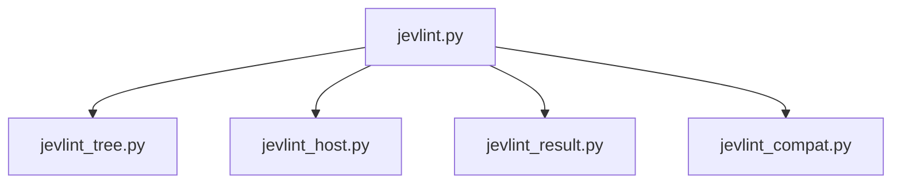

# jev-lint-curated Implementation Plan

> For agentic workers: REQUIRED SUB-SKILL: Use superpowers:subagent-driven-development (recommended) or superpowers:executing-plans to implement this plan task-by-task. Steps use checkbox (`- [ ]`) syntax for tracking.

Goal: jev-lint 0.7.0 を、厳選した 27 項目の rule と、コミット済みの内容だけを送る境界と、キー無しの版の互換検査を持つ単体 skill `skills/tooling/jev-lint-curated/` として取り込む。

Architecture: 入口 `jevlint.py` が引数を検査して、展開 (`jevlint_tree.py`)、host (`jevlint_host.py`)、結果 (`jevlint_result.py`)、compat (`jevlint_compat.py`) を組み立てる。上流はリポジトリの外の host ディレクトリへキー無しで入れ、対象のコミットを checkout 無しの worktree に blob の生のバイトで書き出し、その中で node から直接起動する。上流の終了コードは使わず、JSON と記録から終了コードを決める。

Tech Stack: Python 3.9 以上の標準ライブラリ (subprocess、json、tempfile、pathlib、difflib、hashlib、signal)、unittest、git、pnpm (host の用意だけ)、node 24 以上 (上流の起動)。

Spec: `docs/issues/ISSUE-65_jev-lint の採用方式を決めて取り込む/ISSUE-65-spec.md` (009cc8e)。各タスクの実装役は spec の該当節も読むこと。この plan は spec の決定を再掲せず、タスクへの割り付けと、インターフェースと、テストケースを持つ。

## Global Constraints

- どのスクリプトも標準ライブラリだけで、Python 3.9 で動く書き方にする (先頭の文は `from __future__ import annotations`、`tomllib` や `match` を使わない)
- テストは unittest。runner (`scripts/run-python-tests.py`) は skip と expectedFailure と 0 件を赤にする。ネットワーク、pnpm、node、キーに依存させない。git は本物を使い、`GIT_*` を落とした env から起動する
- 上流の版の pin は `jevlint.py` の定数 1 箇所だけ (0.7.0)。厳選の一覧も同じ。ほかのモジュールへは引数で渡す
- 上流の起動の末尾の固定部分は `--json --config <一時ディレクトリ内> --cache none --retry 3 --model jev-latest --base-url https://api.typesafe.ai` で、この順で argv の最後に置く
- 上流と、ラッパ自身の git に渡す env は組み立てる。入れるのは `PATH`、`HOME`、`TMPDIR`、`LANG` と `LC_*`、キーが要るときだけ `TYPESAFE_API_KEY`
- pnpm には worktree も消費側のリポジトリも cwd として渡さない
- コメントは日本語で WHY を書く。外部コマンドの癖に由来する実装は実測した内容を添える (CLAUDE.md の「コードとコメント」)
- PUBLIC なリポジトリなので、テストの fixture にも絶対パス、メールアドレス、private なリポジトリの名前を書かない
- 利用者への出力は日本語。キーの値はどの出力にも出さない

## Review Focus

spec が名指していないが、使う人が踏みやすい入力と、そのときに期待される振る舞い。各行のテストは括弧内のタスクに足してある。

1. 日本語や空白を含むファイル名: 書き出しでも、パスの検査でも、要約の表示でもそのまま扱える (Task 2、Task 3、Task 5)
2. リポジトリのサブディレクトリからの起動: パスは root からの相対として解釈され、結果は root から起動したときと同じ (Task 6)
3. 解決できない ref (存在しない名前、shallow clone で base のコミットが無い、コミットが 1 つも無いリポジトリ): 終了コード 2 と、どの ref かを名指すメッセージ (Task 2)
4. 数 MB の blob: `cat-file --batch` の読み取りで切れずに同一のバイトが書かれる (Task 3)
5. `HOME` も `XDG_CACHE_HOME` も無い env: host の置き場を決められないことを名指す終了コード 2 (Task 4)

## ファイルの構成

- Create: `skills/tooling/jev-lint-curated/SKILL.md`
- Create: `skills/tooling/jev-lint-curated/scripts/jevlint.py` (入口、定数、設定の生成、check/review/compat の組み立て)
- Create: `skills/tooling/jev-lint-curated/scripts/jevlint_tree.py` (ref の解決、パスの検査、worktree、blob の書き出し、後始末、signal)
- Create: `skills/tooling/jev-lint-curated/scripts/jevlint_host.py` (env の組み立て、host の用意と再利用、node と engines、上流の argv と起動)
- Create: `skills/tooling/jev-lint-curated/scripts/jevlint_result.py` (判定と要約)
- Create: `skills/tooling/jev-lint-curated/scripts/jevlint_compat.py` (rules の表、比較、diff)
- Create: 各モジュールの `test_<module>.py` を同じディレクトリに置く
- Modify: `scripts/check-issue-closure.py:305-306` (`children` の改名)
- Modify: `scripts/test_check_related_refs.py:782,790` (`INHERITED` の改名)
- Modify: `docs/issues/ISSUE-65_jev-lint の採用方式を決めて取り込む/issue.md`
- Regenerate: `README.md` (`python3 scripts/gen-readme.py`)、`scripts/python-tests-manifest.txt` (`python3 scripts/run-python-tests.py --update-manifest`)

モジュールの依存は入口から下へだけ向く。下のモジュールどうしは import し合わない。



## 進め方

コミットはコントローラが行う。各タスクの実装役は実装と、テストの緑と、変異注入 (pin した仕組みを壊すとテストが赤くなることの確認) までを持ち、コミットしない。コントローラは各タスクの境界で、そのタスクのテストファイルと `python3 scripts/run-python-tests.py --update-manifest` と `pre-commit run --all-files` を回し、実装役の報告と `git status` を突き合わせてからコミットする。コミット本文は `dev-workflow:commit-and-pr-message` の手順でファイルに書いて検査を通し、プレフィックスには `(wip)` を付ける (例: `feat(wip): ...`)。

単体のテストファイルの回し方 (テストはモジュールと同じディレクトリを cwd にして起動する):

```bash
cd skills/tooling/jev-lint-curated/scripts && python3 -m unittest test_jevlint_tree -v
```

## Task 1: 入口の定数、設定の生成、引数の検査

Files:
- Create: `skills/tooling/jev-lint-curated/SKILL.md` (骨組み。本文は Task 8)
- Create: `skills/tooling/jev-lint-curated/scripts/jevlint.py`
- Test: `skills/tooling/jev-lint-curated/scripts/test_jevlint.py`
- Regenerate: `README.md`

SKILL.md をこのタスクで作るのは、`scripts/check-package-shape.py` が `skills/<category>/<name>/` に SKILL.md の無いディレクトリを違反にするため (`:117-119`)。無いままだと、このタスクのコミットが pre-commit で止まる。frontmatter の `name` (`jev-lint-curated`) と `description` は最終の形で書き、本文は目的の 1 段落だけにする。

Interfaces:
- Produces:
  - `UPSTREAM_VERSION: str = "0.7.0"`
  - `CURATED: tuple[str, ...]`: `<languageDir>/<id>` の 27 項目 (spec の「厳選する rule」。typescript 7、rust 5、python 7、moonbit 7、javascript/comment-describes-declaration)
  - `build_config(thresholds: dict[str, float]) -> dict`: `{"rules": {key: "on" | {"threshold": v}}}`
  - `parse_threshold(text: str) -> tuple[str, float]`: `<lang>/<id>=<値>` を分け、厳選の外か 0 以下か 1 以上なら `UsageError`
  - `parse_version(text: str) -> str`: `^\d+\.\d+\.\d+$` のみ。違えば `UsageError`
  - `class UsageError(Exception)`: 引数の誤り (終了コード 2)
  - `parse_args(argv: list[str]) -> argparse.Namespace`: サブコマンド `check` (`--commit`、1 つ以上の `paths`)、`review` (`--base` 必須、`--commit`、0 個以上の `paths`)、`compat` (`version`)。`check` と `review` は `--dry-run`、`--exclude` (append)、`--threshold` (append)、`--json-out`。`allow_abbrev=False`。未知の引数と、`-` で始まる位置引数は `UsageError`

- [ ] Step 1: 失敗するテストを書く。テストケース:
  - `CURATED` が 27 項目で重複が無く、言語ごとの数が typescript 7、rust 5、python 7、moonbit 7、javascript 1。rust に pure-name-is-pure と tests-cover-failure-paths が無い。go の項目が無い
  - `build_config({})` のキーが `{"rules"}` だけで、値が全て `"on"`。禁止したキー (`baseUrl`、`apiKeyEnv`、`languages`、`cache`、`model`、`files`) がどの階層にも無い
  - `build_config({"python/var-name-describes-value": 0.6})` はその項目だけ `{"threshold": 0.6}`
  - `parse_threshold`: 受理 `python/var-name-describes-value=0.6`。拒否 `go/var-name-describes-value=0.5` (厳選の外)、`var-name-describes-value=0.5` (言語修飾なし)、`=0`、`=1`、`=1.5`、`=-0.1`、`=nan`、`=abc`、`=` の無い形
  - `parse_version`: 受理 `0.7.0`、`10.20.30`。拒否 `latest`、`0.7`、`v0.7.0`、`0.7.0-beta`、`0.7.0 `、`../0.7.0`
  - `parse_args`: `init`、`run`、`eval` を拒否。`check` の位置引数が 0 個なら拒否。`review` の `--base` が無ければ拒否。`--thresh` (短縮) を拒否。`check -- -x` と `check -x` を拒否
  - Python 3.9 の構文: 同じディレクトリの `jevlint*.py` と `test_jevlint*.py` を glob し、1 本以上あることを確かめてから、それぞれ `ast.parse(..., feature_version=(3, 9))` で解析し、先頭の文 (docstring の次) が `from __future__ import annotations` であること、`tomllib` を import しないこと (前例は `plugins/dev-workflow/skills/commit-and-pr-message/scripts/test_check_outgoing_text.py` の `test_py39_source`)
- [ ] Step 2: テストが赤いことを確かめる (`python3 -m unittest test_jevlint -v`、ImportError か AttributeError で落ちる)
- [ ] Step 3: 実装する。docstring に入口の役割と終了コードの意味を書く (canonical になる)。CURATED の各行の WHY は spec の測定を指すコメント 1 つにまとめ、件数を再掲しない
- [ ] Step 4: テストが緑になることを確かめる
- [ ] Step 5: 変異注入: `CURATED` から 1 項目を消す、`build_config` に `"cache": "none"` を足す、`parse_threshold` の範囲を `<= 1` にする、のそれぞれでテストが赤くなることを確かめて戻す
- [ ] Step 6: SKILL.md の骨組みを書き、`python3 scripts/gen-readme.py` で README を生成して、`python3 scripts/check-package-shape.py` が通ることを確かめる
- [ ] Step 7: コントローラがコミットする

## Task 2: ref の解決とパスの検査

Files:
- Create: `skills/tooling/jev-lint-curated/scripts/jevlint_tree.py`
- Test: `skills/tooling/jev-lint-curated/scripts/test_jevlint_tree.py`

Interfaces:
- Produces:
  - `class TreeError(Exception)`: 展開と検査の失敗 (終了コード 2)。メッセージは対象 (ref やパス) を名指す
  - `repo_root(cwd: Path, env: dict) -> Path`: `git rev-parse --show-toplevel`
  - `resolve_commit(root: Path, ref: str, env: dict) -> str`: `-` で始まる ref は `TreeError`。`git -C <root> rev-parse --verify --quiet <ref>^{commit}` の 40 桁 (SHA-256 のリポジトリなら 64 桁) を返し、失敗は `TreeError`
  - `normalize_path(text: str) -> str`: 先頭の `./`、重なった `/`、末尾の `/` を正規化し、`.` と空は `""` (root) を返す。絶対パス、成分としての `..`、`-` で始まるものは `TreeError`
  - `path_in_commit(root: Path, sha: str, path: str, env: dict) -> bool`: `path == ""` は True。それ以外は `git -C <root> ls-tree -z <sha> -- <path>` の出力が空でないか
- Consumes: env は呼び出し側が組み立てて渡す (Task 4 の `build_env`)。テストでは `GIT_*` を落とした `os.environ` の写しを使う

- [ ] Step 1: 失敗するテストを書く。一時的な git リポジトリ (`git init`、`user.name` と `user.email` はリポジトリの設定に架空の値を入れる) を setUp で作る。テストケース:
  - `normalize_path`: `.` と `./` と `""` → `""`。`./a//b/` → `a/b`。`a/b` → `a/b`。拒否 `/abs`、`../x`、`a/../b`、`a/..`、`-x`
  - `normalize_path` は `a..b.py` と `日本語 ファイル.py` を受理する (部分文字列ではなく成分で判定する)
  - `resolve_commit`: `HEAD` は 40 桁の SHA、タグ名と短い SHA も解決できる。拒否 `no-such-ref`、`--all`、`-h`、コミットでない object (blob の SHA)
  - コミットが 1 つも無いリポジトリで `resolve_commit(root, "HEAD", env)` は `TreeError` で、メッセージに `HEAD` を含む
  - shallow clone (`git clone --depth 1 file://<一時リポジトリ>`) で、元のリポジトリの最初のコミットの SHA を `resolve_commit` すると `TreeError` で、メッセージにその SHA を含む
  - `path_in_commit`: 追跡しているファイルとディレクトリは True、未追跡のファイルと存在しない名前は False、`""` は True、`日本語 ファイル.py` (コミット済み) は True
  - サブディレクトリを cwd にしても `repo_root` が root を返す
- [ ] Step 2: 赤を確かめる
- [ ] Step 3: 実装する。git は `subprocess.run([...], env=env, capture_output=True)` で起動し、`shell=True` を使わない
- [ ] Step 4: 緑を確かめる
- [ ] Step 5: 変異注入: `normalize_path` の `..` の判定を部分文字列にする (`a..b.py` のテストが赤)、`resolve_commit` の `-` の拒否を外す (`--all` のテストが git の挙動次第で赤にならないなら、テストが `TreeError` の送出元を区別していない。区別できる形に直す)
- [ ] Step 6: コントローラがコミットする

## Task 3: blob の書き出しと後始末

このタスクは送る範囲の境界そのものなので、Subagent-Driven では実装役に Fable を使う候補である (CLAUDE.md の委譲の節。1 タスク 1 体まで)。

Files:
- Modify: `skills/tooling/jev-lint-curated/scripts/jevlint_tree.py`
- Modify: `skills/tooling/jev-lint-curated/scripts/test_jevlint_tree.py`

Interfaces:
- Consumes: Task 2 の `TreeError`、`resolve_commit`
- Produces:
  - `validate_tree_paths(paths: list[str]) -> None`: 絶対パス、成分の `..`、`casefold()` が `.git` の成分、`casefold()` が等しい 2 つのパスのどれかで `TreeError`
  - `materialize(root: Path, sha: str, dest: Path, env: dict) -> int`: `git -C <root> ls-tree -r -z --full-tree <sha>` を読み、`validate_tree_paths` を通してから、mode 100644 と 100755 と 120000 の blob を `git -C <root> cat-file --batch` の生のバイトで `dest/<path>` に書く (120000 はリンク先の文字列を中身にした通常ファイル)。160000 は書かない。書いた本数を返す
  - `class Expanded`: `tree: Path` (worktree)、`scratch: Path` (worktree の外の書き捨て置き場。設定と記録を置く)
  - `expanded_commit(root: Path, sha: str, env: dict) -> ContextManager[Expanded]`: 一時ディレクトリ (`tempfile.mkdtemp`) に空の hooks ディレクトリと `scratch` を作り、`git -C <root> -c core.hooksPath=<空> worktree add --detach --no-checkout <tmp>/tree <sha>` → `git -C <tmp>/tree read-tree <sha>` → `materialize` → root の `sgconfig.yml` と `sgconfig.yaml` を消して stderr に 1 行 → `<tmp>/tree` の祖先に sgconfig があれば `TreeError`。`Expanded` を yield し、抜けるときに `git -C <root> worktree remove --force <tmp>/tree`、失敗したら `shutil.rmtree` と `git -C <root> worktree prune`、最後に一時ディレクトリを消す
  - `signals_as_exceptions() -> ContextManager[None]`: SIGTERM と SIGHUP を `KeyboardInterrupt` の派生例外に変え、抜けるときに元のハンドラへ戻す
  - `count_suffix(tree: Path, paths: list[str], suffix: str) -> int`: 対象のパス (空なら全体) の下にある `suffix` のファイルの本数

`cat-file --batch` の読み方の形 (この形が仕様。ヘッダの行を読んでから、宣言された大きさだけを読み、区切りの改行を 1 つ読む):

```python
proc.stdin.write(sha.encode() + b"\n"); proc.stdin.flush()
header = proc.stdout.readline()          # b"<sha> blob <size>\n"
size = int(header.split()[2])
data = proc.stdout.read(size)            # 大きな blob でも size ぶんを読み切る
proc.stdout.read(1)                      # 区切りの b"\n"
```

- [ ] Step 1: 失敗するテストを書く。一時的な git リポジトリに次をコミットしておく: 通常のファイル、実行ビットのあるファイル、日本語と空白を含む名前のファイル、リポジトリの外を指す symlink、`.gitattributes` で `filter=up` を付けたファイル (リポジトリの設定で `filter.up.smudge` を大文字化の `tr` にする)、`sgconfig.yml`、5 MB の blob、`.git/hooks/post-checkout` に目印のファイルを書く hook。テストケース:
  - 書き出したファイルごとに、中身が `git cat-file blob <sha>:<path>` と同一
  - symlink は通常ファイルで、中身はリンク先の文字列
  - filter の付いたファイルが大文字化されていない
  - `sgconfig.yml` が消え、stderr に 1 行出ている
  - post-checkout の目印が書かれていない
  - 5 MB の blob が同一のバイト
  - `validate_tree_paths`: 拒否 `/abs`、`a/../b`、`.GIT/config`、`sub/.Git`、`A.py` と `a.py` の組。受理 `a..b.py`、`.github/x`、`.gitignore`
  - `.GIT` を含む tree を `git mktree` (名前を拒否するなら `git hash-object -t tree --literally -w`) で作り、そのコミットの `materialize` が `TreeError` で、dest に何も書かれていない
  - 後始末: `expanded_commit` の中で (a) 例外を投げる (b) `KeyboardInterrupt` を投げる (c) `signals_as_exceptions` の中で自分に SIGTERM を送る、のそれぞれで、抜けた後に `git worktree list --porcelain` に一時ディレクトリが無く、一時ディレクトリ自体も無い
  - `count_suffix`: `.mbt` を 2 本置いたコミットで、対象 `""` なら 2、別のディレクトリなら 0
- [ ] Step 2: 赤を確かめる
- [ ] Step 3: 実装する。`validate_tree_paths` は書き出しを始める前に全件に対して通す (途中まで書いてから止めない)
- [ ] Step 4: 緑を確かめる
- [ ] Step 5: 変異注入: `--no-checkout` と `core.hooksPath` を両方外して `worktree add` に checkout させる (hook の目印と filter のテストが赤)、symlink を `os.symlink` で作る、`casefold()` を外す、`finally` の `worktree remove` を外す、のそれぞれで対応するテストが赤くなることを確かめて戻す。`core.hooksPath` だけを外しても赤くならないのは正しい (`--no-checkout` の worktree add は post-checkout を走らせないので、二重の防御の片方を外しただけになる)。実装役はこれを実測して報告する
- [ ] Step 6: コントローラが、このリポジトリで `expanded_commit` を一度だけ手で通し (HEAD を展開して本数を数え、`git worktree list` が元に戻ることを見る)、コミットする

## Task 4: env、host、node、上流の起動

Files:
- Create: `skills/tooling/jev-lint-curated/scripts/jevlint_host.py`
- Test: `skills/tooling/jev-lint-curated/scripts/test_jevlint_host.py`

Interfaces:
- Produces:
  - `class HostError(Exception)`: 終了コード 2
  - `build_env(source: Mapping[str, str], with_key: bool) -> dict[str, str]`: `PATH`、`HOME`、`TMPDIR`、`LANG`、`LC_` で始まる変数を写し、`with_key` なら `TYPESAFE_API_KEY` も写す
  - `install_env(source: Mapping[str, str]) -> dict[str, str]`: `source` から `TYPESAFE_`、`TYPESAFEAI_`、`JEV_LINT_` で始まる変数を落とした写し
  - `key_status(source: Mapping[str, str]) -> str`: `"ok"`、`"missing"` (前後の空白を落として空)、`"legacy-only"` (`TYPESAFEAI_API_KEY` だけがある)
  - `host_dir(version: str, source: Mapping[str, str]) -> Path`: `XDG_CACHE_HOME`、無ければ `HOME/.cache` の下の `jev-lint-curated/<version>`。どちらも無ければ `HostError`
  - `prepare_host(version: str, source: Mapping[str, str], run: Callable = subprocess.run) -> Path`: 再利用できればそれを返す。できなければ、host の親に `tempfile.mkdtemp(dir=親, prefix=".tmp-")` を作って `package.json` (`{"private": true}`) を書き、`run(["pnpm", "add", "--allow-build=@ast-grep/cli", f"jev-lint@{version}"], cwd=一時, env=install_env(source))` が 0 を返したら、古い host を消して rename で置く。0 以外なら一時ディレクトリを消して `HostError`。host の祖先に `pnpm-workspace.yaml` があれば `HostError`
  - `host_reusable(host: Path, version: str) -> bool`: `node_modules/jev-lint/package.json` の `version` が一致し、`node_modules/jev-lint/dist/cli.js` がある
  - `parse_node_version(text: str) -> tuple[int, int, int]`: `v24.18.0\n` の形
  - `engines_ok(engines: str, version: tuple[int, int, int]) -> bool`: `^>=\d+(\.\d+){0,2}$` だけを判定し、それ以外の形は `HostError`
  - `read_engines(host: Path) -> str`: `node_modules/jev-lint/package.json` の `engines.node`。無ければ `HostError`
  - `upstream_argv(node: str, host: Path, sub: str, *, base: str | None, excludes: list[str], paths: list[str], dry_run: bool, record: Path | None, config: Path) -> list[str]`
  - `fixed_tail(config: Path) -> list[str]`: Global Constraints の固定部分 (11 要素)

`upstream_argv` の並びの形 (この順が仕様):

```python
[node, str(host / "node_modules/jev-lint/dist/cli.js"), sub,
 *(["--base", base] if base else []),
 *[x for e in excludes for x in ("--exclude", e)],
 *paths,
 *(["--dry-run"] if dry_run else []),
 *(["--record", str(record)] if record else []),
 *fixed_tail(config)]
```

- [ ] Step 1: 失敗するテストを書く。テストケース:
  - `build_env`: 入力に `NODE_OPTIONS`、`HTTPS_PROXY`、`NODE_TLS_REJECT_UNAUTHORIZED`、`NODE_EXTRA_CA_CERTS`、`GIT_DIR`、`JEV_LINT_AST_GREP`、`TYPESAFEAI_API_KEY`、`TYPESAFE_BASE_URL`、`TYPESAFE_API_KEY` を入れ、`with_key=False` の出力のキーが許可の集合の部分集合でキーを含まないこと、`with_key=True` で `TYPESAFE_API_KEY` だけが増えること
  - `install_env`: `TYPESAFE_API_KEY`、`TYPESAFEAI_API_KEY`、`JEV_LINT_CACHE` が落ち、`HTTPS_PROXY` と `PATH` は残る
  - `key_status`: `"abc"` → ok、`""` と `"  \n"` と未設定 → missing、`TYPESAFEAI_API_KEY` だけ → legacy-only
  - `host_dir`: `XDG_CACHE_HOME` が優先、無ければ `HOME/.cache`、両方無ければ `HostError`
  - `prepare_host`: 偽の `run` を渡し、(a) 呼ばれた argv が上の形で pnpm の後に `jev-lint@0.7.0` が来る (b) cwd が host と同じ親の一時ディレクトリで、テスト用に作った「消費側のリポジトリ」の外 (c) env にキーが無い (d) 偽の `run` が 1 を返すと host の名前の下にも一時ディレクトリにも何も残らない (e) 偽の `run` が `node_modules/jev-lint/package.json` と `dist/cli.js` を作って 0 を返すと host に rename される (f) 再利用できる host があると `run` を呼ばない (g) version が違う host は作り直す (h) host の祖先に `pnpm-workspace.yaml` を置くと `HostError`
  - `parse_node_version` と `engines_ok`: `v24.18.0` と `>=24` → True、`v22.1.0` と `>=24` → False、`>=24.1` と `v24.0.5` → False、`^24`、`>=24 <26`、`*` → `HostError`
  - `upstream_argv`: argv に `pnpm` を含まない、最後の 11 要素が固定部分と一致する、`--base` の値が渡した SHA、`--dry-run` のとき `--record` が無い
- [ ] Step 2: 赤を確かめる
- [ ] Step 3: 実装する。`prepare_host` のコメントに、pnpm を worktree で起動しない理由 (消費側の `.npmrc` の registry が効く) と、一時ディレクトリから rename する理由を実測の出所とともに書く
- [ ] Step 4: 緑を確かめる
- [ ] Step 5: 変異注入: `build_env` を `dict(source)` にする、`install_env` がキーを落とさない、`prepare_host` の cwd を呼び出し側の cwd にする、固定部分を argv の先頭へ移す、のそれぞれでテストが赤くなることを確かめて戻す
- [ ] Step 6: コントローラが、キー無しで `prepare_host("0.7.0", os.environ)` を実環境で一度通し、`node <host>/node_modules/jev-lint/dist/cli.js rules --json --no-config` を空の一時ディレクトリで起動して rule が 103 件返ることを確かめる (rename した host で ast-grep が解決できるかは実測でしか分からない)。そのあとコミットする

## Task 5: 結果の判定と要約

Files:
- Create: `skills/tooling/jev-lint-curated/scripts/jevlint_result.py`
- Test: `skills/tooling/jev-lint-curated/scripts/test_jevlint_result.py`

Interfaces:
- Produces:
  - `REQUIRED = ("findings", "stats.subjects", "stats.missing", "errors")`
  - `class Outcome`: `code: int`、`reason: str`、`doc: dict | None`、`record: dict | None`
  - `classify(rc: int, stdout: str, record_text: str | None, dry_run: bool) -> Outcome`: spec の「結果の要約と終了コード」の 2〜9 行目を上から順に判定する (1 行目は呼び出し側)
  - `summarize(outcome: Outcome, *, sha: str, version: str, curated: tuple[str, ...], mbt_count: int, dry_run: bool) -> str`

判定のデシジョンテーブル (テストはこの行ごとに 1 件以上):

1. rc 2 → 2
2. rc 134 (0、1、3 以外) → 2
3. rc 0、stdout が `not json` → 2
4. dry_run、`{"dryRun": true, "subjects": 5, "usd": 0.01}` → 0
5. dry_run、`{"dryRun": true}` (subjects なし) → 2
6. 非 dry_run、`stats.missing` が無い → 2 (`stats.subjects`、`findings`、`errors` もそれぞれ 1 件ずつ)
7. 非 dry_run、必須はそろうが `record_text` が None か JSON でない → 2
8. `stats.missing` 3、findings 0 → 3
9. `errors` 1 件、findings 2 件、上流の rc 1 → 3
10. 不完全なし、findings 1 件、上流の rc 1 → 1
11. 不完全なし、findings 0 件、上流の rc 0 → 0
12. 不完全なし、findings 0 件、上流の rc 3 → 3 にしない。`errors` が空なら 0 (上流の rc は使わない)

- [ ] Step 1: 失敗するテストを書く。判定の 12 行に加えて、`summarize` のテストケース:
  - SHA、版、モデルが出る。記録の `model` が null なら「応答なし」、dry_run ならモデルの行が無い
  - `stats.subjects`、ファイル数 (`stats.byFile` のキーの数)、`missing`、`errors` の件数と先頭の `error`、`degraded` の件数、`spent.usd` と `spent.calls` が出る
  - `ignored` (subjects が 0 でない例)、`unpaired.subjects`、`silentRules` のうち `curated` に含まれるものだけ、`idleLanguages` が出る
  - `mbt_count` が 2 なら「.mbt 2 本は parser が無いので見ていない」、0 なら出ない
  - 指摘の行が `<file>:<line> <rule> <value>/<cutoff>` で、日本語と空白を含むファイル名もそのまま出る
  - 終了コード 3 のとき「N 件は答えが無い」が最初の指摘の行より前にある
  - dry_run のとき、SHA と版、`subjects` の件数、`usd`、聞く前に落とした量 (`ignored`、`unpaired`、`silentRules`、`idleLanguages`) が出る
- [ ] Step 2: 赤を確かめる
- [ ] Step 3: 実装する。必須キーの読み方は寛容にしない (`.get(key, 0)` を使わない) 理由をコメントに書く
- [ ] Step 4: 緑を確かめる
- [ ] Step 5: 変異注入: 判定 8 と 10 の順を入れ替える、必須キーを `.get` で読む、`silentRules` の絞り込みを外す、のそれぞれでテストが赤くなることを確かめて戻す
- [ ] Step 6: コントローラがコミットする

## Task 6: check と review の組み立て

Files:
- Modify: `skills/tooling/jev-lint-curated/scripts/jevlint.py`
- Modify: `skills/tooling/jev-lint-curated/scripts/test_jevlint.py`

Interfaces:
- Consumes: Task 1 の `parse_args`、`build_config`、`UsageError`、Task 2 と 3 の `jevlint_tree` の全関数、Task 4 の `jevlint_host` の全関数、Task 5 の `classify` と `summarize`
- Produces:
  - `main(argv: list[str], *, environ: Mapping[str, str] | None = None, cwd: Path | None = None, run_pnpm: Callable = subprocess.run, run_upstream: Callable = subprocess.run, which: Callable = shutil.which) -> int`: `environ` と `cwd` の None は `os.environ` と `Path.cwd()` を呼び出しの時点で読む (既定値を import の時点で固めない)。`run_upstream` は `subprocess.run` と同じ呼び方 (`stdout=subprocess.PIPE, text=True`) で呼ぶ
  - `if __name__ == "__main__": sys.exit(main(sys.argv[1:]))`

`main` の check と review の順序 (この順が仕様。spec のフローチャートと同じ):

1. `parse_args` → `repo_root` → `resolve_commit` (`--commit`、既定 `HEAD`) と `resolve_commit` (`--base`) → `normalize_path` と `path_in_commit`
2. `prepare_host` (キー無し) → `which("node")` を 1 度だけ解決 → `parse_node_version` と `engines_ok`
3. dry_run でなければ `key_status` が ok であること (missing と legacy-only はそれぞれのメッセージで 2)
4. `signals_as_exceptions` と `expanded_commit` の中で、`Expanded.scratch` に `build_config` の JSON (と非 dry_run なら記録の置き場) を置き、`upstream_argv` を `run_upstream(argv, cwd=worktree, env=build_env(environ, with_key=not dry_run), stdout=PIPE)` で起動する (stderr は流す)
5. `classify` → `count_suffix(".mbt")` → `summarize` を stdout へ → `--json-out` があれば JSON と記録を保存 → 終了コードを返す

1〜3 のどこかの例外は、その場で 2 とメッセージにする。

- [ ] Step 1: 失敗するテストを書く。一時的な git リポジトリと、偽の `run_pnpm` (host を作る) と偽の `run_upstream` (argv と cwd と env を記録し、用意した JSON と記録を書く) を使う。テストケース:
  - 順序: `run_pnpm` が worktree の作成より先に呼ばれ、その env にキーが無い
  - キー: environ に目印の値 `TYPESAFE_API_KEY=SENTINEL-KEY-VALUE` を入れて check を走らせ、stdout と stderr に目印が出ない。`run_upstream` の env にだけ入っている。dry_run では入っていない
  - `key_status` の missing と legacy-only でそれぞれ 2 で、legacy-only のメッセージが `TYPESAFE_API_KEY` を名指す
  - `run_upstream` の cwd が worktree で、worktree に `.npmrc` (コミット済み) があっても `run_pnpm` の cwd はリポジトリの外
  - サブディレクトリを cwd にして `check sub/file.py` と root から `check sub/file.py` を走らせ、`run_upstream` に渡る paths が同じ
  - コミットに無いパスで 2、`review` の `--base` が解決できないと 2
  - `run_upstream` が例外を投げても worktree の登録が残らない
  - `--json-out` で JSON と `<path>.record.json` が書かれ、dry_run では記録が書かれない
  - 偽の上流が `stats.missing: 146` と findings 2 件を返すと 3 で、「146 件は答えが無い」が指摘より先
- [ ] Step 2: 赤を確かめる
- [ ] Step 3: 実装する
- [ ] Step 4: 緑を確かめる
- [ ] Step 5: 変異注入: `prepare_host` を worktree の後へ移す、`build_env` の `with_key` を常に True にする、`run_upstream` の cwd を `cwd` (利用者の場所) にする、のそれぞれでテストが赤くなることを確かめて戻す
- [ ] Step 6: コントローラが、キー無しでこのリポジトリの `scripts/` に `python3 skills/tooling/jev-lint-curated/scripts/jevlint.py check --dry-run scripts` を実環境で通し、要約に subject の件数と費用が出て終了コード 0 であることを確かめてからコミットする

## Task 7: compat

Files:
- Create: `skills/tooling/jev-lint-curated/scripts/jevlint_compat.py`
- Test: `skills/tooling/jev-lint-curated/scripts/test_jevlint_compat.py`
- Modify: `skills/tooling/jev-lint-curated/scripts/jevlint.py` (`compat` の組み立て)
- Modify: `skills/tooling/jev-lint-curated/scripts/test_jevlint.py`

Interfaces:
- Consumes: Task 1 の `CURATED`、`UPSTREAM_VERSION`、`parse_version`、`build_config`、Task 4 の `prepare_host`、`build_env`、`read_engines`、`engines_ok`、`parse_node_version`、`upstream_argv`
- Produces:
  - `class RuleInfo`: `kind: str`、`cutoff: float`、`source: str`
  - `parse_rules(text: str) -> dict[str, RuleInfo]`: `rules --json` の `rules[]` を `<languageDir>/<id>` で引ける表にする。JSON でない、`rules` が無いときは `ValueError`
  - `class CompatReport`: `failures: list[str]`、`reports: list[str]`、`added: list[tuple[str, bool]]` (キーと、厳選の id か)
  - `compare(old: dict[str, RuleInfo], new: dict[str, RuleInfo], curated: tuple[str, ...], read: Callable[[str], bytes]) -> CompatReport`: 項目の消失と kind の変化は failures、cutoff の変化と rule.yml の中身 (`read(source)` の sha256) の変化は reports (中身が変わったものは `difflib.unified_diff` を添える)、`new` にあって `old` に無いものは added
  - `compat_exit(report: CompatReport, config_rcs: list[int], engines_satisfied: bool) -> int`。`main` の側では、`jevlint_host.engines_ok` が `>=N` でない形で `HostError` を投げたら `engines_satisfied=False` として扱う (check と review では 2 だが、compat では失敗の 1 にする。spec の compat の判定)
  - `jevlint.py` の `main` に `compat` の分岐を足す: spec の「版の追従 (compat)」の 1〜7 と判定の 3 行

- [ ] Step 1: 失敗するテストを書く。テストケース:
  - `parse_rules`: 上流の形の最小の JSON (2 件) を表にする。`not json` と `{}` で `ValueError`
  - `compare`: 厳選の 1 項目が new に無い → failures。kind が `score` になった → failures。cutoff が 0.56 から 0.63 → reports。source の中身が違う → reports と diff。new にだけある `typescript/new-rule` → added (厳選の id でない)、`go/pure-name-is-pure` が新しく増えた → added (厳選の id)
  - `compat_exit`: failures あり → 1、config_rcs に 2 → 1、engines_satisfied False → 1、reports だけ → 0
  - `rules --json` は両方の版とも `--no-config` を付け、空の一時ディレクトリを cwd にして起動される (偽の上流が cwd の中身と argv を記録する)
  - `main(["compat", "latest"])` → 2。偽の `run_pnpm` が 1 を返す → 2。偽の上流の `rules --json` が JSON でない → 2
  - compat の全ての子プロセスの env にキーが無い (environ に目印を入れて確かめる)
  - 設定を読ませる段が 2 通り (既定と、1 項目だけ threshold を持つもの) の `--config` で起動され、cwd の一時ディレクトリに `.ts`、`.rs`、`.py`、`.js` のファイルが 1 本ずつある
- [ ] Step 2: 赤を確かめる
- [ ] Step 3: 実装する
- [ ] Step 4: 緑を確かめる
- [ ] Step 5: 変異注入: kind の比較を外す、added の判定を new と old の逆にする、2 通り目の設定を省く、のそれぞれでテストが赤くなることを確かめて戻す
- [ ] Step 6: コントローラが実環境でキー無しの `compat 0.7.0` (変化 0 件、終了コード 0) と `compat 0.6.1` (spec の完了条件のとおり、cutoff の変化 10 項目、rule.yml の変化 27 項目、engines `>=20`、threshold を持つ設定が読めずに終了コード 1) を通してからコミットする。どちらかが期待と違えば、コミットせずに原因を調べる

## Task 8: SKILL.md の本文と README

Files:
- Modify: `skills/tooling/jev-lint-curated/SKILL.md` (Task 1 の骨組みの本文を仕上げる)
- Regenerate: `README.md`

- [ ] Step 1: SKILL.md の本文を書く。frontmatter は Task 1 のまま (`name` は `jev-lint-curated`、`description` は 1 行で「何をするか」と「〜時に使う」を日本語で書き、上流の skill の `jev-lint` と区別がつく)。変えるなら README の再生成も要る。本文に書くもの:
  - いつ使うか: コミット済みのコードの名前やコメントが中身と食い違っていないかを、手動で advisory に確かめたいとき
  - 実行の形: キーが要る実行はユーザーが `!` で行う。形は spec の「キーの渡し方」のとおりプレースホルダで示す (`! TYPESAFE_API_KEY="$(<キーを取り出すコマンド>)" python3 "${CLAUDE_SKILL_DIR}/scripts/jevlint.py" check <path>`)。エージェントが回してよいのは `--dry-run` と `compat` だけ
  - 終了コードの読み方は入口の docstring を指す (値を再掲しない)
  - 版を上げる手順 (spec の「版の追従」の最後の段落)
  - SIGKILL で残った worktree の登録は `git worktree prune` で消す
  - `--exclude` は paired の arm の抜粋には効かない (spec の既知の限界)
  - rule の書き方と cutoff の当て方は上流の skill を参照する
- [ ] Step 2: `python3 scripts/gen-readme.py` で README を生成し、`python3 scripts/gen-readme.py --check` と `python3 scripts/check-package-shape.py` を通す
- [ ] Step 3: コントローラが `pre-commit run --all-files` を通してコミットする

## Task 9: 有用だった 2 件の改名

Files:
- Modify: `scripts/check-issue-closure.py:305-306`
- Modify: `scripts/test_check_related_refs.py:782,790`

- [ ] Step 1: `read_links` の `children` を `raw_children` にする (値は `split_children` で分ける前の文字列)
- [ ] Step 2: `INHERITED` を `SUBPROCESS_TEST_ID` にする (子プロセスで走らせるテストの ID)。直上のコメントと矛盾しないことを確かめる
- [ ] Step 3: `python3 scripts/run-python-tests.py` が緑で、manifest の差分が無いこと (テスト ID は変わらない)
- [ ] Step 4: コントローラがコミットする (`refactor(wip): ...`)

## Task 10: 仕上げ (コントローラ)

- [ ] Step 1: MoonBit の parser の対応を別の Issue として起票する。ユーザー裁定により、起票だけの PR を main から切って即マージする (`dev-workflow:in-repo-issue`)。このブランチには入れない
- [ ] Step 2: ISSUE-65 の issue.md に、09-26 の裁定 (spec の「決定」を指す)、3 リポジトリの集計 (リポジトリ名は書かない)、Step 1 の Issue の識別子を記録し、タスクを消化する
- [ ] Step 3: `.cache/` の試用の記録 (`jev*`、`astgrep-pkg/`、`issue65-*`) を、中身を確かめてから `rm .cache/<file>` の形で消す
- [ ] Step 4: `dev-workflow:pre-merge-quality-gate` を通す
- [ ] Step 5: ユーザーに `!` で 1 回回してもらう: `check --commit 66231ad scripts` (spec の完了条件)。var-name-describes-value の 2 件が出ること、欠けがあれば終了コード 3 と先頭の表示を確かめる
- [ ] Step 6: push して PR を作る。本文に `Closes ISSUE-65`
