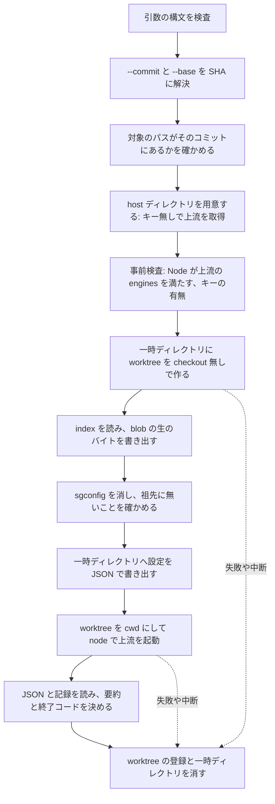

# ISSUE-65 spec: jev-lint を厳選した rule の薄いラッパとして取り込む

2026-09-25 の測定と裁定、2026-09-26 のブレインストーミングと 3 レーンのレビュー (境界、事実確認、設計の整合) で決めた設計のスナップショット。実装後の振る舞いの canonical はラッパのスクリプトの docstring とテストで、この文書は追従させない。

## 決定 (ユーザー裁定)

- 採用方式 (09-25): 厳選した rule を持つ薄いラッパを自前で持ち、上流の版上げに追従できるようにする。退けた案は、上流の plugin を apm でそのまま入れる、見送る
- 実行の形 (09-25): 手動の advisory に限る。送るのはコミット済みの範囲。pre-commit にも CI にも取り付けない
- 送る範囲の強制 (09-26): 対象のコミットをリポジトリの外の一時ディレクトリへ worktree として展開し、その中で走らせる。退けた案は、作業ツリーに未コミットの変更があれば拒否する、`commits` のモードだけを包む
- 置き場 (09-26): 単体 skill `skills/tooling/jev-lint-curated/`。退けた案は dev-workflow の component
- 消費側の調整 (09-26): 実行時の引数だけ (対象のパス、`--exclude`、厳選した rule に限った `--threshold`)。消費側に設定ファイルを置かない。退けた案は、消費側に差分の設定を置く、調整を受けない
- 版の追従 (09-26): キー無しの互換検査をサブコマンドで持つ。ラベルとの突き合わせによる測り直しは手順に留め、キーを持つユーザーが回す。退けた案は、ラベルとの突き合わせも自動化する、版の定数だけを持ち確認は全て手順書にする
- モード (09-26): `check` と `review --base`。退けた案は `check` だけ
- rule の選び方 (09-25、09-26): 下の「厳選する rule」の 7 つの id を、typescript、rust、python、moonbit の各ディレクトリにある分と、javascript/comment-describes-declaration で有効にする (27 項目)。cutoff は上流の値のまま。退けた案は、typescript、rust、python の 19 項目だけ、上流にある全言語の 31 項目 (go を含む)、同じ標本で cutoff を引き上げる
- MoonBit の parser (09-26): moonbit の 7 項目は一覧に載せて compat で追従するだけにする。parser の対応は別の Issue にし、それまで moonbit は走らない。退けた案は、ビルドした parser のパスを引数で受ける、ラッパが parser をビルドする

`commits` のモードは git の object から読むので送る範囲の要件を満たすが、走るのは `subject: commit` と `subject: change` の rule だけで、厳選した名前系・コメント系の rule は走らない。

dev-workflow に入れないのは、キーを使って外部の API を叩く道具を、dev-workflow を入れる全ての消費側へ届けないためである。使う消費側だけが apm の行を足す。

javascript/comment-describes-declaration を足すのは、typescript の残りの 6 つが JavaScript と Jsx も対象に含むのに、typescript/comment-describes-declaration だけは TypeScript と Tsx しか見ず、.js と .jsx のコメントの検査が抜けるためである。

`git archive` ではなく worktree を使うのは、`review` の上流が cwd の git で `<base>...HEAD` の差分を取るからである (前提 17)。

## 前提 (jev-lint 0.7.0、1123887 のソース)

パスは上流のリポジトリの相対パス。1〜13 はソースを読んで確かめ、事実確認のレーンが行番号まで照合した。17〜19 はレビューの裁定の段でソースと上流の文書を読んで確かめた。14〜16 は境界のレーンがリポジトリの外で実行して確かめた (node 24.18.0、pnpm 12.3.4、git 2.55.0、ast-grep 0.45.3)。20 はソースの読解だけで、実行はしていない。

1. `check` と `review` は、subject とその周辺をディスクから読む (`src/run.ts:115-123`)。厳選の項目のうち located と full の arm の項目はファイルの全文を送り、残りの arm も一部をディスクから読んで送る (`src/state.ts` の `ARM_BLURB`)。`review --base` の差分は見るファイルと行の選択に使われ (`src/cli/targets.ts:29-42`)、中身は未コミットの編集を含むディスクから読まれる
2. `--config <path>` を渡すと設定ファイルの上方探索が走らない (`src/cli/context.ts:35`)。baseDir は設定ファイルのディレクトリになる (`:57`)
3. 設定ファイルは `YAML.parse` で読まれるので、JSON の構文で書いたファイルも読める (`src/config.ts:130`)
4. 送り先は、`--base-url`、設定の `baseUrl`、環境変数の順に強い。設定の値は `process.env` へ書き戻されるので、環境変数だけを固定しても設定ファイルに負ける (`src/config.ts:525,541`、`src/jev.ts:268-270`)。設定の `apiKeyEnv` は任意の環境変数の値をキーとして送らせる (`src/config.ts:537-540`)。モデルも同じ形で、フラグ、設定、`JEV_LINT_MODEL` の順 (`src/config.ts:524`、`src/jev.ts:270`)
5. フラグは `opts` への代入で、後に書いたものが勝つ (`src/cli/args.ts:285-302`)
6. 設定の `rules:` に載っていない rule は走らない。載っている名前が読み込んだ rule のどれにも当たらなければエラーになる (`src/rules.ts:733-757`)
7. `check` の終了コードは、`errors` があって finding が 0 件のときだけ 3 で、それ以外は `blocks()` が finding と `--fail-on` から 1 か 0 を決める (`src/cli/cmd-check.ts:79-82`、`src/gate.ts:263-270`)。途中で止まった実行でも、それまでに finding があれば 1 になる
8. `check` と `review` は同じ `cmdCheck` を通り (`src/cli/main.ts:88`)、`--record` の記録に実際に応答したモデルと、cutoff 未満を含む全ての答えが残る (`src/run.ts:939-981`)。`--json` の出力にはモデルが出ない。`--dry-run` は記録を書く前に返る (`src/cli/cmd-check.ts:65`)
9. `rules --json` は各 rule の `id`、`languageDir`、`kind`、`subject`、`state`、`cutoff`、`ask`、`note`、`source` (rule.yml のパス) を出す。内容ハッシュ (draft) と matcher は出ない (`src/cli/cmd-rules.ts:17-45`)
10. 厳選する 27 項目はすべて `kind: noul` で、答えは 0 から 1 の確率である
11. 設定の threshold は「有限の数か」しか検査されない (`src/config.ts:366-369`)。`--threshold` の未知のキーは黙って無視される (`src/cli/args.ts:336-347`)
12. HTTP 200 で答えが欠けた subject は `stats.missing` に数えられるが `errors` には入らず、終了コードは 0 になりうる (`src/questions.ts:188-209`、`src/gate.ts:77-90,191`)
13. 上流が読む環境変数は、キー (`TYPESAFE_API_KEY`、無ければ `TYPESAFEAI_API_KEY`。前後の空白を落としてから空かを見る)、送り先、`JEV_LINT_MODEL`、`JEV_LINT_AST_GREP` (任意の実行ファイルを起動させる、`src/scan.ts:383`)、`JEV_LINT_CACHE`、`JEV_LINT_TOKENS_PER_SECOND`、`JEV_LINT_TOKEN_BURST`、`NO_COLOR` (`src/jev.ts:36-47,131-148`)
14. pnpm は cwd の `.npmrc` の `registry=` を読む。dlx のキャッシュが温まっていても読み、キャッシュのキーは registry を含むので別の registry からは取り直す。環境変数の `npm_config_registry` は project の `.npmrc` に負ける。消費側がコミットした `.npmrc` のある worktree で `pnpm dlx` を起動すると、偽の registry が返す別物の jev-lint がキー付きの env で走った (ダミーのキーで再現)
15. 上流は `languages:` が無いと ast-grep に `-c` を渡さず (`src/scan.ts:456-463`)、ast-grep は cwd と親ディレクトリから `sgconfig.yml` と `sgconfig.yaml` を探して、`customLanguages` の動的ライブラリを読み込もうとする。走査対象の子ディレクトリからは探さない
16. `git worktree add`、`checkout`、`archive` は、追跡されている `.gitattributes` の `filter=` が選ぶ smudge を利用者の環境の driver で走らせる。symlink は symlink として復元され、利用者がそのパスを明示すると上流はリンク先 (リポジトリの外を含む) を読んで送る。ディレクトリの走査は symlink を辿らない (`src/files.ts:55-63`)
17. worktree の中で上流が git を呼ぶのは、`review` の `git diff --unified=0 --no-color --no-ext-diff --diff-filter=d --src-prefix=a/ --dst-prefix=b/ <base>...HEAD` だけで (`src/diff.ts:81-96`)、コミット同士の差分なので作業ツリーも index も読まない。ファイルの列挙はディスクを歩く (`src/files.ts` の `FileIndex`)
18. `check` の `--json` は `findings`、`review`、`stats`、`degraded`、`silentRules`、`idleLanguages`、`ignored`、`unpaired`、`retry`、`spent`、`errors`、`elapsedMs` を持つ (`src/report.ts:382-437`)。parser の無い言語 (`undeclared`)、`excluded`、`skippedByDiff` は出ない。`--dry-run --json` は `dryRun: true` を持つ別の形の文書である (`src/cli/dry-run.ts`)
19. MoonBit は ast-grep に組み込まれていないので、ビルドした tree-sitter の parser を設定の `languages:` で宣言しないと走らない。宣言が無いと上流は moonbit の rule を落とし、落とした言語を言う (`docs/reference.md:1205-1256`)
20. paired の arm (tests-cover-failure-paths の typescript と python) は、指定したパスの外にある慣例のテストディレクトリ (`test`、`tests`、`__tests__`、`spec`) からも関連テストの抜粋を送り、`--exclude` をそこには適用しない (`src/run.ts:219-235`、`src/paired.ts:87,96-98`)

上流の版の変わり方 (git の差分で数えた。CHANGELOG は網羅していない):

- 0.6.0 から 0.7.0 の 4 日間で、rule の追加 5 件、削除と改名 0 件、cutoff の値の変更 20 件 (すべて 0.6.1 から 0.6.5)、ask の変更 0 件、matcher の変更 1 件
- 0.7.0 で rule と設定の `at` が `threshold` に改名された。`threshold` を書いた設定は 0.6.7 以前では未知のフィールドとして拒否される
- 設定のキーの `<lang>/<id>` は 0.6.0 から読める。0.6.6 (7aba0cf) で、言語修飾の無い id に警告が出るようになり、言語をまたぐ同じ id の取り違えが直った
- Node の下限は 0.6.3 で 20 から 24 へ上がり、CHANGELOG に記載が無い
- 6 日間でおよそ 20 版が出ている

## 厳選する rule

有効にするのは次の 7 つの id で、typescript、rust、python、moonbit の各ディレクトリにある分と、javascript/comment-describes-declaration を並べる (typescript 7、rust 5、python 7、moonbit 7、javascript 1 の計 27 項目)。rust には pure-name-is-pure と tests-cover-failure-paths が無い。go にある 4 つは入れない。

- pure-name-is-pure
- doc-errors-match-body
- module-name-describes-contents
- tests-cover-failure-paths
- var-name-describes-value
- comment-describes-declaration
- test-name-describes-code

根拠は 2026-09-25 の測定 (0.7.0)。TypeScript と Rust の private リポジトリ 3 つの指摘 647 件から、rule の群ごとに件数を決めて抜き出した 95 件をコードを読んで判定した。全体では有用 32%、境界 22%、誤検出 46% だった。上の 7 つに絞ると 43 件で、有用 23、境界 10、誤検出 10 になる。選んだのと同じ標本で数えているので、この比率は楽観側に偏っている。rule ごとの判定の比率を全体の件数で重み付けすると、7 つの誤検出はおよそ 28% になる。

測定の条件は揃っていない。2 つのリポジトリは `--retry 3` の 3 回の平均で判定したが、1 つはクレジット切れ (HTTP 402) で subject の約半数に答えが無く、標本のうち 34 件は 1 回の答えで判定した。この 34 件は、版の追従で測り直す候補になる。

外したもの (件数は標本の数):

- test-name-verifies-claim (12 件で有用 3)。判定時の観察では、rust の matcher がテスト関数を `function_item` に `follows: { kind: attribute_item, regex: "test" }` で見分けていて、`#[cfg(test)]` にも当たる形に読める
- catch-hides-failure (8 件で有用 1)
- test-mocks-subject (6 件で有用 0)。判定時の観察では、呼び出しを転送するだけのアダプタのテストを構造的に誤検出する
- fn-name-promises (6 件で有用 0。このリポジトリの `scripts/` でも 3 件とも誤検出)
- module-naming-consistent、method-name-promises、idempotent-name、error-message-matches-condition (それぞれ 2〜3 件で有用 0)
- comment-describes-block (6 件で有用 2)。全体では 43 件あるが、当たりと外れが値で分かれない
- describe-names-subject (3 件で有用 1) と type-name-describes-shape (2 件で有用 0)。全体でも各 3 件しか無い

Python の根拠は薄い。このリポジトリの `scripts/` で指摘が出たのは var-name-describes-value (4 件で有用 2) と fn-name-promises だけだった。残りの 6 つは指摘 0 件だが、doc-errors-match-body と tests-cover-failure-paths は subject が 0 件、pure-name-is-pure は 1 件で、実質的に測れていない。javascript/comment-describes-declaration と moonbit の 7 項目は測っていない。

comment-describes-declaration と test-name-describes-code は cutoff を 0.75 程度に上げると当たりと外れが分かれたが、同じ標本への当てはめなので既定には入れない。別の標本で確かめる用途に `--threshold` を使う。

## 構成

`skills/tooling/jev-lint-curated/` に置く。

- `SKILL.md`: 使う場面、ユーザーが `!` で実行する形、裁定 (手動、コミット済みの範囲、キーはユーザー)、版を上げる手順、rule の書き方は上流の skill を参照すること
- `scripts/jevlint.py`: 入口。引数の検査、サブコマンドの組み立て、設定の生成を持つ。上流の版と厳選の一覧を持つ唯一の場所で、ほかのモジュールへは引数で渡す
- `scripts/jevlint_tree.py`: コミットの展開 (ref の解決、パスの検査、worktree、blob の書き出し、後始末)
- `scripts/jevlint_host.py`: host ディレクトリ、node と engines、上流の argv と env
- `scripts/jevlint_result.py`: 結果の判定と要約
- `scripts/jevlint_compat.py`: compat の比較
- `scripts/test_jevlint*.py`: モジュールごとの unittest。ネットワークにも pnpm にもキーにも依存しない

どのスクリプトも標準ライブラリだけで、Python 3.9 で動く書き方にする。

サブコマンドは 3 つ。

- `check [--commit <rev>] <path>...`
- `review --base <ref> [--commit <rev>] [<path>...]`
- `compat <版>`

`check` と `review` は `--dry-run`、`--exclude <glob>` (複数可)、`--threshold <lang>/<id>=<値>` (複数可。値は 0 より大きく 1 より小さい数)、`--json-out <path>` を受ける。これ以外の引数は拒否する。上流の `init` や `run` のようなサブコマンドは通さない。

## check と review の流れ



- 対象のパスはリポジトリの root からの相対で、起動したディレクトリに依存しない。`.`、末尾の `/`、重なった `/`、先頭の `./` を正規化する。絶対パス、成分としての `..`、`-` で始まるものは拒否する。存在の確認は SHA の解決の後に `git -C <root> ls-tree <SHA> -- <path>` の形で行い、無ければ拒否する
- `--commit` (既定は `HEAD`) と `--base` は、本体のリポジトリで `git rev-parse --verify <ref>^{commit}` を通して SHA に解決し、上流には SHA だけを渡す。`HEAD~3` や `@{u}` のような HEAD 相対の ref は worktree の中では別のコミットを指し、`-` で始まる値は git のオプションとして読まれうるためである。上流の `review` は `--base` を `<base>...HEAD` の 1 引数として git diff に渡すので、見る範囲は merge base からの差分になる
- worktree は `git -c core.hooksPath=<空のディレクトリ> worktree add --detach --no-checkout` で作る。checkout を使わないので、hook も filter も symlink の復元も起きない
- 展開は `git read-tree <SHA>` で index だけを揃え (filter は走らない)、`git ls-tree -r -z <SHA>` と `git cat-file --batch` で blob の生のバイトを書き出す。mode 100644 と 100755 は通常ファイル、120000 (symlink) はリンク先の文字列を中身にした通常ファイルにし、160000 (submodule) は書かない。tree の中のパスが絶対パスのとき、成分に `..` か、大文字小文字を問わず `.git` を含むとき、大文字小文字だけが違う 2 つのパスがあるときは拒否する (macOS の既定のように大文字小文字を区別しないファイルシステムでは、`.GIT` という blob が worktree の `.git` を上書きして、`review` の git が別のリポジトリを指しうるため)。ディスクの中身がコミットの blob と同一であることが構造で保証され、git-crypt の平文化も、LFS の `.lfsconfig` の URL への取得も起きない
- 書き出したあと、worktree の root の `sgconfig.yml` と `sgconfig.yaml` を消して 1 行で告げる (前提 15)。worktree の祖先のディレクトリにどちらかがあれば拒否する
- 設定は worktree の外に書くので、baseDir は一時ディレクトリになり、消費側が追跡している `.jev-lint/rules/` や設定ファイルは読まれない
- 後始末は `finally` で行う。SIGTERM と SIGHUP は例外に変えるハンドラを置いて `finally` を走らせる。`git worktree remove --force` が失敗したら一時ディレクトリを消して `git worktree prune` を呼ぶ。SIGKILL で残った登録は `git worktree prune` で消せることを SKILL.md に書く

## host ディレクトリ

上流は、消費側のリポジトリの外にあるラッパ所有の host ディレクトリへ入れる。キー付きの段で pnpm を起動しないためである (前提 14)。

- 置き場は `${XDG_CACHE_HOME:-$HOME/.cache}/jev-lint-curated/<版>/` で、版ごとに分ける。`<repo>/.cache/` のようなリポジトリの中には置かない (root に `pnpm-workspace.yaml` があると root の `.npmrc` を拾う)
- 用意するときは、host と同じ親の一時ディレクトリに `package.json` を書き、そこを cwd にして `pnpm add --allow-build=@ast-grep/cli jev-lint@<版>` を 1 回だけ走らせ、成功してから rename で host の名前に置く。途中で切れた取得が host として再利用されないようにするためである。env は利用者のものからキーと上流の変数 (`TYPESAFE_*`、`TYPESAFEAI_*`、`JEV_LINT_*`) を落としたもの。`@ast-grep/cli` の postinstall にキーを見せないためである
- host の祖先のディレクトリに `pnpm-workspace.yaml` があれば拒否する
- 再利用するときは、`node_modules/jev-lint/package.json` の `version` が pin と一致し、`dist/cli.js` があることを確かめる。合わなければ host を作り直す
- 上流の起動は `node <host>/node_modules/jev-lint/dist/cli.js` で、argv に pnpm を含まない。ast-grep はパッケージの位置から解決される (`src/scan.ts:382-405`)
- Node の事前検査は、host の `node_modules/jev-lint/package.json` の `engines.node` を読み、起動に使う node (PATH から 1 度だけ解決した絶対パス) の版と比べる。`>=N` の形だけを判定し、それ以外の形は拒否して SKILL.md の手順へ誘導する。上流は `engines` を宣言するだけで実行時に検査しない

## 設定と、起動の引数と環境変数

書き出す設定は `rules` だけを持つ。値は `"on"` か、`--threshold` を受けたものは `{"threshold": <値>}`。`baseUrl`、`apiKeyEnv`、`languages`、`cache`、`model`、`files` は書かない。書かないことを生成の構造で保証し、テストで押さえる。moonbit の項目は `languages` が無いので上流に落とされる (前提 19)。

上流の起動の形は次のとおり。固定する部分は前提 5 の後勝ちに合わせて末尾に置く。

```
<node の絶対パス> <host>/node_modules/jev-lint/dist/cli.js <check|review> [--base <SHA>] [--exclude <glob>]... [<path>]... [--dry-run]
  [--record <一時ディレクトリ内>] --json --config <一時ディレクトリ内> --cache none --retry 3 --model jev-latest --base-url https://api.typesafe.ai
```

- `--cache none` にするのは、`--retry 3` のときは上流がキャッシュを使わず、置き場の管理も要らなくなるからである
- `--retry 3` は測定のうち 2 リポジトリと同じ条件で、cutoff の判定を 3 回の平均で行う
- `--model jev-latest` は設定や環境変数からの差し替えを塞ぐために明示する

上流の env は、落とすものを列挙するのではなく、ラッパが組み立てる。入れるのは `PATH`、`HOME`、`TMPDIR`、`LANG` と `LC_*`、そして `--dry-run` でないときだけ `TYPESAFE_API_KEY`。これで `NODE_OPTIONS`、proxy 系、`NODE_TLS_*` と `NODE_EXTRA_CA_CERTS`、`GIT_*`、`JEV_LINT_*`、`TYPESAFEAI_*` は入らない。ラッパ自身の git の呼び出しも、キーを除いた同じ組み立ての env で行う。

キーの事前検査は、`TYPESAFE_API_KEY` の前後の空白を落としてから空かを見る。`TYPESAFEAI_API_KEY` だけがあるときは、`TYPESAFE_API_KEY` を名指すエラーにする。キーの値は表示しない。

## 結果の要約と終了コード

上流の終了コードは判定に使わない (前提 7、12)。上から順に判定し、最初に当たったものを返す。

1. 引数、事前検査、host の用意、展開のいずれかのエラー: 2
2. 上流が 0、1、3 以外を返した (2 やクラッシュ): 2
3. stdout が JSON として読めない: 2
4. `--dry-run` のとき: `dryRun` が真で subject の件数を持てば 0、持たなければ 2
5. 必須のキー (`findings`、`stats.subjects`、`stats.missing`、`errors`) のどれかが無い: 2。寛容に読むと、上流がキーを改名した版で不完全な実行が 0 になるため
6. 記録が無いか読めない: 2
7. `stats.missing` が 1 以上、または `errors` が空でない: 3
8. finding がある: 1
9. それ以外: 0

要約として必ず出すもの:

- 判定した内容: コミットの SHA、jev-lint の版、応答したモデル (記録の `model`。null なら「応答なし」。`--dry-run` では出さない)
- 見た量: `stats.subjects` の件数とファイル数 (`stats.byFile`)、`stats.missing`、`errors` の件数と先頭の理由、`degraded` の件数、費用 (`spent.usd` と `spent.calls`)
- 聞く前に落とした量: `ignored` (消費側の `jev-lint-ignore` のコメント)、`unpaired` (関連テストが見つからない paired の subject)、厳選の項目のうち `silentRules` に入ったもの、`idleLanguages`。対象のパスの下に `.mbt` のファイルがあれば、その本数と「parser が無いので見ていない」
- 指摘: 1 件ごとに `<ファイル>:<行> <rule> <値>/<cutoff>`。worktree の中の相対パスは本体のリポジトリと同じ
- 終了コードが 3 のときは、指摘より先に「N 件は答えが無い」を出す

`--dry-run` の要約は、判定する内容 (コミットの SHA と版)、subject の件数、上流が見積もった費用、聞く前に落とした量を出す。

上流の stderr はそのまま流す (設定のエラーを利用者が読めるように)。`--json-out <path>` を付けたときは、上流の JSON を `<path>` に、記録があるとき (`--dry-run` でないとき) は記録を `<path>.record.json` に保存する。記録には cutoff 未満の答えもあるので、cutoff の当て直しとラベルとの突き合わせに使える。

## 版の追従 (compat)

`compat <版>` は、ラッパが pin している版と引数の版を比べる。子プロセスはすべてキーを含まない組み立ての env で起動する。

1. 版の文字列は `X.Y.Z` の数字の形だけを受け付ける (`jev-lint@<版>` に埋め込むため)
2. 両方の版の host を用意する (host ディレクトリの節と同じ手順)
3. 両方の版で `rules --json --no-config` を空の一時ディレクトリを cwd にして取り、`<languageDir>/<id>` をキーにした表を作る
4. 厳選の 27 項目それぞれについて、存在、`kind`、`cutoff` を比べ、`source` が指す rule.yml の中身の sha256 が変わっていれば unified diff (difflib) を出す。matcher と criteria は `rules --json` に出ないので (前提 9)、diff で見せる
5. 引数の版で増えた rule をすべて報告し、厳選の 7 つの id のものには印を付ける
6. ラッパが生成する設定を引数の版に読ませる。本番と同じ argv の組み立てで `--dry-run` を付け、既定の設定と、1 項目だけ `{"threshold": x}` を持つ設定の 2 通りを、typescript、rust、python、javascript の最小のファイルを 1 本ずつ置いた一時ディレクトリで走らせる
7. 引数の版の host の `engines.node` を読み、起動に使う node と比べる

判定は上から順に次のとおり。

1. 検査不能 (2): 版の文字列が不正、host の用意の失敗、`rules --json` の起動の失敗か出力が JSON でない
2. 失敗 (1): 厳選の項目が引数の版に無い、`kind` が noul でなくなった、6 のどちらかの設定で上流が 0 以外を返した、手元の node が `engines` を満たさないか `engines` が `>=N` の形でない
3. 報告だけ (0): cutoff の変化、rule.yml の変化、増えた rule

版を上げる手順は SKILL.md に書く。`compat` を回し、報告された変化を上流の CHANGELOG と git の差分で読み、スクリプトの版の定数を書き換える。必要ならユーザーが `!` で測り直し、`--json-out` の記録を手元のラベルと突き合わせる。ラベルは private なリポジトリのコードを指すので、このリポジトリには置かない。

## キーの渡し方

「キーはユーザーが扱う」はラッパの側では守れない。キーを Claude Code を起動したシェルの環境に置くと、エージェントの Bash からも同じラッパが動くからである。SKILL.md に書く `!` の形は、そのコマンド 1 回にだけキーを渡すもの (export しない) にする。保管庫のパスのような個人の値は書かず、`TYPESAFE_API_KEY="$(<キーを取り出すコマンド>)" python3 <スクリプト> ...` のようにプレースホルダで示す。

## テスト

モジュールごとの `scripts/test_jevlint*.py` に unittest で置く。runner は skip と 0 件を赤にするので、pnpm やキーの有無で逃げる形は取らない。上流の起動、pnpm の起動、node の版の取得は差し替えられる形にし、テストは偽物を渡す。git は本物を使い、`GIT_*` を落とした env から起動する。

- 上流の argv: 先頭が node の絶対パスと host の `dist/cli.js` で pnpm を含まない、固定フラグが末尾にある、`--base` に SHA が渡る
- pnpm の起動: cwd が host で worktree の外、env にキーが無い、版が pin と一致する。host の祖先に `pnpm-workspace.yaml` があれば拒否する
- host の再利用: version が合わない、`dist/cli.js` が無いときに作り直す
- 引数の検査: 未知のフラグ、上流の他のサブコマンド、厳選の外の rule への `--threshold`、0 以下か 1 以上の値、不正な版の文字列、絶対パス、成分としての `..`、`-` で始まるパス、コミットに無いパスを拒否する。`.` や `./a//b/` の正規化
- 事前検査: `node --version` の出力 (v24.18.0 のような形) と `engines` の比較、`>=N` でない `engines`、キーが空か空白だけ、`TYPESAFEAI_API_KEY` だけがある
- キーの値を出力しない: 目印の値を env に入れ、stdout と stderr に出ないことを見る
- 生成する設定: 厳選の 27 項目だけを持ち、禁止したキーを持たない。`--threshold` がその項目の `threshold` になる
- 上流の env: 組み立てた env に上の許可以外の変数が無い。`--dry-run` と compat と pnpm の段ではキーも無い
- 展開: 一時的な git リポジトリに、smudge の filter を設定したファイル、リポジトリの外を指す symlink、実行ビットのあるファイル、`sgconfig.yml` をコミットし、書き出した中身が `git cat-file blob` と同一であること、symlink が通常ファイルになること、filter が走らないこと、`sgconfig.yml` が消えることを見る。post-checkout の hook が走らないことも目印で見る。`.GIT` や `a/../b` のような成分と、大文字小文字だけが違う 2 つのパスを持つ tree を拒否すること (tree は `git mktree` か、それが名前を拒否するなら `git hash-object -t tree --literally` で作る)
- host の用意: 取得が途中で失敗したとき、host の名前の下に何も残らない
- 後始末: 上流の起動を失敗する偽物、KeyboardInterrupt を投げる偽物、SIGTERM を受ける場合のそれぞれで、worktree の登録と一時ディレクトリが残らない
- 順序: host の用意が worktree の作成より先で、キー無しで呼ばれる
- 結果の分類: 合成した JSON で判定の 9 行それぞれと、不完全かつ finding ありが 3 になること、`ignored` が 0 でない例
- 要約: 必ず出すものが出ること、終了コード 3 のときに「N 件は答えが無い」が指摘より先に出ること、`.mbt` の本数
- compat: 合成した 2 つの表で、消えた項目、kind の変化、cutoff の変化、rule.yml の diff、増えた rule と印、6 の判定 (偽物が 2 を返す)、engines の判定、検査不能の分岐
- Python 3.9: `ast.parse(..., feature_version=(3, 9))` でスクリプトとテストを解析する (前例は `plugins/dev-workflow/skills/commit-and-pr-message/scripts/test_check_outgoing_text.py`)。標準ライブラリの API の版までは見られないので、そこはレビューに残る

実装役は、pin した仕組みを壊したときにテストが赤くなることを変異注入で確かめる。

## 完了条件

- `pre-commit run --all-files` が全て通り、`scripts/python-tests-manifest.txt` と README を再生成してある
- 実環境での確認 (外部コマンドを組み立てる層なので、テストの緑だけで完了にしない)
  - エージェントがキー無しで回す: このリポジトリの `scripts/` への `check --dry-run`、`compat 0.7.0` (同じ版なので変化 0 件で 0)、対照の `compat 0.6.1`。0.6.1 からの対照では、cutoff の変化が 10 項目 (typescript/pure-name-is-pure、typescript/comment-describes-declaration、rust/var-name-describes-value、rust/comment-describes-declaration、python/pure-name-is-pure、python/module-name-describes-contents、python/var-name-describes-value、javascript/comment-describes-declaration、moonbit/var-name-describes-value、moonbit/comment-describes-declaration)、rule.yml の変化が 27 項目 (0.7.0 の `at` から `threshold` への改名)、`engines` が `>=20` で、`threshold` を持つ設定が読めないので終了コード 1 になるはずである。何も報告されなければ検査が見ていない
  - ユーザーが `!` で 1 回回す: 0.7.0 で測ったのと同じコミット (66231ad) の `scripts/` に `check --commit 66231ad`。当時有用と判定した var-name-describes-value の 2 件 (`scripts/check-issue-closure.py:305` と `scripts/test_check_related_refs.py:782`) が出ることで full chain を確かめる。当時は `scripts/test_check_issue_closure.py` で 146 件の答えが欠けたので、再び欠ければ終了コード 3 と先頭の表示も確かめられる
- 有用だった 2 件を改名する (`scripts/check-issue-closure.py` の `children`、`scripts/test_check_related_refs.py` の `INHERITED`)
- ISSUE-65 に裁定と 3 リポジトリの集計 (リポジトリ名は書かない) を記録し、タスクを消化して PR で閉じる
- MoonBit の parser の対応を別の Issue として起票する
- `.cache/` に残した試用の記録を片付ける

## 既知の限界

- 推移依存の `@ast-grep/cli` は、host を用意したときに上流の範囲指定 (`^0.45.3`) で解決される。ラッパは pin せず、`compat` もこれは見ない
- キーは上流のプロセスと、上流が起動する ast-grep の env に載る。上流の変更無しには塞げない
- 採点は非決定的である。1 つの subject の値のばらつきは上流の実測で中央値 0.01、p90 0.05、最大 0.3 で、cutoff の近くでは判定が実行ごとに入れ替わる
- submodule の中のファイルは書き出さないので見ない
- paired の arm は、指定したパスの外の慣例のテストディレクトリからも抜粋を送り、`--exclude` もそこには効かない (前提 20)。コミットの中身なので裁定には反しないが、送りたくないファイルを `--exclude` で守ることはできない
- 上流の env に proxy の変数を渡さないので、proxy の内側からは使えない
- `review` の上流の git diff は `--no-textconv` を付けていないので、利用者の設定にある textconv の driver が走りうる。影響は差分の行の範囲だけ
- moonbit の 7 項目は parser の対応まで走らない
- SIGKILL で止まると、本体のリポジトリに worktree の登録が残る

## 範囲外

- リリースを切ることと、消費側の pin を上げること
- 上流への不具合の報告の送付
- ラベルとの突き合わせの自動化、キャッシュの利用、pre-commit と CI への取り付け (裁定で作らない)
- MoonBit の parser の対応 (別の Issue)
- jev-test-filter (ISSUE-71) と、文書と canonical の食い違いの検出 (ISSUE-72)
