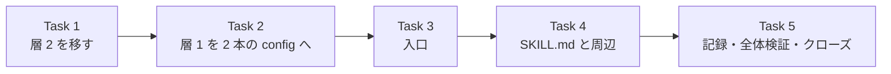

# ISSUE-58 実装計画: 公開される本文へ漏洩検査を通す手順を配布物に入れる

> For agentic workers: REQUIRED SUB-SKILL: Use superpowers:subagent-driven-development (recommended) or superpowers:executing-plans to implement this plan task-by-task. Steps use checkbox (`- [ ]`) syntax for tracking.

Goal: `dev-workflow:commit-and-pr-message` の手順が、公開される本文を渡す前に層 1 と層 2 の漏洩検査を
同梱の入口 1 本で通す状態にする。

Architecture: 層 2 のスクリプトと層 1 のルールの canonical を skill 配下へ移す。層 1 は custom ルール
だけの config と既定ルールだけの config の 2 本に分け、root の `.gitleaks.toml` は消す。新しい入口
`check-outgoing-text.py` は入力ごとに canary の行を前後に置いて `gitleaks stdin` へ流し、層 2 を
subprocess で呼び、終了コード 0/1/2/3 に畳む。SKILL.md は全ての面で 4 手の手順を持つ。

Tech Stack: 入口は Python 3.9 以上で読める標準ライブラリだけ (tomllib を使わない)。リポジトリ側の
検査は 3.11 以上 (tomllib)。unittest、gitleaks 8.30.1、pre-commit、GitHub Actions。

Spec: `docs/issues/ISSUE-58_PR 本文の漏洩検査を配布物の手順へ組み込む/ISSUE-58-spec.md`
(実行者は plan と spec の両方を読むこと。2026-09-18 に簡素化の決定を反映して書き直した)

## 実行方式 (ユーザー裁定)

- Task ごとに Workflow を 1 本回す。中身は implementer 1 体 → レビュー 2 観点 (spec との対応 /
  品質と素材) の並列 → 指摘があれば修正 1 回
- Fable は Task 3 の implementer 1 体だけ。他は既定のモデル
- 次の Step はコントローラ (親) だけが行う。Step の頭に「コントローラ」と書いてある
  - Task の着手前の基準の確認 (HEAD、`python3 scripts/run-python-tests.py`)
  - `--update-manifest` による manifest の再生成
  - `pre-commit run --all-files` と commit-msg stage の実行
  - git status と implementer の報告の突合、コミット
  - コミットの前に、その時点で使える層 1 をメッセージのファイルへ当てる。Task 1 は root の config、Task 2 は
    2 本の config を `gitleaks stdin --ignore-gitleaks-allow --redact --no-banner -c <config>` で、Task 3 からは
    入口を使う。記録は rc と件数だけにする (commit-msg の hook は層 2 しか見ない)
  - clone を使う全履歴の走査、live smoke
- implementer とレビュアーが守ること
  - 単体テストは対象のモジュールだけを直接回す。env は `env -u LEAK_GUARD_DENYLIST PYTHONDONTWRITEBYTECODE=1` を
    前置する。subagent は起動元の環境変数を継承するので、外さないと実物の禁止語リストで層 2 が走る
  - 禁止語リストを開かない。環境変数の値を表示しない
  - 変異注入は作業ツリーの使い捨ての写しで行い、本体へは入れない。写しは
    `rsync -a --exclude .git --exclude .cache ./ .cache/mut-t<N>/` で作り、写しの中でテストを回し、
    確認したら `rm -r .cache/mut-t<N>` で消す (コマンド文字列に `.cache/` を書く)。変異ごとに
    「赤になるべきテスト ID」を先に書き、`-v` の出力で実際に赤になった ID と突き合わせる
  - レビュアーは本体を変更しない。実験は `.cache/review-t<N>-<観点>/` の写しで行う
  - gitleaks の有無を作るときは、PATH を空の一時ディレクトリ 1 つにする。開発機の PATH には
    gitleaks が 2 つある (spec の前提 15)

## Global Constraints

- 依存を増やさない。標準ライブラリと unittest だけで書く。pytest を入れない
- テストに skip と expectedFailure を置かない (runner が赤にする)
- コメントは日本語。WHY を書き、外部コマンドの挙動に由来する実装には実測を添える
- 追跡ファイルに実在の絶対パス・メールアドレス・個人を特定する情報を書かない。合成したユーザーパス・
  メールアドレス・UUID・トークンは、ソース上で連続しないよう変数や連結で実行時に組み立てる
  (先例は `scripts/check-leak-guard-rules.py` の `NAME` と `_UUID_PARTS`)。ソースに連続した形で
  書くと、そのファイル自身が層 1 に捕まる
- トークン形の値の本体を、名前に key / token / secret を含む変数へ単独で置かない。既定ルールの
  generic-api-key がそのファイル自身を検出する (実測)
- 入口と層 2 の出力に、禁止語・入力パス・一致した文字列・gitleaks の生の出力を出さない
- gitleaks の版は 8.30.1。開発機の実体は Homebrew 側 (mise の shim はそちらへ委ねる)
- 書き捨ては `<repo>/.cache/` に置く。コミット本文は `.cache/commit-<slug>.txt` に Write で書き
  `git commit -F` で渡す。末尾に `Claude-Session: <URL>` を置く
- 配布物 (`plugins/`) の中の散文は、配布先で読まれても偽にならない形で書く。「このリポジトリ」
  「`scripts/...` を実行する」のような配布元の前提を断定しない
- SKILL.md の散文では skill のディレクトリを指す変数の名前に触れない (spec の前提 8)

## 基準値

| 項目 | 値 | 測った時点 |
|---|---|---|
| `python3 scripts/run-python-tests.py` | 9 ファイル / 665 件 | 2026-09-18、`56bdc9d` |
| うち `scripts/test_check_leak_guard_denylist.py` | 78 件 (Attachment 10 件 + それ以外 68 件) | 同上 |
| `pre-commit run --all-files` | 14 Passed + 1 Skipped、leak-guard-denylist は `scanned=166 findings=0` | 同上 |
| 全履歴の走査 (clone で `.gitleaksignore` を消す、当時の root config) | 10 件 (user-path 1 / vm-uuid 9) | 同上 |
| 同じ走査を custom だけの config (名前の除外あり) / 既定だけの config で | 10 件 (内訳同じ) / 0 件 | 同上 |

commit 数は基準値にしない。期待値は「走査時点の `git rev-list --count HEAD` と一致」で取る。
git モードでは `-i` を渡しても走査対象リポジトリの root の `.gitleaksignore` が読まれる (実測)。
`.gitleaksignore` を効かせない対照は、clone からファイルを消して取ること。

## ファイル構成

置き場の略記: `CPM` = `plugins/dev-workflow/skills/commit-and-pr-message`

| パス | 種別 | 責務 | Task |
|---|---|---|---|
| `CPM/scripts/check-leak-guard-denylist.py` | `scripts/` から移動 | 層 2 | 1 |
| `CPM/scripts/test_check_leak_guard_denylist.py` | `scripts/` から移動し分割 | 層 2 の単体テスト | 1 |
| `scripts/test_leak_guard_attachment.py` | 新規 (分割先) | 層 1・層 2・入口の取り付けの pin | 1, 2, 3 |
| `scripts/hook_config_lines.py` | 新規 | pre-commit 設定を行で読む補助 (2 本の配線テストで共有する。ISSUE-55 の F2) | 1 |
| `CPM/scripts/leak-guard.gitleaks.toml` | root から custom ルールを移す | 層 1 の custom ルール | 2 |
| `CPM/scripts/leak-guard-default.gitleaks.toml` | 新規 | 層 1 の既定ルール | 2 |
| `.gitleaks.toml` | 削除 | — | 2 |
| `scripts/check-leak-guard-rules.py` | 変更 | 層 1 の 2 本の config を対照で検査 | 2, 3 |
| `scripts/ci/install-gitleaks.sh` | 新規 (実行ビット付き) | gitleaks の版と sha256 の canonical | 2 |
| `.github/workflows/ci.yml` | 変更 | install-gitleaks.sh、2 本の全履歴走査 | 2, 3 |
| `CPM/scripts/check-outgoing-text.py` | 新規 (実行ビット付き) | 入口 | 3 |
| `CPM/scripts/test_check_outgoing_text.py` | 新規 | 入口の単体テストと SKILL.md の表の pin | 3, 4 |
| `CPM/SKILL.md` | 変更 | 4 手の手順と表 | 4 |
| `plugins/dev-workflow/SKILL.md` | 変更 | component 表と前提の段落 | 4 |
| `.claude/skills/release/SKILL.md` | 変更 | 入口をリポジトリ内のパスで呼ぶ | 1, 4 |
| `.pre-commit-config.yaml` / `CLAUDE.md` / README / manifest 2 本 | 変更 | 追従 | 1〜4 |
| ISSUE-55 / ISSUE-61 / 新規 Issue / 前提 17 の記録先 | 変更・起票 | 記録 | 5 |



Task 1 と Task 2 は内容では独立だが、同じ `.pre-commit-config.yaml`・`CLAUDE.md`・配線テストを
触るので順に行う。Task 3 は Task 2 の 2 本の config と、Task 1 の層 2 を sibling として使う。

### Task 1: 層 2 を skill 配下へ移す (振る舞いは変えない)

Files:
- Move: `scripts/check-leak-guard-denylist.py` → `CPM/scripts/check-leak-guard-denylist.py` (`git mv`)
- Move: `scripts/test_check_leak_guard_denylist.py` → `CPM/scripts/test_check_leak_guard_denylist.py` (`git mv`)
- Create: `scripts/test_leak_guard_attachment.py`、`scripts/hook_config_lines.py`
- Modify: `scripts/test_issue_id_attachment.py` (補助を共有モジュールから使う)、`.pre-commit-config.yaml`
  (層 2 の hook 2 本の `entry`)、`CLAUDE.md` (確認手順の canonical のパス)、`.claude/skills/release/SKILL.md`
  (手順 3 と 4 のコマンドのパス。Task 4 で置き換える)、`scripts/python-tests-manifest.txt` (再生成)

Interfaces:
- Consumes: なし
- Produces: `CPM/scripts/check-leak-guard-denylist.py` (CLI と定数 `ENV_VAR` / `STATUS_SKIPPED` /
  `STATUS_CHECKED` / `EXIT_OK` / `EXIT_VIOLATION` / `EXIT_UNABLE` は不変)。
  `scripts/hook_config_lines.py` (`live_lines(path)`、`invocations(lines, checker, flag)`、
  `hook_block(lines, checker, flag)`、`hook_keys(block)`。checker を引数に取る以外は
  `scripts/test_issue_id_attachment.py` の現行の補助と同じ振る舞い)

- [ ] Step 1 (コントローラ): HEAD と `python3 scripts/run-python-tests.py` が基準値どおりであること
- [ ] Step 2: 共有の補助を作る。`scripts/test_issue_id_attachment.py` の補助 4 本を `scripts/hook_config_lines.py` へ
  移し、checker を引数にする。`test_issue_id_attachment.py` はそこから読む形へ直し、単体で緑のまま
  であることを確かめる (ISSUE-55 の F2)。読み込みは既存のテストと同じく importlib で行う (素の import は
  リポジトリ root から回すと失敗する)。このファイルは `test_*.py` に当たらないので runner には収集されない
- [ ] Step 3: 分割先の配線テストを先に書く。`scripts/test_leak_guard_attachment.py` へ現行の `Attachment`
  クラスを移し、補助は共有モジュールから使う。`CHECKER` は移動先のパス
  `"plugins/dev-workflow/skills/commit-and-pr-message/scripts/check-leak-guard-denylist.py"`。
  `TRACKED_HOOK_KEYS` / `COMMIT_MSG_HOOK_KEYS` も移す。`test_ci_does_not_run_this_check` の docstring へ、
  スクリプト側から外す「CI へ取り付けない理由」(PUBLIC リポジトリの Actions ログから座標の交差で
  語を復元できる) を書く
- [ ] Step 4: 実行して赤を確かめる。`test_checker_path_exists` と pre-commit の呼び出しの pin が失敗すること
- [ ] Step 5: `git mv` で 2 ファイルを移す。移したテストから `Attachment` クラスと、それだけが使う定数を消す。
  `CHECKER` はテストファイルの隣を指す形 (`Path(__file__).resolve().parent / "check-leak-guard-denylist.py"`)
  にし、`load()` と `run_cli()` をそれに合わせる。`ROOT` と `PRE_COMMIT_CONFIG` は不要になるので消す
- [ ] Step 6: `.pre-commit-config.yaml` の `leak-guard-denylist` と `leak-guard-denylist-commit-msg` の `entry` を
  移動先へ。hook のコメントのうち「CI へ取り付けない」理由がスクリプトの docstring を名指ししていたら、
  配線テストを名指しする形へ直す
- [ ] Step 7: 移した 2 ファイルを全文読み、配布先で偽になる散文を直す。基準は「配布先に同じものが無くても真であるか」。検索は補助にとどめる。直す方向は次のとおり
  - 配布元の実測や経緯は「配布元で測った」と分かる書き方にするか、一般化する
  - 取り付けの判断 (pre-commit へ載せる・CI へ載せない) は「利用する側の判断」とし、配布元の
    判断の理由は配線テストへ移す (Step 3)
  - セットアップの確認手順は、パスを含めず「無害な 1 行のファイルを `--check-text` へ通して
    `status=checked` を見る」にする。`--check` は git リポジトリの外では変数が届いていても rc 2 になる
    (実測) ので確認手順にしない
  - 層 1 を名指す箇所は、ルールファイルの名前ではなく「形の決まったルール」と書く (Task 2 でファイルが変わる)
  - `#N` 記法の禁止の出所は、同じ bundle の `in-repo-issue` の `issue-id.py` と書く
  - `run_check_text` の「spec の実装順序 5 (未実装)」は Task 4 で直すので、ここでは触らない
- [ ] Step 8: 移したテストが literal で持つ不可視文字 (U+200B / U+00AD / U+FEFF / U+2060 / U+2028 / U+2029 など) を
  `\u....` のエスケープへ書き換える。書き換え前後で同じテストが同じ結果になること。
  `apm audit --file <path> --no-policy` を移した 2 ファイルへ当て、warning が 0 件であること
- [ ] Step 9: `CLAUDE.md` の「確認手順の canonical は `scripts/check-leak-guard-denylist.py` の docstring」を
  移動先のパスへ。release skill の手順 3 と 4 の `python3 scripts/check-leak-guard-denylist.py` を移動先の
  パスへ (Task 4 で置き換えるまでの橋渡し)
- [ ] Step 10: 旧パスが残っていないこと。旧パスは新パスの末尾に含まれるので、直前がパスの一部でない形で探す。`rg -n --hidden -g '!.git' -g '!docs/issues/**' '(^|[^/A-Za-z_-])scripts/check-leak-guard-denylist\.py' .` が 0 件。陽性の対照として、新しいパスが `.pre-commit-config.yaml` で 2 件当たること (この対照は dot 始まりが走査面に入っていることの確認を兼ねる)。`docs/issues/` はスナップショットなので対象外
- [ ] Step 11: 単体テスト (移した層 2 のテスト、2 本の配線テスト) を直接回して緑
- [ ] Step 12: 変異注入 (写しで行う)
  - `leak-guard-denylist` hook の `entry` 行をコメントアウト → `test_leak_guard_attachment` の pre-commit の pin が赤
  - `leak-guard-denylist-commit-msg` hook の `entry` 行をコメントアウト → 同じテストの commit-msg の pin が赤
  - 共有補助の `invocations` を部分文字列の照合へ戻す変異は、単独では赤にならない (hook が 2 本とも揃って
    いると、部分文字列でも `--check` の行が見つかる。反証で再現)。1 つ目の変異を入れた状態で照合を部分文字列へ
    戻し、`test_pre_commit_runs_the_tracked_file_check` が赤から緑へ変わることを見る
- [ ] Step 13 (コントローラ): `python3 scripts/run-python-tests.py` が、移動分の「消えた / 未記録」で赤になる
  ことを確かめてから `--update-manifest`。再実行で 10 ファイル / 665 件、manifest と一致
- [ ] Step 14 (コントローラ): `pre-commit run --all-files` が全 hook 緑、`leak-guard-denylist` の出力が
  `status=checked`。`pre-commit run --hook-stage commit-msg --commit-msg-filename <.cache のファイル>` で
  commit-msg の hook も緑
- [ ] Step 15 (コントローラ): コミット。件名 `refactor(dev-workflow): 禁止語の検査を commit-and-pr-message へ移す (ISSUE-58)`

### Task 2: 層 1 を custom と既定の 2 本の config へ分け、root の config を消す

Files:
- Create: `CPM/scripts/leak-guard.gitleaks.toml`、`CPM/scripts/leak-guard-default.gitleaks.toml`、
  `scripts/ci/install-gitleaks.sh` (実行ビット付き)
- Delete: `.gitleaks.toml` (`git rm`)
- Modify: `scripts/check-leak-guard-rules.py`、`scripts/leak-guard-cases-manifest.txt` (再生成)、
  `scripts/test_leak_guard_attachment.py`、`.pre-commit-config.yaml`、`.github/workflows/ci.yml`、`CLAUDE.md`、
  `plugins/dev-workflow/skills/issue-scoped-artifacts/SKILL.md` (ボーイスカウト)

Interfaces:
- Consumes: なし
- Produces:
  - `CPM/scripts/leak-guard.gitleaks.toml`: custom ルール `user-path` / `vm-uuid` / `email-address`。
    `[extend]` を持たない。実在する 3 つの名前 (`.gitleaks.toml` と 2 本の config) だけを外す path の allowlist を持つ
  - `CPM/scripts/leak-guard-default.gitleaks.toml`: `title` と `[extend] useDefault = true` だけ
  - Task 3 はどちらも sibling として `-c` へ渡す

- [ ] Step 1: 対照ケースを先に足す (`scripts/check-leak-guard-rules.py`)
  - `SHOULD_ALLOW` に `mail-anthropic-noreply` を足す。値は帰属行が持つ Anthropic の noreply アドレスそのもの。
    許可側なので literal で書いてよい (Step 3 の許可と同じコミットに入れること。許可より先にコミットすると、
    そのファイル自身が層 1 に捕まる)
  - `SHOULD_DETECT` (email-address) に次を足す。どれも連結で組み立てる
    - GitHub noreply 形。ID は先頭を 0 にし、login には `_` を含めた名前を使う (実在するアカウントの ID と
      login を組み合わせない)
    - Anthropic の noreply アドレスの前に文字を付けた形と、後ろにドメインを続けた形 (許可の `^` と `$` の pin)。
      後ろのドメインは予約ドメインの免除に掛からない形にする
    - 前提 10 の形: ローカル部が `true` で始まるもの、`false` を含むもの
  - `SHOULD_DETECT` (user-path) に、前提 10 の形 (名前に `false` を含むもの、`null` で終わるもの) を足す
  - 印 (前提 12) の行は対照検査に置かない。対照検査に置いても pin されるのは対照検査自身のフラグだけで、
    配備の呼び出しは配線テストと入口のテストが見る
- [ ] Step 2: `python3 scripts/check-leak-guard-rules.py` を実行し、赤の内訳を記録する。期待は
  `mail-anthropic-noreply` の誤検出と、前提 10 の形の取りこぼし。他の新ケースは現行のルールで期待どおり
- [ ] Step 3: `CPM/scripts/leak-guard.gitleaks.toml` を作る。root の `.gitleaks.toml` から custom ルールを移し、全文を
  読んで次を直す
  - `[extend] useDefault = true` を持たない。理由 (前提 10) をコメントに書く
  - `[allowlist]` に `paths = ['''(^|/)(\.gitleaks|leak-guard(-default)?\.gitleaks)\.toml$''']` を置く。このファイル
    自身と過去の root の config が実例を literal で持つため (前提 14。外すと全履歴で 24 件)。名前を 3 つに絞るのは、
    `[^/]*gitleaks\.toml$` のような形だと無関係なファイルまで層 1 から隠れるため (反証で実測)。「gitleaks が
    `.gitleaks.toml` という名前を外す」という旧い説明はこの allowlist の説明へ置き換え、外したファイルは層 2 だけが
    見ることを書く
  - `email-address` の allowlist の末尾に `'''(?i)^noreply@anthropic\.com$'''` を足す。allowlist の regexes は
    1 本へ束ねて評価され `(?i)` が前方へ漏れるので、既存と同じく付ける
  - `title` を配布物として中立な名前へ
  - 配布先で偽になる記述 (「pre-commit と CI の双方が本設定を使用する」、履歴へ入った経緯、特定の plugin や
    Issue や CLAUDE.md の名指し、「現在の追跡ツリーには 1 件も無い」、`scripts/check-leak-guard-rules.py` の
    名指し) を、配布先でも真である書き方へ直す。値そのもの (fixture の UUID など) は残す。パスで免除しない理由と
    Public を許可する理由のうち配布元に固有の部分は、`scripts/check-leak-guard-rules.py` の `SHOULD_ALLOW` 側の
    コメントへ移す
- [ ] Step 4: `CPM/scripts/leak-guard-default.gitleaks.toml` を作る。`title` と `[extend] useDefault = true` だけ。
  custom ルールと分けている理由 (前提 10) をコメントに書く
- [ ] Step 5: `git rm .gitleaks.toml`
- [ ] Step 6: `scripts/check-leak-guard-rules.py` を直す
  - `CUSTOM_RULES` と `DEFAULT_RULES` を置き、`CONFIG` を消す
  - 全ケースを 2 本の config でそれぞれ 1 回ずつ `gitleaks dir` へ通し、検出を合わせる。どちらの呼び出しにも
    配備と揃えて `--ignore-gitleaks-allow` を付ける。検出ケースは custom の config の検出で判定する。許可ケースは、
    どちらの config のどのルールにも掛からないことで判定する
  - `RULE_IDS` を消し、ルール集合の一致は custom の config の id と `SHOULD_DETECT` のルールの 2 集合で見る
    (Task 3 で canary のキーを足して 3 集合にする)。既定の config が `rules` を持たないことも確かめ、持っていれば 2
    (custom ルールが既定の config へ移ると前提 10 の見逃しが戻る)
  - パスを印字する経路 (gitleaks の stderr、設定ファイルや manifest が無いときの文言、読めないときの例外の文字列) を
    1 つの関数に通し、`str(ROOT)` と一時ディレクトリの絶対パスをプレースホルダへ置き換える
  - モジュール docstring が名指す canonical を新しい置き場へ
- [ ] Step 7: `python3 scripts/check-leak-guard-rules.py` が緑。`--update-manifest` で manifest を再生成し、再実行で一致
- [ ] Step 8: `scripts/ci/install-gitleaks.sh` を作る。版 (`8.30.1` と「開発機と揃える」の注記)、sha256、ダウンロードと
  展開 (`download-and-verify.sh` を呼ぶ)、展開先 `$RUNNER_TEMP`、`$GITHUB_PATH` への追記はこのスクリプトだけが持つ。
  `chmod +x` し、`git add` 後の `git ls-files -s` で `100755` であることを確かめる (Write が作るファイルは 0644)
- [ ] Step 9: `ci.yml` の leak-guard job を直す。「Install gitleaks」をスクリプトの呼び出しへ置き換え、全履歴の走査を
  config ごとの 2 step にする。どちらも `gitleaks git --redact --no-banner --ignore-gitleaks-allow -c <config>`。
  コメントの「`-c` で custom ルールを渡す」を 2 本の形に合わせる
- [ ] Step 10: `.pre-commit-config.yaml` を直す
  - `gitleaks` hook を config ごとの 2 本にする。entry は
    `gitleaks git --staged --redact --no-banner --ignore-gitleaks-allow -c <config>`
  - `leak-guard-rules` の `files:` の `\.gitleaks\.toml` を 2 本の config のパスへ置き換える
  - 冒頭コメントのうち、ルール集合を再掲している部分と `.gitleaks.toml` を名指す部分を、2 本の config を
    名指す形へ直す。hook の `name` にもルール集合を書かない (ISSUE-55 の F25)
- [ ] Step 11: 配線テストに層 1 の pin を足す (`scripts/test_leak_guard_attachment.py`)
  - pre-commit の gitleaks の呼び出しが 2 本の config をそれぞれ `--staged` と `--ignore-gitleaks-allow` 付きで呼ぶ。
    entry が `gitleaks git ` で始まる
  - gitleaks の hook 2 本に、層 2 の hook と同じ形の pin を掛ける (許可するキーの集合、`always_run: true`、
    `pass_filenames: false`、stage は `default_stages` を継ぐ)。`stages: [manual]` を 1 行足すだけで hook は
    コミット時に走らなくなるが、呼び出し行の pin は緑のままになるため
  - CI が 2 本の config をそれぞれ `--ignore-gitleaks-allow` 付きで全履歴走査する。同じ job の checkout が
    `fetch-depth: 0` を持ち、job と step に `continue-on-error` が無い (浅い clone では `1 commits scanned` の緑になる)
  - 2 本の config のパスが実在する
- [ ] Step 12: `CLAUDE.md` を直す
  - 「形の決まった漏洩の検査ルール」の canonical (表と本文の 2 箇所) を 2 本の config へ
  - 「検証」節の gitleaks の hook についての記述を 2 本の形に合わせる (全文を読んで、hook を 1 本と断定している
    文が残らないようにする)
  - 「依存を増やさない」の対象を、置き場所ではなく「pre-commit か CI から呼ばれる Python」へ書き直す。
    例外は `uv run --script` で依存を宣言するスタンドアロンスクリプトに限る
  - ボーイスカウト: `plugins/dev-workflow/skills/issue-scoped-artifacts/SKILL.md` が旧いルール名を名指している行を、
    今の置き場と名前に合わせて直す (配布先でも偽にならない書き方にする)
- [ ] Step 13: 単体テスト (配線テスト) を直接回して緑
- [ ] Step 14: 変異注入 (写しで行う)
  - custom の config から noreply の許可を消す → `mail-anthropic-noreply` の誤検出で `check-leak-guard-rules.py` が 1
  - noreply の許可から `^` を消す / `$` を消す → それぞれ前置・後置のケースの取りこぼしで 1
  - custom の config に `[extend] useDefault = true` を足す → 前提 10 のケースの取りこぼしで 1
  - custom に無い新しいルールを既定の config にだけ足す → 「既定の config がルールを持たない」検査だけで 2
    (custom のルールを移す形では、custom 側の id の不一致が同時に 2 を出すので、この検査が生きていることを示せない)
  - pre-commit の gitleaks hook の片方から `--ignore-gitleaks-allow` を消す / 片方に `stages: [manual]` を足す /
    ci.yml の leak-guard job から `fetch-depth: 0` を消す → それぞれ配線テストが赤
  - 既定の config から `useDefault` を消す変異は Task 3 で行う (既定ルールの有効性は入口の canary とテストが見る)
- [ ] Step 15 (コントローラ): stage した差分を 2 本の config で `gitleaks git --staged --redact --no-banner --ignore-gitleaks-allow -c <config>`
  へ通し、どちらも no leaks で、走査量が 0 でないこと。作業ツリーでの `gitleaks git` は未コミットの変更を
  見ないので、この時点の根拠にしない
- [ ] Step 16 (コントローラ): `pre-commit run --all-files` 全緑。コミット。
  件名 `refactor(security): 漏洩ルールを custom と既定の 2 本の config に分けて commit-and-pr-message へ移す (ISSUE-58)`
- [ ] Step 17 (コントローラ): コミット後に fresh clone を作り、`.gitleaksignore` を消した全履歴走査を 2 本の config で行う。
  custom は 10 件 (user-path 1 / vm-uuid 9)、既定は 0 件。`.gitleaksignore` を残した走査はどちらも no leaks。
  clone で `git rev-parse --is-shallow-repository` が false であり、走査したコミット数が `git rev-list --count HEAD`
  と一致すること (浅い clone ではどちらも 1 になって一致する)

### Task 3: 入口 `check-outgoing-text.py`

Files:
- Create: `CPM/scripts/check-outgoing-text.py` (実行ビット付き)、`CPM/scripts/test_check_outgoing_text.py`
- Modify: `.github/workflows/ci.yml` (python-tests job で install-gitleaks.sh を呼ぶ)、
  `scripts/test_leak_guard_attachment.py` (CI が入口を呼ばないことの pin)、`scripts/check-leak-guard-rules.py`
  (入口の canary を借りる)、`.pre-commit-config.yaml` (`leak-guard-rules` の `files:` に入口を足す)、
  `CPM/scripts/check-leak-guard-denylist.py` と `CPM/scripts/test_check_leak_guard_denylist.py` (単独の CR)、
  `scripts/python-tests-manifest.txt` と `scripts/leak-guard-cases-manifest.txt` (再生成)

Interfaces:
- Consumes: Task 1 の `check-leak-guard-denylist.py` (sibling、subprocess で `--check-text <path>`)、
  Task 2 の 2 本の config (sibling)
- Produces (Task 4 のテストと `check-leak-guard-rules.py` が使う):

```python
from __future__ import annotations  # 3.9 で注釈を評価させない

EXIT_OK, EXIT_FINDING, EXIT_UNABLE, EXIT_SKIPPED = 0, 1, 2, 3
RESULT_BY_EXIT = {EXIT_OK: "ok", EXIT_FINDING: "finding", EXIT_UNABLE: "unable", EXIT_SKIPPED: "skipped"}
STATE_CHECKED, STATE_SKIPPED, STATE_UNABLE = "checked", "skipped", "unable"
STATE_NOT_APPLICABLE = "not-applicable"   # --target-private のときの層 2 だけが取る
TARGET_PRIVATE = "--target-private"
HERE: Path                      # このファイルのディレクトリ
DENYLIST_SCRIPT: Path           # HERE / "check-leak-guard-denylist.py"
CUSTOM_RULES: Path              # HERE / "leak-guard.gitleaks.toml"
DEFAULT_RULES: Path             # HERE / "leak-guard-default.gitleaks.toml"

def custom_canary() -> dict[str, str]    # custom ルール ID -> canary の行 (実行時に組み立てる)
def default_canary() -> dict[str, str]   # 既定ルール ID -> canary の行

class Hit(NamedTuple):
    file_no: int   # 引数の順番 (1 始まり)
    line: int      # 入力の行番号 (前の canary の行を除いた番号)
    layer: int     # 1 or 2
    label: str     # 層 1 はルール ID、層 2 は "denylist line <n>"

class Layer(NamedTuple):
    state: str
    reason: str    # checked のときは ""
    hits: list[Hit]

def decide(layer1: Layer, layer2: Layer) -> int          # 純粋関数。優先順は spec の表
def parse_report(stdout: bytes) -> list[tuple[int, str]]  # 純粋関数。(StartLine, RuleID) を返す。読めなければ ReportError
def locate(report: list[tuple[int, str]], rules: list[str], input_lines: int) -> list[tuple[int, str]]
    # 純粋関数。rules は canary の行の並び (K 本)。前の canary の i 行目と後ろの canary の i 行目
    # (K + input_lines + i) に rules[i] の検出が揃わなければ CanaryMissing。1..2K+input_lines の外の行があれば
    # ReportError。canary の行の余分な検出は捨てる。間の検出を (行 - K, ルール) にして返す
def main(argv: list[str] | None = None, *, env: Mapping[str, str] | None = None,
         custom_rules: Path = CUSTOM_RULES, default_rules: Path = DEFAULT_RULES,
         denylist_script: Path = DENYLIST_SCRIPT) -> int
```

振る舞いの canonical は spec の「入口の振る舞い」節で、実装後はこのファイルの docstring が持つ。要点だけ次に置く。

| 項目 | 決め |
|---|---|
| env | `main` は受けた env を gitleaks の解決と層 2 の subprocess の両方へ渡す。`None` なら `os.environ` |
| 引数 | argparse を使わない。先頭が `TARGET_PRIVATE` ならそれを取り除き、層 2 を not-applicable (`target-private`) にして起動しない。残りは全てファイルとして扱う。残りが空なら両層を `no-input` の unable にする |
| 入力の前段 | 通常ファイルでない (symlink は辿った先で見る)・読めない → `input-unreadable`、0 byte → `input-empty`、UTF-8 として読めない・NUL を含む → `input-undecodable`。どれかに当たれば両層をその理由の unable にし (層 2 が not-applicable のときは層 1 だけ)、gitleaks も層 2 も起動しない |
| gitleaks の解決 | `shutil.which("gitleaks", path=env.get("PATH", ""))`。PATH キーが無いときに `None` を渡すと実行元の PATH へ戻るので、空文字列を渡す。`None` が返れば層 1 は skipped (`gitleaks-not-found`)。見つかった絶対パスで起動する。起動に失敗したら unable (`gitleaks-failed`) |
| gitleaks の呼び出し | 入力ごと・config ごとに `[<絶対パス>, "stdin", "-c", <config>, "--ignore-gitleaks-allow", "--report-format", "json", "--report-path", "-", "--redact", "--no-banner", "--no-color", "--exit-code", "0"]`。`-i` は渡さず、cwd を実行ごとに作る空の一時ディレクトリにする (stdin モードは `-i` に関係なく cwd の `.gitleaksignore` を読む。反証で再現)。stdin は、ルール ID の昇順に並べた canary の行、入力のバイト列、(入力が改行で終わらなければ改行)、同じ並びの canary の行 |
| canary の値 | どの行も `gitleaks:allow` の印を持つ (フラグが落ちた config では canary が消える)。custom の user-path と email-address の canary は `false` を含む (custom の config に `useDefault` が戻ると消える。反証で再現)。既定の canary は true / false / null を含まない。値は実行時に組み立てる |
| gitleaks の rc | 0 以外は unable (`gitleaks-failed`)。stdout と stderr は印字しない |
| レポート | `parse_report` が読めなければ unable (`report-unreadable`)。`locate` に渡す `input_lines` は、入力の改行の数に、改行で終わらないとき 1 を足したもの。`CanaryMissing` は unable (`canary-not-detected`)、`ReportError` は unable (`report-unreadable`) |
| 層 2 | 入力ごとに `[sys.executable, denylist_script, "--check-text", path]`。stdout は `errors="replace"` で読み、ASCII の目印だけで判定する。stdout に `status=skipped` → skipped (`env-unset`)。rc 0 かつ `status=checked` → checked。rc 1 かつ `status=checked` で stderr の `line N: denylist line M` を 1 件以上読めた → 検出。それ以外は unable (`denylist-unable`) |
| 層の状態 | 入力間で最悪 (unable > skipped > checked) を採る。理由は最初に最悪になった入力のもの |
| 想定外の例外 | `main` の最上位で受け、`error=<型名>` と `result=unable` と要約だけを出して EXIT_UNABLE |
| 終了コード | `decide` が検出 > unable > skipped > checked の順に 1 / 2 / 3 / 0 を返す。not-applicable は checked と同じに扱う |
| docstring | 状態と理由の語彙、終了コードの優先順と result の語、canary の目的と、揃わないときに考えられる原因 (中身による読み飛ばし、ルールの欠落、版の違い)、stdin 経由にした理由、各フラグを渡す理由 (実測)、stderr を流さない理由 (実測)、検証した gitleaks の版、既知の限界 (spec の該当行のうち入口に関わるもの) |

出力の形 (stdout。stderr には何も出さない):

```text
layer1 status=<state> [reason=<reason>] findings=<n>
layer2 status=<state> [reason=<reason>] findings=<n>
  [x] file <n> line <m>: layer1 <rule-id>
  [x] file <n> line <m>: layer2 denylist line <k>
result=<ok|finding|unable|skipped>
<日本語の要約 1 行>
```

`<state>` は checked / skipped / unable / not-applicable のどれか。想定外の例外のときは `error=<型名>`、
`result=unable`、要約の 3 行だけを出す。引数が無いときは、両層の状態行 (`reason=no-input`) から始まる通常の形で出す。

- [ ] Step 1: ci.yml の python-tests job の runner の前に `scripts/ci/install-gitleaks.sh` の呼び出しを足す
- [ ] Step 2: テストを先に書く (`CPM/scripts/test_check_outgoing_text.py`)。禁止語は架空語、禁止語リストはテスト内の
  一時ファイル。合成値は組み立てる。env は `os.environ` から `LEAK_GUARD_DENYLIST` と `GIT_*` を除いた dict を
  基点にする補助を置き、全ケースがそこから作る。「P」はプロセス境界 (`sys.executable` で起動し、stdout と
  stderr の両方を捕捉)、「M」は `main(...)` 呼び出し (stdout を捕捉)、「U」は純粋関数。
  状態行を出す全ての P と M のケース (`unexpected_error` 以外) で、rc に加えて両層の `status=` と `reason=` を
  assert する。全ての P のケースで stderr が空であることも assert する

  | テスト | 形 | 入力と環境 | 期待 |
  |---|---|---|---|
  | clean | P | 清浄な本文 1 本、リスト設定済み | 0、両層 checked |
  | layer1_custom_hit | P | 合成ユーザーパスの行 | 1、`file 1 line <n>: layer1 user-path` |
  | layer1_default_hit | M | 既定ルールに当たる行 (値は組み立てる) | 1、`layer1 github-pat` |
  | layer2_hit | M | 架空語の行 | 1、`layer2 denylist line 1` |
  | two_files | M | 2 本の入力の 2 本目に層 1 と層 2 の両方の検出 | 座標がどちらも `file 2` |
  | allow_marker | M | 合成パスの後ろに印を持つ行、HTML コメントの中に印を持つ行、既定ルールに当たる値 (`default_canary()` から組み立てる) の後ろに印を持つ行 | 1、3 行とも座標が出る |
  | first_line_hit | M | 1 行目が vm-uuid に当たる入力 (前の canary との継ぎ目の pin) | 1、`file 1 line 1: layer1 vm-uuid` |
  | no_trailing_newline | M | 改行で終わらず、最終行に合成パスを持つ入力 (後ろの canary との継ぎ目の pin) | 1、最終行の座標 |
  | caller_ignore_file | P | 呼び出し元の cwd に `.gitleaksignore` を置く。中身は、入力の検出行 (前の canary の行数 + n) と canary の行を指す stdin 形の fingerprint | 1、座標が残る |
  | magic_prefixed | M | 先頭が `%PDF-`・`MZ`・`{\rtf` の UTF-8 入力に合成パス | 1 |
  | content_skipped | M | 既定の canary の行を足したあとも 128 バイト目に `DICM` が来る入力 (既定の canary の長さから作り、その行が 128 バイト未満であることを assert する) | 2、`canary-not-detected` |
  | symlink_input | M | 合成パスを持つファイルを指す symlink | 1 |
  | undecodable | M | UTF-16 / 不正な UTF-8 / NUL を含む入力 (それぞれ) | 2、両層 `input-undecodable`。層 2 には、呼ばれたら目印のファイルを作る stub を渡し、ファイルが無いことで呼ばれていないことを見る (最悪の状態を採る規則のため、理由では見えない) |
  | empty_and_missing | M | 0 byte / 無いパス | 2、両層 `input-empty` / `input-unreadable` |
  | gitleaks_absent | P | PATH を空の一時ディレクトリ 1 つにする (テスト内でその PATH の `which` が None であることを assert) | 3、`layer1 status=skipped reason=gitleaks-not-found` |
  | env_unset | P | リスト未設定 | 3、`layer2 status=skipped reason=env-unset` |
  | env_not_inherited | M | `os.environ` には架空語リストを指す変数を置き、`main` には変数を除いた env を渡す | 3、層 2 が skipped |
  | target_private | M | `TARGET_PRIVATE` を付け、(a) 架空語だけの入力 (b) 合成パスの入力 (c) リスト未設定で清浄な入力。層 2 には目印のファイルを作る stub を渡す | (a) 0 (b) 1 (c) 0。どれも `layer2 status=not-applicable reason=target-private` で、stub は呼ばれていない |
  | custom_regex_broken | M | custom の config の `user-path` の regex を当たらない形へ置換した写し | 2、`canary-not-detected` |
  | custom_rule_missing | M | custom の config から `vm-uuid` のブロックを除いた写し | 2、`canary-not-detected` |
  | custom_use_default | M | custom の config に `[extend] useDefault = true` を足した写し | 2、`canary-not-detected` |
  | default_dropped | M | 既定の config から `useDefault` を除いた写し | 2、`canary-not-detected` |
  | gitleaks_config_failed | P | 入口・層 2・2 本の config を一時ディレクトリへ写し、写した custom の config を「目印を含む存在しない絶対パスを extend する config」で置き換える | 2、`gitleaks-failed`。stdout に一時ディレクトリのパスと目印が無い |
  | denylist_stubs | M | 何も出さず rc 0 / 何も出さず rc 1 / `status=checked` を出して rc 1 で座標なし、の stub (それぞれ) | 2、`denylist-unable` |
  | no_args | P | 引数なし | 2、両層 `no-input` |
  | unexpected_error | M | 内部の関数 1 つを `unittest.mock.patch` で例外にする | 2、`error=<型名>`、traceback なし |
  | decide_table | U | 両層の (状態, 検出の有無) の全組。層 2 は not-applicable を含む | 検出 > unable > skipped > checked。not-applicable は checked と同じ |
  | parse_report_rejects | U | JSON でない / 配列でない / `StartLine` か `RuleID` が無い | `ReportError` |
  | locate_table | U | 合成したレポート: 揃っている / 前の canary が 1 つ欠ける / 後ろの canary が 1 つ欠ける / canary の行に余分な検出がある / 範囲外の行がある | 座標 / `CanaryMissing` / `CanaryMissing` / 余分を捨てた座標 / `ReportError` |
  | canary_values | U | `custom_canary()` と `default_canary()` の値 | どの行も印を持つ。custom の user-path と email-address は `false` を含む。既定は `true` / `false` / `null` を含まない (大小無視) |
  | output_grammar | P と M の全ケース | 出力の全行 | 決めた形のどれかに一致し、架空語・合成値・入力パス・config のパス・一時ディレクトリのパスを含まない |
  | py39_source | U | 入口と層 2 のソース | `ast.parse(..., feature_version=(3, 9))` が通る。先頭の文 (docstring の次) が `from __future__ import annotations`。`tomllib` を import しない |

  写しの config は元の本文への文字列置換で作り、置換が 1 回起きたことを assert する (起きていないと
  テストが対象を壊していない dead pin になる)
- [ ] Step 3: 入口が無いことによる失敗を確かめる
- [ ] Step 4: `check-outgoing-text.py` を実装する (上の表と出力の形)。`chmod +x` し、コミット時に `git ls-files -s` で
  `100755` であることを確かめる。あわせて層 2 の `run_check_text` を `read_bytes().decode("utf-8")` で読む形に変え、
  単独の CR を含む入力で行番号が gitleaks の数え方 (`\n` だけ) と一致するテストを層 2 のテストへ先に足す
  (`read_text` は単独の CR を行の境界に数え、層ごとに座標がずれる。反証で実測)
- [ ] Step 5: テストを直接回して緑
- [ ] Step 6: `scripts/check-leak-guard-rules.py` が入口を importlib で読み、ルール集合の一致に `custom_canary()` の
  キーを加える (custom の config の id・`SHOULD_DETECT` のルール・canary のキーの 3 集合)。入口を読めなければ 2
- [ ] Step 7: `.pre-commit-config.yaml` の `leak-guard-rules` の `files:` に入口のパスを足す。
  `scripts/test_leak_guard_attachment.py` の「CI が層 2 を呼ばない」pin を入口のパスにも掛ける
  (workflow が入口を呼ぶと、層 2 が公開ログへ取り付く)
- [ ] Step 8: 変異注入 (写しで行う)。どれも赤になることを、赤になるべきテスト ID と突き合わせて確かめる
  - canary の照合を外し、レポートを読めたら checked にする → `custom_regex_broken` / `custom_rule_missing` / `custom_use_default` / `default_dropped` / `content_skipped` / `locate_table`
  - 前の canary を足さない (行番号の補正は合わせる) → `magic_prefixed`
  - 後ろの canary の照合を外す → `locate_table`
  - 前の canary の最後の改行を落とす → `first_line_hit`。後ろの canary の前に改行を足さない → `no_trailing_newline`
  - `--ignore-gitleaks-allow` を両方の呼び出しから外す → `allow_marker` と `clean`。既定の config の呼び出しからだけ外す → `clean`
  - gitleaks の cwd を呼び出し元へ戻す → `caller_ignore_file`
  - `TARGET_PRIVATE` のときに層 1 も外す → `target_private`
  - 実物の custom の config に `useDefault` を足す / 実物の既定の config から `useDefault` を消す → それぞれ `clean`
  - `decide` の優先順の 1 と 2 を入れ替える → `decide_table`
  - gitleaks の stderr を stdout へ流す → `gitleaks_config_failed`
  - 層 2 を rc だけで判定する → `denylist_stubs`
  - 0 byte を通す → `empty_and_missing`。UTF-8 の確認を外す → `undecodable` の UTF-16 と不正な UTF-8。NUL の確認を外す → `undecodable` の NUL
  - 層 2 の subprocess へ env を渡さない → `env_not_inherited`
  - 入口から `from __future__ import annotations` を消す → `py39_source`
  - ci.yml の python-tests job に入口を呼ぶ step を足す → 配線テストの負の pin
- [ ] Step 9 (コントローラ): `python3 scripts/run-python-tests.py --update-manifest` と
  `python3 scripts/check-leak-guard-rules.py --update-manifest` のあと、それぞれ再実行で緑
- [ ] Step 10 (コントローラ): live smoke。入口はリポジトリ内のパスで呼び、入力は `.cache/` の合成ファイル、
  環境変数は起動元のまま (実物のリストと shim を含む PATH は、単体テストでは見ない条件)。清浄 → 0、
  `TARGET_PRIVATE` を付けて清浄 → 0 (層 2 は not-applicable)、`/usr/bin/python3` で清浄 → 0 (import の失敗の 1 に
  ならない)。出力に語もパスも出ないことを目で確かめる。検出や skip の経路は P のテストが実物の gitleaks で見るので、
  ここでは繰り返さない
- [ ] Step 11 (コントローラ): `pre-commit run --all-files` 全緑。コミット。
  件名 `feat(dev-workflow): 公開する本文へ両層の漏洩検査を通す入口を足す (ISSUE-58)`

### Task 4: SKILL.md の手順と周辺の追従

Files:
- Modify: `CPM/SKILL.md`、`CPM/scripts/test_check_outgoing_text.py` (表の pin)、`CPM/scripts/check-leak-guard-denylist.py`
  (`run_check_text` の docstring)、`.claude/skills/release/SKILL.md`、`plugins/dev-workflow/SKILL.md`、
  `README.md` (再生成が要る場合)、`scripts/python-tests-manifest.txt` (再生成)

Interfaces:
- Consumes: Task 3 の `RESULT_BY_EXIT` と `EXIT_*`
- Produces: SKILL.md の節 `### 送る前の検査` (pin テストがこの見出しで節を引く)

- [ ] Step 1: pin テストを先に書く
  - SKILL.md の「送る前の検査」節にある表から `| <整数> / <語> |` で始まる行を取り、(整数, 語) の組の集合が
    `RESULT_BY_EXIT` の項目の集合と一致すること。節が見つからない・表が空のときも赤 (0 件で緑にしない)
  - `EXIT_OK` / `EXIT_FINDING` / `EXIT_UNABLE` / `EXIT_SKIPPED` の値を literal の 0 / 1 / 2 / 3 で pin する
- [ ] Step 2: テストが節の不在で赤になることを確かめる
- [ ] Step 3: `CPM/SKILL.md` を直す
  - frontmatter の description と「いつ使うか」「使わない」を、言語と Tirith の有無を問わず「公開される本文を
    git / gh に渡すとき」に広げる。「渡す前に同梱の入口で漏洩検査を通す」を足す。Tirith に由来する条件は
    「なぜファイル経由なのか」節に閉じ込める
  - ワークフローの冒頭を 4 手 (書く / 送る前の検査 / 渡す / 載ったことを確認) にする
  - 2 手目の頭で送り先の公開範囲を判定する。`gh repo view --json visibility --jq .visibility` の結果が `PRIVATE`
    のときだけ入口に `--target-private` を付け、それ以外 (`PUBLIC`、`INTERNAL`、失敗、空) では付けない。判定は入口の
    結果を見る前に行い、結果を見たあとで判定し直さない。層 1 は公開範囲を問わず当たることも書く
  - 「2 のあとでファイルを変えたら、理由を問わず 2 からやり直す」を書く
  - 「送る前の検査」節: 入口の呼び出し (コードブロック 1 箇所だけで skill のディレクトリの変数を使う)、
    (終了コード, result) ごとの行動の表と「上記以外」の行、2 と 3 のあとで環境を調べない・ツールを入れないこと、
    書き直しの規則 (spec の「書き直し」)、「検査が見るのは形とリストに載った語だけなので渡す前に自分で読む」、
    「入口のコマンド行と出力を公開する本文へ貼らない。記録するなら rc と `result=` の行だけ」
  - 1 行の値 (`--title` / `--subject` / Issue タイトル / リリースタイトル) は `.cache/<面>-<slug>.title` に書いて入口へ
    一緒に渡し、渡すときは `--title "$(cat .cache/<面>-<slug>.title)"` の形にする (spec の前提 16)。「`--title` だけは
    ファイルで渡せない」「唯一の箇所」の記述と、タイトルに句点を入れない注意を、この形に合わせて直す
  - Phase A / C と C.3 の表に、2 手目が入口であることを反映する (面ごとに同じ説明を繰り返さない)
  - 既知の限界を書く (1 行を `$(cat ...)` 以外で渡すと一致の保証が無い、手順を踏まない主体と画面上の編集は通らない、
    GitHub が squash merge で足す `Co-authored-by:` の trailer は検査の外、公開範囲の判定を誤ると層 2 が外れる、
    上限を超える本文は `reason=input-too-large` で止まり、空行の位置で分けたファイルを通す必要がある。上限の
    値は入口の docstring が canonical なので SKILL.md に再掲しない)
  - 落とし穴の表に「検査で 3 が出たが急ぐので渡す」「rc 1 の語をリストで確かめる」「skip の理由を見て環境を直しに行く」
    「通ったあとの小さな修正をそのまま渡す」「rc 1 を見てから公開範囲を判定し直す」「上限を超えた本文を行の途中で
    分けて通す」を足す
  - 「なぜファイル経由なのか」節の再測の手順を削り、発火条件は tirith と hook の版と設定に依存するとだけ書く
    (手元の tirith 0.4.1 では、この手順が hook の止める例に allow を返す。反証で実測)
  - 散文で skill のディレクトリの変数の名前に触れていないこと
- [ ] Step 4: `run_check_text` の docstring の「spec の実装順序 5 が扱う (未実装)」の段落を消す。手順の canonical は
  SKILL.md で、関数の docstring が状態を持つと drift する (ISSUE-55 の F35)
- [ ] Step 5: release skill の手順 3 と 4 を直す
  - 検査は入口をリポジトリ内のパスで呼ぶ形にする
    (`python3 plugins/dev-workflow/skills/commit-and-pr-message/scripts/check-outgoing-text.py .cache/tag-v<X.Y.Z>.txt`。
    手順 4 はノートとタイトルのファイルを一緒に渡す)。このリポジトリは PUBLIC なので `--target-private` は付けない
  - 終了コードごとの行動は、リポジトリ内の `plugins/dev-workflow/skills/commit-and-pr-message/SKILL.md` の
    「送る前の検査」節を名指す。消費側で読み込まれる skill は pin が上がるまで旧版で入口を持たないので、
    読み込んだ skill へ委ねるだけにはしない (この理由を書く)
  - 「この面は gitleaks の走査面の外で、見る機会がこの手順にしか無い」という理由は残す
  - 「載っていない語は通る」の段落は CPM へ移したので参照にする。落とし穴の表の該当行も合わせる
- [ ] Step 6: `plugins/dev-workflow/SKILL.md` の component 表の `commit-and-pr-message` の役割と、前提の段落
  (「作法そのものは環境に依存しない」) を、検査を含む手順に合わせる (python3 と gitleaks が無ければ手順が止まって
  確認を求める)。`python3 scripts/gen-readme.py --check` が drift を報告したら `python3 scripts/gen-readme.py` で再生成する
- [ ] Step 7: pin テストを直接回して緑
- [ ] Step 8: 変異注入 (写しで行う)。SKILL.md の表から `3 / skipped` の行を消す → 表の pin が赤。
  `EXIT_UNABLE` と `EXIT_SKIPPED` の値を入れ替え、SKILL.md の表の番号も揃えて入れ替える → literal の pin だけが赤
  (定数だけを入れ替える形では表の pin も赤になり、literal の pin が生きていることを示せない。Task 3 の P と M の
  テストは rc を定数で比べておく。literal で比べるとそれらも赤になる)
- [ ] Step 9 (コントローラ): `python3 scripts/run-python-tests.py --update-manifest` と再実行で緑
- [ ] Step 10 (コントローラ): `pre-commit run --all-files` 全緑 (`claude plugin validate` / package-shape / readme-drift を含む)。
  コミット本文と件名をリポジトリ内のパスで入口に通してからコミットする (この Task から dogfooding。記録は rc と
  `result=` の行だけ)。件名 `feat(dev-workflow): 公開する本文を送る前に漏洩検査を通す手順を書く (ISSUE-58)`

### Task 5: 記録・全体検証・クローズ

Files:
- Modify: `docs/issues/ISSUE-58_PR 本文の漏洩検査を配布物の手順へ組み込む/issue.md` (クローズで `closed/` へ移る)、
  `docs/issues/ISSUE-55_層 2 のマージ前レビューで消化しなかった 35 件が残っている/issue.md`、
  `docs/issues/ISSUE-61_配布物が配布先で成立しているかを見る検査層が無い/issue.md`
- Create: Linux のホームディレクトリ形のパスを user-path に含めるかを扱う Issue。前提 17 の記録先 (重複検索で決める)

- [ ] Step 1: 新しい Issue を起票する (`dev-workflow:in-repo-issue` の Phase A。A.0 の重複検索を先に通す)。
  内容は、Linux のホームディレクトリ形のパスが user-path に当たらないこと、Skill ツールで読み込んだ手順の
  コマンド行がホームディレクトリの絶対パスを含むこと、広げる場合に要る許可 (CI runner など) と対照、
  全履歴走査への影響を測ること
- [ ] Step 2: ISSUE-55 を更新する。F2 と F25 を `[x]` にし、解決の内容を添える。F34・F35・F36・F38 は現物と照合し、
  今回の変更で解消していれば `[x]` にする。層 2 の本体とテストが `commit-and-pr-message/scripts/` へ移り、Issue 内の
  「本体:NNN / テスト:NNN」が移動前の座標であることを追記する。R2 には、層 2 のテストは配布物へ移ったので `scripts/` の
  共有モジュールの対象外であることを追記する
- [ ] Step 3: ISSUE-61 に、計画レビューで見つかった 2 件を記録する (plugin の内側の skill 名を見ないインストール先の
  検査、in-repo-issue の SKILL.md の散文が変数の置換で壊れること)。ISSUE-61 の関連節の ISSUE-58 の行に、今回の結論
  (同梱の入口 + canonical の移動。hook と CI の取り付けは範囲外) を 1 行足す
- [ ] Step 3.5: main のコミットメッセージの漏洩を記録する (spec の前提 17)。記録先は `dev-workflow:in-repo-issue` の
  A.0 の重複検索で決める。書くのは、再現の手順 (origin/main のメッセージを 2 本の config へ stdin で通す) と分類ごとの
  件数だけで、SHA と値は書かない。既に公開済みの語と同じであり、履歴は書き換えないことも書く
- [ ] Step 4 (コントローラ): 全体検証。すべて実測を記録する
  - `pre-commit run --all-files` 全緑。`leak-guard-denylist` が `status=checked`
  - `pre-commit run --hook-stage commit-msg --commit-msg-filename <file>` が緑
  - `python3 scripts/run-python-tests.py` が manifest と一致 (ファイル数と件数を記録)
  - `python3 scripts/check-leak-guard-rules.py` が緑 (ケース数を記録)
  - fresh clone の全履歴走査が Task 2 Step 17 と同じ結果
  - 旧パスと旧い config の名指しが残っていない。`(^|[^/A-Za-z_-])scripts/check-leak-guard-denylist\.py` と
    `\.gitleaks\.toml` を、`docs/issues/` を除く追跡ファイルと dot 始まりのファイル (個別に渡す) で引き、
    後者は当たった行を全件読んで「root の config を指しているか」を判定する。陽性の対照として、新しい
    config のパスが `.pre-commit-config.yaml` と `ci.yml` で当たること
  - 配布物へ `apm audit --file <path> --no-policy` を当て、warning が 0 件
  - origin/main のコミットメッセージを 2 本の config へ通した件数と分類が、Step 3.5 の記録と一致する
- [ ] Step 5: ISSUE-58 の本文に決定の要約 (spec を名指し) と実施結果を書き、タスク 4 つを `[x]` にする。
  同じコミットでクローズする (`dev-workflow:in-repo-issue` の「クローズ経路: feature PR 同梱を優先」節。
  status の書き換え、`git mv` で `closed/` へ、相対リンクの補正、新パスの明示 stage)。最後の箱を `[x]` にした
  状態を active のままコミットすると不変条件の検査が赤になる。D.5 もここで行う (親は無いので Phase E は何もしない)
- [ ] Step 6 (コントローラ): コミット (本文と件名を入口に通す)。件名 `docs(issues): ISSUE-58 の実装結果を記録してクローズする (ISSUE-58)`
- [ ] Step 7 (コントローラ): `dev-workflow:pre-merge-quality-gate` を通す。PR 本文とタイトルをリポジトリ内のパスで入口に
  通してから `gh pr create` する (live smoke)。PR 本文の検証節に残すのは rc と `result=` の行だけ
- [ ] Step 8 (コントローラ): マージと次のリリースのあとで、配布経路の確認 (pin を上げた消費側で Skill ツールから
  読み込み、置換後のパスで入口が rc 0 か 3 を返すこと。`/usr/bin/python3` で起動した場合も確かめること) を dotfiles へ依頼する

## 変異注入の一覧

| Task | 壊すもの | 赤になる検査 |
|---|---|---|
| 1 | 層 2 の hook 2 本の entry / 共有補助の flag の照合 (entry を外した状態と対で) | 配線テスト |
| 2 | noreply の許可とその `^` `$` / custom の config の `useDefault` / 既定の config にだけあるルール | `check-leak-guard-rules.py` |
| 2 | pre-commit の gitleaks hook の `--ignore-gitleaks-allow` と `stages` / CI の `fetch-depth` | 配線テスト |
| 3 | canary の照合 (前・後ろ) / 前の canary / 継ぎ目の改行 / `--ignore-gitleaks-allow` (両方・既定だけ) / gitleaks の cwd / `--target-private` / 実物の config の `useDefault` / 優先順 / stderr の遮断 / 層 2 の状態行 / 入力の前段 (0 byte・UTF-8・NUL) / env の受け渡し / future import | 入口の単体テスト |
| 3 | workflow が入口を呼ぶ | 配線テストの負の pin |
| 4 | SKILL.md の表の 1 行 / 定数と表の番号を揃えた入れ替え | 表の pin テスト / literal の pin |

## 計画レビューの裁定 (2026-09-18)

2026-09-17 の計画レビュー (4 観点、60 件) を読み、ユーザーの裁定 (前提 10 の直し方、中身による読み飛ばし、
範囲に足すもの、簡素化の方向) と合わせて次のとおり扱った。「解消」は簡素化で対象の仕組みごと無くなったもの。

| 指摘 | 扱い | 行き先 |
|---|---|---|
| A-1 / C-1 / D-5 (stderr の pin が gitleaks に届かない) | 採用 | Task 3 の `gitleaks_config_failed` と、P のケースの stderr が空の assert |
| A-2 (全 `[x]` の active でコミットできない) | 採用 | Task 5 Step 5 |
| A-3 / B-2 (release skill を旧版の skill へ委ねると検査が消える) | 採用 | Task 4 Step 5 |
| A-4 / D-8 (spec と plan の食い違い) | 採用 | spec を直した |
| A-5 / C-2 / D-6 (構造検査が変異を先に止める) | 解消 | extend と構造検査を廃止 |
| A-6 / B-18 / C-13 (旧パスの検索が成立しない) | 採用 | Task 1 Step 10、Task 5 Step 4 |
| A-7 / B-17 / C-8 / D-4 (PATH の gitleaks が 2 つ) | 採用 | 実行方式、Task 3 の `gitleaks_absent` と解決の決め |
| A-8 (README の生成器が内側の skill を読まない) | 採用 | Task 4 Step 6 |
| A-9 (実行ビット) | 採用 | Task 2 Step 8、Task 3 Step 4 |
| A-10 (既知の限界の行き先) | 採用 | Task 2 Step 3、Task 3 の docstring、Task 4 Step 3 |
| A-11 / C-4 / C-5 (判定表が狙った分岐を通らない) | 採用 (形を変えて) | 全ケースで両層の状態と理由を assert。組み合わせは `decide_table`、レポートは `parse_report_rejects`。一時ファイル名と未知のファイル名は stdin 化で解消 |
| A-12 / B-5 (env の継承) | 採用 | Task 3 の env の補助と `env_not_inherited` |
| A-13 / B-7 (散文の検索式が足りない) | 採用 | Task 1 Step 7 (全文を読む) |
| A-14 (依存節の対象) | 採用 (ユーザー裁定) | Task 2 Step 12 |
| A-15 (ISSUE-55 の F2 / F25) | 採用 (ユーザー裁定) | Task 1 Step 2、Task 2 Step 10、Task 5 Step 2 |
| A-16 (節の名指しを見る検査の範囲) | 不採用 | spec の「見送ったもの」 |
| A-17 / B-12 / C-9 (版の確認の pin) | 解消 (一部採用) | 入口が tomllib を使わないので版の確認自体が不要。3.9 の構文 pin (`py39_syntax`) と 3.9 での live smoke を残す。rc と `result=` の組で引く表 (Task 4) |
| A-18 (コントローラの Step) | 採用 | 実行方式と各 Step の「コントローラ」 |
| A-19 (既定ルールの値の重複) | 採用 | Task 3 Step 6、Global Constraints |
| A-20 (commit 数の基準) | 採用 | 基準値 |
| A-21 (他の経路の絶対パス) | 採用 | Task 2 Step 6 |
| B-1 (`gitleaks:allow` で検出が消える) | 採用 (ユーザー裁定でリポジトリ側も) | Task 2 Step 9・10・11、Task 3 |
| B-3 (dogfooding の呼び方) | 採用 | Task 3 Step 10、Task 4 Step 10、Task 5 Step 7・8 |
| B-4 (適用範囲が Tirith と日本語に限られる) | 採用 | Task 4 Step 3 |
| B-6 (skip のあとで環境を直しに行く) | 採用 | Task 4 Step 3 |
| B-8 (ルールファイルの配布元前提) | 採用 | Task 2 Step 3 |
| B-9 (既定の path 除外の射程) | 採用 | spec の前提 2 を直した。入口の面は stdin 化で解消 |
| B-10 (配布先の gitleaks の版) | 不採用 | canary の不一致で止まる。検証した版は docstring に書く |
| B-11 (不可視文字と apm audit) | 採用 | Task 1 Step 8、Task 5 Step 4 |
| B-13 (インストール先の検査が内側の skill 名を見ない) | 別記録 | Task 5 Step 3 (ISSUE-61) |
| B-14 (`--check` による確認手順) | 採用 | Task 1 Step 7 |
| B-15 / D-7 (変数の置換が散文を壊す) | 採用 | Global Constraints、Task 4 Step 3。in-repo-issue 側は Task 5 Step 3 (ISSUE-61) |
| B-16 (入口の出力を本文へ貼る) | 採用 | Task 4 Step 3、Task 5 Step 7 |
| C-3 (noreply の許可のアンカー) | 採用 | Task 2 Step 1・14 |
| C-6 (symlink と UTF-16) | 採用 | Task 3 の `symlink_input` と `undecodable` |
| C-7 (表の pin が値と行動の対応を固定しない) | 採用 (一部) | Task 4 Step 1。SKILL.md が名指すスクリプトの実在の pin は不採用 |
| C-10 (変異注入の確かめ方) | 採用 (形を変えて) | 実行方式 (写しで行い、赤になるべき ID と突き合わせる)。Task 1 と Task 3 の変異を足した |
| C-11 (作業ツリーの `gitleaks git` は未コミットを見ない) | 採用 | Task 2 Step 15・17 |
| C-12 (合成の GitHub noreply が実在の ID と login の組) | 採用 | Task 2 Step 1 |
| D-1 (中身による読み飛ばし) | 採用 (ユーザー裁定) | 入力ごとの canary と入力の前段、Task 3 の `magic_prefixed` / `content_skipped` / `undecodable` |
| D-2 (既定の全体除外が custom に効く) | 採用 (ユーザー裁定) | config の分割 (Task 2)、Task 2 Step 1 と Task 3 の `allowlist_bypass_values` |
| D-3 (Linux のホームディレクトリ形のパス) | 別 Issue (ユーザー裁定) | Task 5 Step 1。本文へ貼らない規則は Task 4 Step 3 |

レビュー後にユーザーから「やりすぎな検証が無いか」の確認を求められ、次を落とした。理由は spec の「見送ったもの」が持つ。

- 入口での gitleaks の版の確認
- 偽の gitleaks によるレポートの壊れ方のテスト
- 終了コードの組み合わせをプロセス境界で全て並べるテスト
- 設定ファイル自身を名前で外す allowlist の pin
- 節の名指しを見る検査の範囲の拡大

## 反証の裁定 (2026-09-18)

書き直した spec と plan を 3 観点 (見逃しの穴 H / 複雑さとやりすぎ S / 前提を疑う P) で反証し、27 件が返った。
H-2・S-1・P-2 (cwd の免除ファイル)、H-6 (custom の canary と `useDefault`)、H-7 (既定ルールの印)、P-3 (`$(cat)` の形)、
P-4 (main のメッセージ)、H-4・S-2 (単独では赤にならない変異) は、コントローラが自分で再現してから裁定した。
P-1 と H-3 はユーザーが裁定した。前節の表の行き先 (`py39_syntax`、`allowlist_bypass_values` など) と食い違うところは
この表が優先し、Task の本文はこの表に合わせてある。

| 指摘 | 扱い | 行き先 |
|---|---|---|
| H-1 (名前の allowlist が任意の `*gitleaks.toml` と設定ファイル自身を隠す) | 採用 (一部) | 名前を実在する 3 つへ絞る (Task 2 Step 3)。設定ファイル自身は既知の限界へ。走査の段を足す案は見送り (spec) |
| H-2 / S-1 / P-2 (stdin は `-i` に関係なく cwd の免除ファイルを読む) | 採用 | gitleaks の cwd を実行ごとの空の一時ディレクトリにし `-i` を外す。`no_ignore_file` を消し `caller_ignore_file` を足す (Task 3) |
| H-3 (canary が先頭だけ) | 採用 (ユーザー裁定) | 後ろにも canary を置く。照合は純粋関数 `locate` にする (Task 3)。多重集合での比較は見送り (spec) |
| H-4 / S-2 (flag の照合を戻す変異が単独で赤にならない) | 採用 | Task 1 Step 12 の変異を対にする |
| H-5 (gitleaks の hook と CI の pin が呼び出し行だけ) | 採用 | Task 2 Step 11 と Step 17 |
| H-6 (custom に `useDefault` が戻る変異が無い) | 採用 | custom の canary に `false` を含める。Task 2 Step 14、Task 3 の `custom_use_default` と Step 8 |
| H-7 (既定ルールの印のケースが無い) | 採用 | 全ての canary の行に印を載せる。`allow_marker` に既定ルールの行 (Task 3) |
| H-8 (検査後にファイルを変えたときの規則が無い) | 採用 (一部) | 手順の規則と落とし穴 (Task 4 Step 3)。digest の照合は見送り (spec) |
| H-9 (Task 1〜3 のコミットメッセージに層 1 が当たらない) | 採用 | 実行方式 |
| S-3 (引数なしと想定外の例外が一律の assert と両立しない) | 採用 | argparse を使わず `no-input` にする。例外は mock で起こす (Task 3) |
| S-4 (変異が狙った検査以外も赤にする) | 採用 | Task 2 Step 14 の 5 つ目、Task 4 Step 8 |
| S-5 (既定ルールの有効性を 3 経路で見ている) | 採用 | `DEFAULT_DETECT` と既定の canary の借用を消す。`useDefault` を消す変異は Task 3 へ |
| S-6 (対照検査の印の行が自分のフラグしか pin しない / 前提 10 の値の重複) | 採用 | 対照検査の印の行と変異、`allowlist_bypass_values` を消す |
| S-7 / P-5 (3.9 の pin が層 2 に掛からず、構文しか見ない) | 採用 | `py39_syntax` を `py39_source` に改め、両方のソースで構文・future import・tomllib を見る。Task 5 Step 8 の依頼に `/usr/bin/python3` |
| S-8 (`run_check_text` の段落と ISSUE-55 の閉じ漏れ) | 採用 | Task 4 Step 4 (消す)、Task 5 Step 2 |
| S-9 (`RULE_IDS` が何も守らない) | 採用 | Task 2 Step 6 |
| S-10 (ISSUE-32 の更新が spec に無い / 完了条件の「前提」) | 採用 | ISSUE-32 の更新を落とす。完了条件から「前提」を外す |
| P-1 (層 2 を private のリポジトリにも当てる) | 採用 (ユーザー裁定) | `--target-private` と手順の公開範囲の判定 (Task 3、Task 4) |
| P-3 (1 行は `"$(cat <file>)"` で渡せる) | 採用 | Task 4 Step 3。spec の前提 16 |
| P-4 (main のメッセージに既知の漏洩と trailer) | 採用 | spec の前提 17 と既知の限界、Task 5 Step 4 |
| P-6 (canary の完全一致が上流の追加で止まる) | 採用 | canary の行の余分な検出は無視する (Task 3) |
| P-7 (単独の CR で層ごとの行番号がずれる) | 採用 | Task 3 Step 4 |
| P-8 (SKILL.md の再測手順が hook を再現しない) | 採用 | 再測手順を削る (Task 4 Step 3) |

dropped の行から次を拾った: `hook_config_lines.py` の読み込み方 (Task 1 Step 2)、`content_skipped` の組み立ての前提と
既定の canary の利用、`undecodable` で層 2 が呼ばれていないことの観測、UTF-8 と NUL の変異の分割、合成の GitHub noreply の
ID の先頭を 0 にすること、live smoke の重複の削減、PATH キーの無い env、層 2 の stdout の CP932、`issue-scoped-artifacts` の
旧いルール名 (Task 2 Step 12)、入口の実行ビットの確認。

## Task 3 レビューの裁定 (2026-09-24)

Task 3 の実装を 2 観点 (spec との対応 A / 品質と素材 B) でレビューし、15 件が返った。コントローラが全件を
写しで再現してから採用し、修正担当へ F-1〜F-10 として渡した。修正の差分を検証役が見て 7 件 (N-1〜N-7) が
返り、N-6 以外を R-1〜R-7 として 2 度目の修正担当へ渡した。Task 3 の本文 (上の表と Step) と食い違うところは
この表が優先する。

| 指摘 | 扱い | 行き先 |
|---|---|---|
| B-1 (大きい入力の途中の検出が消える fail-open) | 採用 (ユーザー承認で仕様に追加) | F-1。stdin を普通のファイルにし、payload の上限を置く (spec の前提 18)。上限を超える入力は `input-too-large` |
| A-1 / B-3 (入力間の畳み方を pin するテストが無い) | 採用 | F-2 |
| A-2 / B-2 (stdout の符号化で traceback と rc 1。層 2 は検出が unable に化ける) | 採用 | F-3。入口と層 2 の両方を backslashreplace で書く |
| A-3 (`--target-private` だけのときの状態) | 採用 (実装の形) | F-8。層 2 は not-applicable のまま。spec に裁定を書き足した |
| A-4 / A-5 / B-5 (gitleaks の解決の pin と相対パス) | 採用 | F-4 |
| B-4 (S_ISREG と座標の判定の dead pin) | 採用 | F-5 |
| B-6 (`-` で始まる入力名) | 採用 | F-6。層 2 へ `--check-text=<path>` で渡す |
| A-6 / B-7 (UTF-16 の subTest が UTF-8 の確認へ届かない) | 採用 | F-7 |
| A-7 (要約が手順の行動の写しを持つ) | 採用 | F-9。要約は結果だけにする |
| B-8 (docstring の食い違い) | 採用 | F-10 |
| N-1 (上限を超えた本文の分け方が書かれていない) | 採用 | R-1。空行の位置で分ける。Task 4 Step 3 の既知の限界と落とし穴にも足した |
| N-2 (層 2 の `--help` が ASCII の stdout で落ちる) | 採用 | R-2 |
| N-3 / N-4 (テストの docstring の言い過ぎ、対照の rc) | 採用 | R-3 / R-4 |
| N-5 (巨大な入力を全部読んでから止める) | 採用 | R-5。読む前に大きさで止める |
| N-6 (spec に上限が無い) | 採用 | コントローラが spec を直した |
| N-7 (既知の限界に残った呼ぶ側の行動) | 採用 | R-6 |
| (コントローラ) 層 2 の新しいテストの assertion が弱い | 採用 | R-7 |

## Task 4 レビューの裁定 (2026-09-24)

Task 4の実装を2観点 (spec との対応 A / 品質と素材 B) でレビューし、18件が返った。コントローラが全件を現物と照合し、重複をまとめて G-1〜G-13として修正担当へ渡した。修正のあとでコントローラが差分を読み、release skill の名指しに「3」が2つ並ぶ読み違えやすい形が残っていたので自分で直した。Task 4の本文と食い違うところはこの表が優先する。

| 指摘 | 扱い | 行き先 |
|---|---|---|
| A-1 (Linux のホームディレクトリ形のパスが既知の限界に無い) | 採用 | G-1。SKILL.md と入口の docstring の既知の限界。記録先の Issue は Task 5 Step 1 |
| A-2 / B-1 (in-repo-issue の squash merge の subject がインラインのまま、CPM から消えた規則を名指す) | 採用 (ボーイスカウト) | G-2。ファイルに書き、`test -s` を前に置いた `"$(cat <file>)"` で渡す |
| A-3 / B-8の後半 (「2 手目からやり直す」が判定を1回に限る規則と衝突する。表の番号が release skill の手順の番号と取り違えうる) | 採用 | G-3。入口の呼び出しからやり直し、公開範囲は最初の判定を使う。表の行動は番号に頼らない |
| A-4 / B-2 (やり直しの規則が名指された節の外にある) | 採用 | G-4。規則を「送る前の検査」節の中へ移す |
| A-5 / B-4 / B-5の前半 (hook に由来する断定が条件なしで残る) | 採用 | G-5。hook がある環境に限り、「なぜファイル経由なのか」節を名指す |
| A-6 (上限を超えた本文の渡し方と、rc 2の行動とのつながり) | 採用 | G-6。渡すのは元のファイルで、分けたものをつないだものと一致させる。rc 2の行から分け方へつなぐ |
| A-7 / B-5の後半 (配布元の配置を断定する記述) | 採用 (ボーイスカウト) | G-7。条件付きの書き方にする |
| A-8 / B-10 (件数を持つコメント) | 採用 | G-8。件数を消す |
| B-3 (対象の境界が追跡ファイルの内容を含むように読める) | 採用 | G-9。フラグやファイル引数で渡すものに限る |
| B-6 (表の「上記以外」の行が pin されていない) | 採用 | G-10。1本であることを pin する。コントローラが写しで行を消す・2本にする変異を入れ、この pin だけが赤になることを確かめた |
| B-7 (`"$(cat <file>)"` はファイルが無いと空の値を渡す) | 採用 | G-11。`test -s` を前に置き、渡すパスを入口に渡したパスと揃える |
| B-8の前半 (release skill が CPM の文を写している) | 採用 | G-12。CPM の「ワークフロー」節の「渡す」と「C.4 その他の面」を名指す |
| B-9 (座標の file 番号が `--target-private` の分ずれて読める) | 採用 | G-13 |

## 完了条件

- spec の「決定」「配置と canonical」「入口の振る舞い」「手順」「このリポジトリ側の追従」「テスト」
  「既知の限界」の各行に、対応する Task の Step がある
- Task 5 の全体検証が全て記録どおり
- PR の本文とタイトルが入口を rc 0 で通り、その rc と `result=` の行が PR 本文の検証節にある
